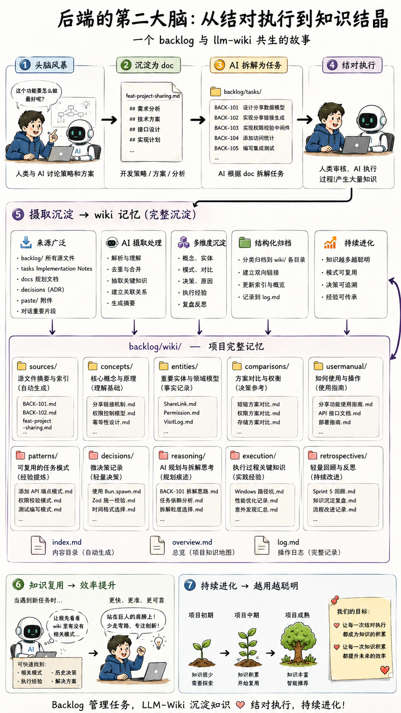
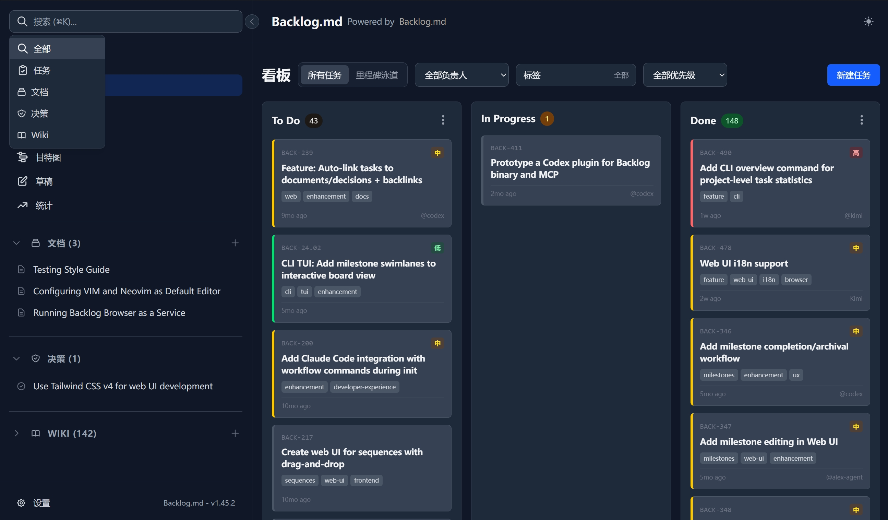
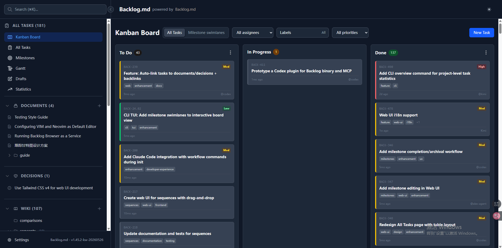

<h1 align="center">Backlog.md</h1>
<p align="center">:us: <a href="./README.en.md">English</a></p>
<p align="center">适用于任何 Git 仓库的本地 Markdown 任务管理器 &amp; 看板视图</p>

<p align="center">
<code>npm i -g @kuwork/backlog.md</code> 或 <code>bun add -g @kuwork/backlog.md</code> 或 <code>brew install backlog-md</code>（上游）或 <code>nix run github:MrLesk/Backlog.md</code>（上游）
</p>


---

> **Backlog.md** 让任何含 Git 仓库的文件夹都能成为**独立的项目看板**
> 由纯 Markdown 文件和零配置 CLI 驱动。
> 为**规范驱动的 AI 开发**量身打造 —— 通过结构化任务让 AI 智能体产出可预期的结果。

## 功能特性

* 📝 **本地 Markdown 任务** —— 每个事项都是一份纯 `.md` 文件

* 🤖 **为 AI 而生** —— 兼容 Claude Code、Gemini CLI、Codex、Kiro 及任何其他支持 MCP 或 CLI 的 AI 助手

* 📊 **即时终端看板** —— `backlog board` 在终端中实时呈现看板

* 🌐 **现代 Web 界面** —— `backlog browser` 启动精致的 Web UI，让任务管理一目了然

* 🌍 **多语言界面** —— Web UI 支持英语、日语、简体中文、繁体中文，在设置中一键切换

* 🧠 **LLM Wiki 知识库** —— AI 自动维护的结对笔记本，支持摄取、查询与健康检查

* 📄 **富文本粘贴与文档上传** —— 从 Word、网页直接粘贴为 Markdown，支持 `.docx` 上传与图片自动提取

* 📅 **跟踪甘特图** —— 基于 `plannedStart` / `plannedEnd` / `actualStart` / `actualEnd` 时间字段的可视化时间线，计划与实际双层对比

* 🔍 **强大的搜索功能** —— `backlog search` 可在任务、文档和决策间进行模糊搜索

* 📋 **丰富的查询命令** —— 轻松查看、列出、筛选或归档任务
* ✅ **完成定义默认值** —— 为每个新任务添加可复用的检查清单

* 📤 **看板导出** —— `backlog board export` 创建可共享的 Markdown 报告

* 🔒 **100% 隐私保护 &amp; 离线储存** —— backlog 完全存储在您的仓库内部，所有操作都在本地完成

* 💻 **跨平台** —— 支持 macOS、Linux 和 Windows

* 🆓 **MIT 许可证 &amp; 开源** —— 个人或商业用途均免费


---

## 🧠 LLM Wiki 知识库

Backlog.md 内置由 LLM 自动维护的 **Wiki 知识库**，让人类与 AI 的每一次结对执行都沉淀为可复用的知识结晶。

### 结对编程思路

> 人类主导策略 → AI 拆解任务 → 结对执行 → 知识自动沉淀到 Wiki

```
头脑风暴 → doc → AI 规划 → tasks → 结对执行 → wiki
```

| 层级 | 载体 | 内容 | 所有者 |
|------|------|------|--------|
| **规划层** | `backlog/docs/` | 开发策略、技术方案 | 人类主导，AI 辅助 |
| **执行层** | `backlog/tasks/` | 具体任务、验收标准 | AI 创建，人类审核 |
| **记忆层** | `backlog/wiki/` | 知识结晶、模式提取 | AI 维护，人类审阅 |

### 如何使用

Wiki 由 LLM 全自动维护，无需手动创建文件。在对话中触发以下关键词，AI 即会接管：

| 触发词 | 作用 |
|--------|------|
| `build wiki` / `init wiki` / `搭建知识库` | 初始化 Wiki 目录结构，注入工作流指引 |
| `ingest` / `process source` / `摄取` | 将 backlog 源文件（tasks/docs/decisions 等）吸入 Wiki |
| `wiki query` / `知识库查询` | 基于已积累的知识回答问题、生成报告 |
| `lint wiki` / `health check` / `检查 wiki` | 扫描矛盾、孤儿页面和过时内容 |

Wiki 遵循**非正式、轻量、AI 维护、可质疑**四大原则——它不是企业知识库，而是你和 AI 的"结对笔记本"。



---

##  快速入门

```bash
# 安装
bun i -g @kuwork/backlog.md
# 或：npm i -g @kuwork/backlog.md
# 或：brew install backlog-md

# 在任何 Git 仓库中初始化
backlog init "My Awesome Project"

# 或无 Git 初始化，用于本地/非代码项目
backlog init "Personal Planning" --no-git
```

初始化向导会询问您希望如何接入 AI 工具：
- **CLI 指令**（推荐）—— 创建简短的指令文件，告诉智能体运行 `backlog instructions overview`。
- **MCP 连接器** —— 如果您更偏好 MCP，可以自动配置 Claude Code、Codex、Gemini CLI、Kiro 或 Cursor。
- **跳过** —— 不设置 AI；仅将 Backlog.md 作为任务管理器使用。

Backlog 数据存储在项目本地的 backlog 文件夹中，例如 `backlog/`、`.backlog/`，或通过 `backlog.config.yml` 配置的项目相对路径。任务仍是可直接阅读的 Markdown 文件（例如 `task-10 - Add core search functionality.md`）。Git 是可选的：`backlog init --no-git` 创建纯文件系统项目，并禁用跨分支检查、远程操作和自动提交。

---

### 与 AI 智能体协作

这是针对 Claude Code、Codex、Gemini CLI、Kiro 及类似工具的推荐工作流 —— 遵循**规范驱动的 AI 开发**方法。
运行 `backlog init` 后，智能体应首先运行 `backlog instructions overview`，然后按以下循环工作：

**步骤 1 —— 描述您的想法。** 告诉智能体您想构建什么，并要求它将工作拆分为小任务，附上清晰的描述和验收标准。

**🤖 询问您的 AI 智能体：**
> 我想为 Web 视图添加一个搜索功能，用于搜索任务、文档和决策。请将其分解为小的 Backlog.md 任务。

> [!NOTE]
> **审查检查点 #1** —— 阅读任务描述和验收标准。

**步骤 2 —— 一次一个任务。** 每个 AI 会话只处理一个任务，一个任务对应一个 PR。良好的任务拆分意味着每个会话可以独立工作、互不冲突。确保每个任务足够小，能在一次对话中完成，避免超出上下文窗口上限。

**步骤 3 —— 编码前先规划。** 要求智能体调研代码库，并在任务中编写实施计划。就在实施前执行这一步，确保计划反映代码库的当前状态。

**🤖 询问您的 AI 智能体：**
> 只处理 BACK-10。研究代码库并在任务中编写实施计划。在编码前等待我的批准。

> [!NOTE]
> **审查检查点 #2** —— 阅读计划。方法是否合理？批准或要求智能体修正。

**步骤 4 —— 实施和验证。** 让智能体实施任务。

> [!NOTE]
> **审查检查点 #3** —— 审查代码、运行测试、检查代码规范，并验证结果是否符合您的预期。

如果结果不理想：清除计划/备注/最终总结，完善任务描述和验收标准，然后在新的会话中重新处理该任务。

---

### 不与 AI 智能体协作

直接在终端或浏览器中使用 Backlog.md 管理任务。

```bash
# 创建和完善任务
backlog task create "Render markdown as kanban"
backlog task edit BACK-1 -d "Detailed context" --ac "Clear acceptance criteria"

# 跟踪工作
backlog task list -s "To Do"
backlog task edit BACK-1 --comment "Can we split the UI work into a separate PR?" --comment-author @sara
backlog search "kanban"
backlog board

# 在浏览器中可视化工作
backlog browser
```

您可以随时在 AI 辅助和手动工作流之间切换 —— 两者都基于相同的 Markdown 任务文件。建议通过 Backlog.md 命令（CLI/MCP/Web）修改任务，而不是手动编辑任务文件，以保持字段类型和元数据的一致性。任务可记录项目根目录下的已修改文件，之后通过 `backlog search --modified-file src/path.ts --plain` 即可找到。使用任务评论进行讨论和审阅记录；评论正文支持 Markdown，但单独的 `---` 行被保留为评论分隔符。使用执行记录跟踪执行进度，使用最终总结编写类似 PR 的完成说明。

**了解更多：** [CLI 参考](CLI-INSTRUCTIONS.md) | [高级配置](ADVANCED-CONFIG.md)

---

##  Web 界面

启动现代、响应式的 Web 界面，用于可视化任务管理：

```bash
# 启动 Web 服务器（自动打开浏览器）
backlog browser

# 自定义端口
backlog browser --port 8080

# 不自动打开浏览器
backlog browser --no-open
```

**功能特性：**
- 支持拖放的交互式看板
- 带有丰富表单的任务创建和编辑
- 带有检查清单的交互式验收标准编辑器
- 所有视图的实时更新
- 支持桌面和移动设备的响应式设计
- 带确认对话框的任务归档
- 与 CLI 无缝集成 —— 所有更改与 Markdown 文件同步



### 甘特图视图

`backlog browser` 内置甘特图视图，支持五种时间粒度（日/周/月/季度/年），纯 React/CSS 实现，零外部依赖：

- **计划时间**：`plannedStart` / `plannedEnd`（`YYYY-MM-DD`）绘制计划边框
- **实际时间**：`actualStart` / `actualEnd`（`YYYY-MM-DD HH:MM` UTC）自动随状态变更填充，绘制状态色实心条
- **跟踪对比**：同一行叠加计划边框与实际条，延期/提前一目了然
- **依赖箭头**：SVG 智能连接任务依赖关系

时间字段支持 CLI 直接设置或清除：

```bash
# 计划字段（Date-only）
backlog task edit BACK-10 --planned-start 2026-06-01 --planned-end 2026-06-07 --due-date 2026-06-10

# 实际字段（Date-time UTC），状态变更时自动填充
backlog task edit BACK-10 --status "In Progress"  # actualStart 自动设为当前时间

# 清除任意时间字段
backlog task edit BACK-10 --clear-due-date --clear-planned-start --clear-planned-end --clear-actual-start --clear-actual-end

# 里程碑时间字段清除
backlog milestone edit "Release 1.0" --clear-due-date --clear-planned-start --clear-planned-end
```




要使 Web UI 作为自动启动的本地服务持续运行，请参阅 [将 Backlog.md 作为服务运行](backlog/docs/doc-003%20-%20Running-Backlog-Browser-as-a-Service.md)。

---

## 🔧 MCP 集成（Model Context Protocol）

CLI 指令是默认的 AI 接入方式。如果您明确偏好 MCP 连接器，Backlog.md 仍支持 Claude Code、Codex、Gemini CLI 和 Kiro 等 AI 编码助手。
您可以运行 `backlog init`（即使您已经初始化了 Backlog.md）并选择 MCP 集成，或按照以下手动步骤操作。

### 客户端指南

<details>
  <summary><strong>Claude Code</strong></summary>

  ```bash
  claude mcp add backlog --scope user -- backlog mcp start
  ```

</details>

<details>
  <summary><strong>Codex</strong></summary>

  ```bash
  codex mcp add backlog -- backlog mcp start
  ```

</details>

<details>
  <summary><strong>Gemini CLI</strong></summary>

  ```bash
  gemini mcp add backlog -s user backlog mcp start
  ```

</details>

<details>
  <summary><strong>Kiro</strong></summary>

  ```bash
  kiro-cli mcp add --scope global --name backlog --command backlog --args mcp,start
  ```

</details>

处处统一使用 `backlog` 作为服务器名称 —— MCP 服务器会自动检测当前目录是否已初始化，并在需要时回退到 `backlog://init-required`。

### 手动配置

```json
{
  "mcpServers": {
    "backlog": {
      "command": "backlog",
      "args": ["mcp", "start"],
      "env": {
        "BACKLOG_CWD": "/absolute/path/to/your/project"
      }
    }
  }
}
```

如果您的 IDE 无法为 MCP 服务器设置进程工作目录，如上所示设置 `BACKLOG_CWD`。
如果您的 IDE 支持自定义参数但不支持环境变量，您也可以使用 `["mcp", "start", "--cwd", "/absolute/path/to/your/project"]`。

> [!IMPORTANT]
> 手动添加 MCP 服务器时，建议在 CLAUDE.md/AGENTS.md 文件中补充简短说明，让智能体读取 `backlog://workflow/overview`。
> 使用 `backlog init` 时无需此步骤，因为它会自动添加这些说明。
> 基于 CLI 的 setup，请使用 `backlog instructions overview` 获取当前工作流指引。


连接后，智能体可以通过 `backlog://workflow/overview` 读取 Backlog.md 工作流说明，详细指南位于 `backlog://workflow/task-creation`、`backlog://workflow/task-execution` 和 `backlog://workflow/task-finalization`。
在您的 AI 工具（Claude Code、Codex、Kiro）中使用 `/mcp` 命令验证连接是否正常工作。

---

##  CLI 参考

完整命令参考 —— 任务管理、搜索、看板、文档、决策等：**[CLI-INSTRUCTIONS.md](CLI-INSTRUCTIONS.md)**

快速示例：`backlog`、`backlog instructions`、`backlog task create`、`backlog task list`、`backlog task edit`、`backlog milestone add`、`backlog milestone edit`、`backlog milestone remove`、`backlog search`、`backlog board`、`backlog browser`。

完整帮助：`backlog --help`

---

##  配置

Backlog.md 的配置按以下层次叠加（优先级从高到低）：

1. CLI 参数
2. 项目配置文件：
   - 存在时使用 `backlog.config.yml`
   - 否则使用 `backlog/config.yml` 或 `.backlog/config.yml`
3. 内置默认值

### 交互式向导（`backlog config`）

不带参数运行 `backlog config` 以启动完整的交互式向导。这与在 `backlog init` 中选择开启高级设置时触发的体验相同，它会引导您完成所有配置项：
- 跨分支准确性：`checkActiveBranches`、`remoteOperations` 和 `activeBranchDays`。
- Git 工作流：`autoCommit` 和 `bypassGitHooks`。
- ID 格式化：启用 `zeroPaddedIds` 或设置其长度。
- 编辑器集成：选择一个带可用性检查的 `defaultEditor`。
- 完成定义默认值：交互式添加/删除/重新排序/清除项目级 `definition_of_done` 检查清单项。
- Web UI 默认值：选择 `defaultPort` 以及是否启用 `autoOpenBrowser`。

跳过向导（在 init 期间回答"否"）将应用 Backlog.md 内置的安全默认设置：
- `checkActiveBranches=true`、`remoteOperations=true`、`activeBranchDays=30`。
- `autoCommit=false`、`bypassGitHooks=false`。
- `zeroPaddedIds` 禁用。
- `defaultEditor` 未设置（回退到您的环境配置）。
- `defaultPort=6420`、`autoOpenBrowser=true`。

对于纯文件系统项目，运行 `backlog init --no-git`。Backlog.md 不会运行 `git init`，保存的配置会强制设置 `checkActiveBranches=false`、`remoteOperations=false` 和 `autoCommit=false`，以便 CLI、Web 和 MCP 本地文件工作流不依赖 Git 仓库。

每当您重新访问 `backlog init` 或重新运行 `backlog config` 时，向导都会用您当前的值预填充提示，以便您只调整已更改的内容。

### 完成定义默认值

使用 `backlog config`（或在 `backlog init` 高级设置期间）、在 Web UI 中（设置 → 完成定义默认值），或直接编辑项目配置文件来设置项目范围的 DoD 项：

```yaml
definition_of_done:
  - Tests pass
  - Documentation updated
  - No regressions introduced
```

当项目使用根目录配置自动发现时，请编辑 `backlog.config.yml` 而不是 `backlog/config.yml`。

这些检查项默认添加到每个新任务中。您可以在创建时使用 `--dod` 添加更多，或使用 `--no-dod-defaults` 为单个任务禁用默认值。

有关完整配置参考（所有选项、命令和详细说明），请参阅 **[ADVANCED-CONFIG.md](ADVANCED-CONFIG.md)**。

---

## 🌐 社区工具

- **[vscode-backlog-md](https://marketplace.visualstudio.com/items?itemName=ysamlan.vscode-backlog-md)** - VS Code 扩展，包含事项面板、看板视图和编辑功能。([ysamlan/vscode-backlog-md](https://github.com/ysamlan/vscode-backlog-md))

---

### 许可证

Backlog.md 采用 **MIT 许可证**发布 —— 随意使用，只需注明出处。请参阅 [LICENSE](LICENSE)。
