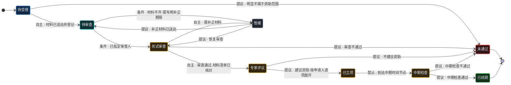
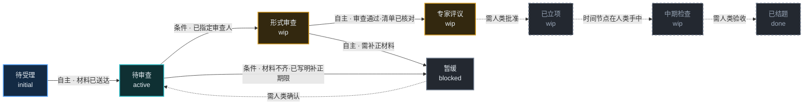

# 状态机语义缺失：为什么"配置无错"，AI 却不会操作你的状态

> 本文由根目录 `state-machine-ai-collaboration-report.html`（生成于 2026-09-27）**全文转换**而来，
> 站在 AI 与人类协同的视角审视「科研课题管理」改造样例，用于指导 Backlog.md 状态机相关 PRD 的编写。
>
> 诊断结论：问题不在配置语法，而在 Backlog.md 用**位置约定**和**硬编码字符串**推断状态语义——
> 任何自定义状态列都会让这套推断失效。
>
> 证据来源：本仓库 `src/utils/terminal-status.ts`、`src/utils/status.ts`、`src/core/backlog.ts`、
> `src/mcp/tools/tasks/handlers.ts`、`src/mcp/utils/schema-generators.ts` 实读。
> 故障链为基于源码的推演，建议按 3.3 节步骤实测确认。

## 目录

1. [结论：问题不在配置，在语义推断](#01-结论问题不在配置在语义推断)
2. [三个断层：AI 为什么不会操作状态](#02-三个断层ai-为什么不会操作状态)
3. [实证：你的科研配置在代码里发生了什么](#03-实证你的科研配置在代码里发生了什么)
4. [现有机制为什么堵不住](#04-现有机制为什么堵不住)
5. [别人怎么定义 AI 协同状态机](#05-别人怎么定义-ai-协同状态机)
6. [协同范式：八款产品如何做 AI 协同](#06-协同范式八款产品如何做-ai-协同)
7. [关键洞察：命令即门禁](#07-关键洞察命令即门禁)
8. [方案 A：今天就能用的绕过与加固](#08-方案-a今天就能用的绕过与加固)
9. [方案 B：把 statuses 升级为状态机定义](#09-方案-b把-statuses-升级为状态机定义)
10. [AI 权限矩阵设计](#10-ai-权限矩阵设计)
11. [方案 C：MCP 层的状态机下发与校验](#11-方案-cmcp-层的状态机下发与校验)
12. [落地路线与一页速查](#12-落地路线与一页速查)
13. [引擎选型：要不要引入现成的流程引擎](#13-引擎选型要不要引入现成的流程引擎)

---

## 01 结论：问题不在配置，在语义推断

> **核心判断**
>
> Backlog.md 的 `statuses` 是一个**显示层的列定义**，而不是**语义层的状态机定义**。
> 系统在需要判断语义时，只能靠两条脆弱的约定去"猜"：
>
> - **终态 = 数组最后一个元素**
> - **进行中 = 字符串归一化后等于 `"inprogress"`**
>
> 你的科研配置 `["待受理","形式审查","专家评议","已立项","中期检查","已结题","未通过"]`
> 语法完全合法，但这两条约定在它上面**全部失效**——而且是静默失效，不报错、不警告。

| 影响面 | 表现 |
|---|---|
| **对人的影响** · 看板照常显示 | 人类看板、CLI、Web UI 一切正常——七个列都渲染出来，拖放也能用。所以你感觉"代码无错"。 |
| **对系统的影响** · 语义静默错位 | 终态被判定为"未通过"，导致结题课题无法归档、时间字段错填。系统行为与业务语义**完全颠倒**。 |
| **对 AI 的影响** · 无据可依 | AI 通过 MCP 只拿到一个字符串枚举。它不知道准入条件、不知道谁能推进、不知道转换要留什么证据——只能猜，或者每次都问你。 |

---

## 02 三个断层：AI 为什么不会操作状态

把"AI 不会操作状态"拆开看，其实是三个彼此独立、但都会导致瘫痪的断层。

### 断层 A · 语义断层 —— AI 只看到名字，看不到规则 · 致命

AI 调用 `task_edit` 时，`status` 字段的 schema 是一个枚举：值必须在这七个字符串里。
这是**值合法性校验**，不是**转换合法性校验**。

- 它不知道"待受理"能不能直接跳到"已立项"（应当不能，必须经形式审查与专家评议）；
- 它不知道"已结题"和"未通过"都是终态（系统只认最后一个）；
- 它不知道"专家评议"是 WIP 态，同时只能有 N 个。

结果：AI 要么**越权跳步**（一步把课题标成已立项），要么**过度保守**（每个转换都回头问你），两种都破坏协同节奏。

### 断层 B · 权限断层 —— 没有任何地方写"这步 AI 能不能自己走" · 致命

协同的核心是**划清谁做什么**。但 Backlog.md 的配置里没有任何字段能表达：

- "形式审查 → 专家评议" 必须由人类拍板（AI 无权）；
- "待受理 → 形式审查" AI 可自主完成（纯机械校验）；
- "专家评议 → 已立项" AI 只能*提议*，人类确认后执行。

没有这个表达位，权限就只能靠 prompt 里的自然语言描述——而自然语言对 AI 的约束力，取决于模型当天的心情。

### 断层 C · 证据断层 —— 转换需要留下什么，没有载体 · 重要

状态推进在真实业务里往往伴随**必须产出的证据**：形式审查要留审查结论、专家评议要留评议意见、结题要留验收结论。

Backlog.md 有 `comments`（讨论）、`implementationNotes`（执行记录）、`finalSummary`（完成说明）三个文本位，
但**没有任何机制把这些位与特定转换绑定**——"进入专家评议必须留下评议意见"这条规则无处安放。

结果：AI 把状态推过去了，但没留下该留的东西，人类事后审查时无从追溯。

> **一句话概括**
>
> 现有 `statuses` 回答了"**有哪些站**"，但没有回答"**怎么走、谁能走、走了要留什么**"。
> 后三个问题缺位，AI 就无法真正参与协同，只能退化成一个会改字符串的打字员。

---

## 03 实证：你的科研配置在代码里发生了什么

这一节直接用源码说话。以下内容均可在本仓库复现。

### 3.1 两条语义推断的真实实现

`src/utils/terminal-status.ts` —— 终态判定：

```ts
export function getTerminalStatus(statuses: readonly string[]): string | null {
  if (statuses.length === 0) return null;
  const terminalStatus = statuses[statuses.length - 1];   // ← 取数组最后一个
  return terminalStatus && terminalStatus.trim().length > 0 ? terminalStatus : null;
}
```

`src/utils/status.ts:100` —— 进行中判定：

```ts
export function isInProgressStatus(status: string | null | undefined): boolean {
  return normalizeStatusForComparison(status) === "inprogress";  // ← 硬编码英文
}
```

把你的科研配置代进去：

```text
statuses: ["待受理", "形式审查", "专家评议", "已立项", "中期检查", "已结题", "未通过"]
                                                                    ↑ 数组最后一个 = 系统认定的唯一终态
// 推断结果：
//   终态      = "未通过"
//   进行中态  = 无（没有任何一列归一化后等于 "inprogress"）
```

### 3.2 四条故障链

#### 故障 1：结题课题永远无法归档 → task_complete 直接报错

`src/mcp/tools/tasks/handlers.ts:485-492` 的逻辑是"非终态不许 complete"：

```ts
if (!isTerminalStatus(task.status, statuses)) {
  throw new BacklogToolError(
    `Task ${task.id} is not ${terminalStatus}. Set status to "${terminalStatus}" with task_edit before completing it.`,
    "VALIDATION_ERROR");
}
```

于是 AI 想把"已结题"的课题归档时，会收到：

```text
Task fund-12 is not 未通过. Set status to "未通过" with task_edit before completing it.
```

**业务上完全荒谬**：一个已经结题的课题，被要求先改成"未通过"才能归档。AI 若照做，就把结题成果改成了否定结论。

#### 故障 2：甘特图"实际"层失效：actualStart 永不填，actualEnd 只在判否时填

`src/core/backlog.ts:1724-1730` 的自动填充：

```ts
if (isInProgressStatus(newStatus) && !isInProgressStatus(oldStatus) && !task.actualStart) {
  task.actualStart = now;          // 需要状态名归一化 == "inprogress" → 永不触发
}
if (isTerminalStatus(newStatus, statuses) && !isTerminalStatus(oldStatus, statuses) && !task.actualEnd) {
  task.actualEnd = now;            // 只在切到"未通过"时触发
}
```

- `actualStart`：**永远不会被自动填充**，因为七列中没有一列叫 In Progress；
- `actualEnd`：课题**被判"未通过"时才会填**——实际结束时间被记在了失败那一刻，而真正结题的课题反而没有结束时间。

后果：你在上一份报告里看好的"计划 vs 实际双层甘特图"，在这套配置下**实际条基本不可用**。

#### 故障 3：结题课题走 archive 通道 → 成果被当作"无效任务"

既然 complete 走不通，AI（或人类）的自然选择是改用 `task_archive`。而 archive 的语义在 MCP 文档里写得很清楚：

> *"archive a task that should not be completed (duplicate, canceled, invalid)"* —— 用于重复、取消、无效。

**于是：顺利结题的课题，被系统归档进了"无效/取消"通道。** 这是最隐蔽的一条故障——不报错、不冲突，只是语义被污染，
等你要回溯结题清单时才发现数据全在 `archive/` 而不是 `completed/`。

#### 故障 4："未通过"被当成完成 → 里程碑进度虚高

`src/core/backlog.ts:1737-1750`：任务进入终态时会推进所属里程碑的 `actualEnd`，并统计"里程碑下所有任务是否都已终态"。

由于终态 = "未通过"，一个课题被**否决**时，系统会认为它**完成了**，并据此计算里程碑完成度。
**否决的课题越多，里程碑看起来完成得越快。**

> **这一节的要点**
>
> 故障 1–4 全都**不会抛出语法错误**——配置能存、看板能显、命令能跑。
> 它们只在语义层面静默错位。这正是"配置无错但没法用"的本质：
> **工具校验了值的合法性，却从没校验过语义的正确性。**

### 3.3 最小复现步骤

```bash
# 1. 在测试项目里应用科研配置
backlog config set statuses '["待受理","形式审查","专家评议","已立项","中期检查","已结题","未通过"]'

# 2. 建一个课题，走到已结题
backlog task create "课题A：气候变化监测" --status "已结题"

# 3. 尝试归档 → 触发故障 1
backlog task complete fund-1
# ✗ Task fund-1 is not 未通过. Set status to "未通过" ...

# 4. 检查时间字段 → 触发故障 2
backlog task view fund-1 --plain | grep actual
# actualStart 为空、actualEnd 为空（因为从未进入"未通过"）

# 5. 若改用 archive → 触发故障 3（结题课题进 archive/）
backlog task archive fund-1
```

---

## 04 现有机制为什么堵不住

Backlog.md 其实已有五个与状态相关的机制，逐一检查后，没有一个能承载状态机语义。

| 机制 | 能做什么 | 为什么堵不住 |
|---|---|---|
| **MCP status 枚举**<br>`schema-generators.ts` | 把 `statuses` 编译成 JSON Schema 的 enum，值不在列表内则拒绝 | 只做**值白名单**校验。它保证"状态必须是七者之一"，但不保证"从当前状态能走到那一个"。**非法跳步畅通无阻。** |
| **onStatusChange 回调**<br>配置项 + 任务级覆盖 | 状态变更时执行 shell 命令，可用 `$TASK_ID $OLD_STATUS $NEW_STATUS $TASK_TITLE` | ① **事后触发**，无法阻止非法转换；② 只有命令执行失败的非零退出才可能间接阻断，语义模糊；③ **AI 看不到它**——它不在 MCP 工具描述里，AI 不知道存在这条规则。 |
| **MCP workflow 资源**<br>`backlog://workflow/*` | 下发任务创建/执行/收尾/里程碑/文档/决策/草稿的流程指引 | 内容是**静态通用文本**，写的是普适的任务生命周期，**不含项目自定义的状态机**。AI 读了它，依然不知道你的七列怎么走。 |
| **AGENTS.md 注入**<br>五种文件 · 标记块幂等 | 把指引段写进 CLAUDE/AGENTS/GEMINI/copilot 指令文件 | 本质仍是**自然语言**。可以写"进入专家评议必须留评议意见"，但这是**请求**不是**约束**——无强制力、无校验、违反时不报错。 |
| **definition_of_done**<br>项目级检查清单 | 每个新任务自动注入完成卫生检查项 | 定位是"交付前清洁度"（测试通过、文档更新），**与状态转换无关**。它管不了"从 A 到 B 要满足什么"。 |

> **共同的结构性缺陷**
>
> 这五个机制有一个共同点：**它们都作用于"单次操作"，而非"状态之间的转换关系"**。
> 状态机的本质是**关系**（A 能不能到 B、谁可以、要留什么），而现有机制全部是**属性**级别的。
> 用属性机制去表达关系，注定表达不出来。

---

## 05 别人怎么定义 AI 协同状态机

带着"关系如何表达"这个问题去看同类产品，会发现四条不同的路线。

| 产品 | 机制 | 如何表达"谁能推进 / 走哪条路" | 代价 |
|---|---|---|---|
| **Jira**（最完整） | Workflow Scheme | 显式定义 transition（A→B），每条 transition 挂三类插件：**condition**（能否走）、**validator**（输入是否合法）、**post-function**（走完做什么）。权限由角色方案控制。**这是状态机的黄金标准。** | 配置极重 |
| **Beads** | 状态类别 + gate 类型 | `status.custom "名称:类别"` 给每个状态打类别，`bd ready` 据此筛选；另有 `gate` 工单类型表示**需要人工审批的检查点**——用**类型**而非状态来表达"此处需人类介入"。 | 轻 |
| **spec-kit / cc-sdd** | 命令族 + 阶段递进 | `/speckit.specify → plan → tasks → implement` 每段是一个**人类敲的斜杠命令**。AI 不能自己进入下一阶段，因为阶段推进由人类命令触发。**权限模型隐含在交互方式里。** | 零配置 |
| **OpenSpec** | 三段状态机 + 目录分区 | `specs/`（真相）· `changes/`（进行中提案）· `archive/`（已归档）。**用目录位置表达状态**，`archive` 动作=合并回写，天然带审批含义。 | 轻 |
| **BMAD** | 角色边界 | 21+ 人格代理各管一段（Mary 出 brief、Winston 出架构、Devon 实现、Quinn 验收）。**用"谁在场"决定"能推进到哪"**。 | 交接重 |
| **Beans** | 五态固定 | draft/todo/in-progress/completed/scrapped 写死，无转换规则、无权限模型。**与 Backlog.md 处境最接近。** | 能力弱 |

> ⚠ **关于 Beads 四类的更正**
>
> `active / wip / done / frozen` 是**队列可见性**语义，不是流程图语义：
> `done` 与 `frozen` 在 `bd ready` / `bd list` 上行为**完全相同**（都不入队、都不默认显示）；
> 起点由内置 `open` 隐式承担，`blocked` 被并入 `wip`。
> 用它来表达流程，起止两端都是塌的。详见第 9 节的修正。

以上是**状态机这一层**的横向对比。下一节把视野拉开一层，看这些产品**整体上如何组织人与 AI 的分工**——状态机只是其中的一环。

---

## 06 协同范式：八款产品如何做 AI 协同

### 6.1 四种协同范式

八款产品的做法看似五花八门，实际可以归到四种范式。区别只在一件事：**人类的注意力被安排在哪个时点**。

**范式一 · 门禁式 Gated**

**人类分步批准，AI 在阶段内自主。** 流程被切成若干段，每段结束必须人点头才能进入下一段。

- 优点：可控、可追溯、返工代价小。
- 代价：人类必须持续在线，是吞吐瓶颈。
- 代表：spec-kit · OpenSpec · cc-sdd · **Backlog.md**

**范式二 · 托管式 Delegated**

**人类只给目标，AI 自主跑完，人类事后审。** AI 拥有任务选择、分解、推进的完整权限。

- 优点：人类负担最轻，适合批量执行。
- 代价：失控风险高，错了要整段重来。
- 代表：TaskMaster · GitHub Copilot Agent

**范式三 · 角色式 Role-based**

**多个专职代理分工，人类在交接点介入。** 每个代理有明确职责边界与产物格式。

- 优点：覆盖需求→设计→实现→测试全生命周期。
- 代价：学习曲线陡、交接开销大、反馈回流笨拙。
- 代表：BMAD-METHOD

**范式四 · 记忆式 Memory-driven**

**不靠显式门禁，靠持续供给上下文来维持协同。** 会话开始注入项目状态，结束强制同步，已完成的工单沉淀为可查询记忆。

- 优点：适合长周期、跨会话、多分支并行。
- 代价：对人类审查的依赖靠自觉，缺乏硬约束。
- 代表：Beads · Beans

> **范式选择决定状态机复杂度**
>
> 门禁式**必须**有清晰的状态机（否则人不知道该在哪点头）；
> 托管式**不需要**状态机（AI 自己决定，人只看结果）；
> 记忆式用**类型与依赖**替代状态机（`bd ready` 就够了）；
> 角色式用**代理边界**替代状态机。
> **Backlog.md 属于门禁式，却没配状态机——这正是它当前困境的根源。**

### 6.2 六个协同维度对比

| 产品 | ① 上下文注入<br>会话开始 AI 拿到什么 | ② 任务获取 | ③ 人类门禁在哪 | ④ AI 权限硬边界 | ⑤ 失忆防护 / ⑥ 留痕 |
|---|---|---|---|---|---|
| **Backlog.md**（门禁式） | 静态：AGENTS.md 指引段 + MCP `backlog://workflow/*` 资源<br>动态已有：`backlog overview --plain`（须显式加 `--plain`，否则进 TUI） | `task_list`/`task_search`，可按 status/assignee/milestone/labels/`ready` 过滤 | **三审查点**：审 Spec（描述+验收标准）→ 审 Plan（实施计划）→ 审 Result（diff+测试+验收） | **无**：文档图里有，工具层无强制 | ⑤ wiki（LLM 维护，重资产）<br>⑥ comments / notes / finalSummary + completed/ + archive/ |
| **Beads**（记忆式） | `bd prime` 注入当前项目状态摘要 | `bd ready`：**依赖感知**的下一任务选择（含状态类别判断） | `gate` 类型工单 = 显式人工批准检查点 | 状态类别 + 依赖图；hash ID 防多 Agent 冲突 | ⑤ 已完成任务**语义压缩**后保留<br>⑥ `bd sync` 会话结束强制同步 |
| **Beans**（记忆式） | `beans prime`；经 Claude Code hooks 在 **SessionStart 与 PreCompact** 自动执行 | `beans list --ready --json` | 靠人执行命令推进；无显式门禁 | 明确禁止直改 `.beans/` 的 md 文件 | ⑤ PreCompact hook 防压缩失忆<br>⑥ 归档 bean 即**项目记忆**可查询 |
| **TaskMaster**（托管式） | MCP 工具集即上下文；`initialize_project` | `next_task`：**AI 自主**按复杂度+依赖决定下一个 | 主要在前端：人写/审 PRD；执行过程基本放手 | `TASK_MASTER_TOOLS` 模式（core 7 / standard 15 / all 36） | ⑤ docs/ + reports/ 持久化<br>⑥ 子任务状态 + 复杂度报告 |
| **spec-kit**（门禁式） | constitution.md 常驻 + 模板注入 | `/speckit.tasks` 生成任务清单，AI 按序执行 | **命令之间**：人敲下一个 `/speckit.*` 即批准 | constitution 硬约束；阶段推进不在 AI 工具集内 | ⑤ spec/plan 文档留档<br>⑥ `checklist` = "需求的单元测试" |
| **OpenSpec**（门禁式） | AGENTS.md scaffold + `specs/` 作为行为契约 | proposal 中的 `tasks.md` | **proposal 审批**与 **archive 合并**两处 | `openspec validate --strict` 可检出场景缺失 | ⑤ delta 规格只写增量<br>⑥ archive 时回写主文档，真相不漂移 |
| **cc-sdd**（门禁式） | 一行部署生成 Kiro 风格指令 | `/kiro-spec-tasks` 产出任务 | 五段命令逐步推进 + 独立评审环节 | 内置 TDD 循环（RED → GREEN → Refactor） | ⑤ 设计文档留档<br>⑥ 自动调试记录 |
| **BMAD**（角色式） | 文档分片（document sharding）按需取用 | 由当前在场代理决定（如 Devon 领开发故事） | **代理交接点**：上一角色产物交下一角色 | 代理规约即边界；scale-adaptive 调整严谨度 | ⑤ 分片文档跨会话复用<br>⑥ PRD/架构/用户故事全套留档 |

### 6.3 逐款拆解：它们的协同循环长什么样

**Beads · 为多 Agent 并发而生**

- *循环*：`bd prime`（注入）→ `bd ready`（选活）→ `bd update --status in_progress`（认领）→ 干活 → `bd close -r "原因"` → `bd sync`（**强制**）。
- *协同设计亮点*：① hash 型 ID（`bd-a3f2`）让多个 Agent 在不同分支同时建任务也不冲突；② `discovered-from:` 依赖让 AI 中途发现的新问题挂回原任务，而不是丢进黑洞；③ `gate` 类型是唯一需要人批准的工单。

**Beans · 把"防失忆"做成标配**

- *循环*：SessionStart/PreCompact hook 自动跑 `beans prime` → `beans list --ready --json` → 边做边用 `--body-replace-old/new` 勾掉清单 → 完成追加 Summary → `beans update -s completed`。
- *协同设计亮点*：① GraphQL 查询让 AI 精确取所需，**把 token 用量当作协同成本来优化**；② 提交信息强制带 bean ID footer，代码与工单双向可追溯；③ 明令"永不直接改 .beans/ 下的 md"——与 Backlog.md 的"黄金规则"同构。

**TaskMaster · 自主度最高，也最考验 PRD 质量**

- *循环*：`parse_prd`（PRD→任务）→ `analyze_project_complexity` → `next_task` → `expand_task`（AI 自己拆子任务）→ 实现 → `update_subtask`。人可以几乎不介入。
- *协同设计亮点*：`TASK_MASTER_TOOLS` 环境变量是个聪明设计——**用工具集大小来调节 AI 自主度**（core 7 个工具 ≈ 5k token，all 36 个 ≈ 21k token）。这是目前唯一把"AI 权限"做成可量化旋钮的产品。

**spec-kit · 宪法 + 命令族双保险**

- *循环*：`/speckit.constitution`（立宪）→ `specify`（只要 What/Why，禁止技术细节）→ `clarify`（**AI 主动提问**消歧）→ `plan` → `tasks` → `implement`。
- *协同设计亮点*：① `clarify` 把"AI 不懂就猜"改成"AI 不懂就问"，是协同质量的隐形功臣；② 宪法在生成前强校验，不是事后提醒；③ `checklist` 把验收标准变成"需求的单元测试"。

**OpenSpec · 用目录表达状态，天然带审批语义**

- *循环*：`/opsx:proposal`（生成 proposal.md + tasks.md + delta specs）→ **人审** → `/opsx:apply`（AI 执行）→ `/opsx:archive`（delta 回写主文档）。
- *协同设计亮点*：`specs/`（真相）· `changes/`（进行中）· `archive/`（已归档）**三个目录就是状态机**——文件在哪，状态就是什么，AI 改不了也绕不过。delta 只写增量，人类审查量极小。

**cc-sdd · 把 TDD 变成协同节拍**

- *循环*：`spec-init → requirements → design → tasks → impl`，impl 内部跑 RED → GREEN → Refactor。
- *协同设计亮点*：TDD 循环本身就是**高频、低成本的审查节拍**——不用等人，测试替人把关。另有独立评审与自动调试环节。代价是只适配有测试的代码项目，非代码场景无处安放。

**BMAD · 用组织仿真替代流程定义**

- *循环*：Mary(BA) 出 brief → Preston(PM) 出 PRD → Winston(架构师) 出设计 → Sally(PO) 拆故事 → Devon(开发) 实现 → Quinn(QA) 验收，每步产物落盘交给下一角色。
- *协同设计亮点*：**角色边界即权限边界**，不需要额外定义谁能做什么。代价也真实：实测中设计问题浮现时，反馈必须绕回架构师代理，交接开销显著；且生成文档含绝对路径，可移植性差。

**Backlog.md 自己：设计最好，保障最弱**

- *循环*：读 `backlog://workflow/overview`（规则）→ `backlog overview --plain`（**现状，已具备**）→ 搜索/列任务 → 建任务（人审 Spec）→ 写计划（人审 Plan）→ 执行 → 验收（人审 Result）→ 沉淀 wiki。
- **它的三审查点是全表最清晰的门禁设计**——问题在于它只存在于 README 的 mermaid 图和 MCP 的静态文本里，**没有任何工具强制 AI 停下来等人**。对比 OpenSpec 用目录、spec-kit 用命令、Beads 用 gate 类型，Backlog.md 的门禁是"建议"而非"机制"。

### 6.4 对 Backlog.md 的三点启示

**启示 1 · 门禁要有机制保障**

三审查点的设计本身是优等生水平。缺的是把它**从图变成闸**。
最低成本的做法：在 `task_edit` 校验"从 To Do 直接到 Done 是否跳过了 Plan 阶段"——
用 `implementationPlan` 字段是否为空来判定，零新增配置即可实现大半。

**启示 2 · 不是缺 `prime`，是没接上链路**

**更正**：Backlog.md 并非没有动态上下文注入——`backlog overview --plain` 已经具备该能力，
且统计维度**比 `bd prime` / `beans prime` 更丰富**：各状态计数、优先级分布、完成率与完成热力图、近期创建/更新、
以及项目健康四件套（`staleTasks` / `atRiskTasks` / `overdueTasks` / `blockedTasks` 各 Top 5）。

真正的问题有三处，且都是"接驳"问题而非"能力"问题：

- **默认形态是 TUI**：不带 `--plain` 会进交互式界面。prime 的设计假设是"输出即可被 AI 读"，这里需要显式加参数才成立。
- **不在 AI 入口链路上**：README 指引 AI 第一步跑 `backlog instructions overview`（*静态工作流规则*），而非 `backlog overview`（*动态项目状态*）。前者讲"怎么做"，后者讲"现在怎么样"——**AI 默认只读到前者**。
- **缺 ready 清单**：统计里有 `blockedTasks`，但没有"现在能开工的任务"。该能力 MCP 侧有（`task_list --ready`），CLI 侧 overview 不输出。

**启示 3 · 失忆防护要靠轻量钩子**

Beans 用 PreCompact hook 自动重注上下文，成本极低。Backlog.md 的 wiki 是重资产（需 LLM 维护、有独立的 skill 与目录体系）。
**建议先做轻的**：把已有的 `backlog overview --plain` 挂进 Claude Code 的 PreCompact / SessionStart hook（一行命令即可），重资产 wiki 保持可选。

> **横向看完后的整体判断**
>
> 没有一款产品"解决"了 AI 协同。它们只是把**人的注意力**放在了不同位置：
> spec-kit 放在阶段之间、OpenSpec 放在提案审批、Beads 放在 gate 工单、BMAD 放在角色交接、TaskMaster 放在 PRD 撰写。
> **共同点是：全都用某种"结构性手段"（目录、命令、类型、角色）来承载门禁，而不是用自然语言请求。**
> 唯一的例外是 Backlog.md——它把门禁写在了文档里，于是门禁就成了可选建议。

---

## 07 关键洞察：命令即门禁

> **spec-kit / OpenSpec 用了一招零成本的解法**
>
> 它们**根本没有定义状态机**，却把 AI 权限问题解决了。
> 办法是：**把"推进阶段"这个动作，从 AI 可调用的工具里拿走，交还给人类敲的命令。**

机制是这样的：

- AI 能调用的工具只覆盖"当前阶段内的产出"（写 spec、拆任务、写代码）；
- "进入下一阶段"这个动作，必须由人类输入 `/speckit.plan`、`/openspec:apply` 触发；
- 对 AI 而言，**它压根没有"改状态"的工具可调用**——想跳步也无能为力；
- 对人类而言，敲命令这个动作本身就是**一次显式批准**，无需额外的审批机制。

**这招的精妙之处**：它绕开了"如何用配置表达权限"这个难题，改用**交互结构**来承载权限。
不需要 workflow scheme，不需要 condition/validator，只要"阶段推进不在 AI 的工具集里"就够了。

**对 Backlog.md 的启示 · AI 不必拥有全部转换权**

现在的困境是：AI 拿到了 `task_edit`，就能改任意状态——能力过大，所以不敢放手。
解法不是"教它规则"（自然语言不可靠），而是**收敛它能改的范围**。

**具体做法 · 把状态转换分成两类通道**

- **AI 通道**：机械性、低风险的推进（待受理→形式审查、补录信息）；
- **人类通道**：判断性、有后果的推进（专家评议→已立项、→未通过），由人敲命令或点按钮。

> **但命令即门禁有个前提**
>
> 它适用于**流程阶段清晰、单线程推进**的场景（spec-kit 的六段、OpenSpec 的三段）。
> 科研课题管理也基本符合——一条课题在任一时刻只处于一个阶段。
> 但如果你的场景需要"多任务并行在不同阶段 + AI 批量推进"，命令门禁会变成瓶颈，此时需要真正的状态机（方案 B/C）。

---

## 08 方案 A：今天就能用的绕过与加固

不动一行代码，用现有机制把 80% 的问题解决掉。分两步：先绕开终态 bug，再用文档+指令建立协同契约。

### A-1 · 绕开终态判定：重排 statuses 顺序（零代码）

既然终态固定取数组最后一个，就**让真正的终态站在最后**。同时重新分配"未通过"的出口：

- **已结题** → 放在数组最后一位，充当系统认定的终态。`task_complete` 可用，`actualEnd` 自动填充，成果进 `completed/`；
- **未通过** → 放在倒数第二位（普通列），出口走 `task_archive`。而 archive 的语义正是"duplicate, canceled, invalid"——**与"未通过"天然吻合**，这次是语义对齐而非错位。

```bash
# 只改顺序：把"已结题"挪到最后，"未通过"挪到倒数第二
statuses: ["待受理", "形式审查", "专家评议", "已立项", "中期检查", "未通过", "已结题"]
#                                                        未通过(普通列)   已结题(终态)

# 结题课题：改状态 → 归档到 completed/
backlog task edit fund-12 --status "已结题"   # actualEnd 自动填充
backlog task complete fund-12                    # ✓ 进 completed/

# 否决课题：改状态 → 归档到 archive/（语义=无效/取消，吻合）
backlog task edit fund-7 --status "未通过"
backlog task archive fund-7                      # ✓ 进 archive/
```

**残余损失**：`actualStart` 仍不会自动填充（硬编码 `"inprogress"` 所致）。
变通办法：需要时间追踪时，手动设 `backlog task edit fund-12 --planned-start ... --planned-end ...`，
或接受只看计划层甘特图。若确实需要自动 actualStart，可考虑把"进行中"那一列直接命名为 `In Progress`（英文），
用一枚英文列名换取时间字段自动化。

### A-2 · 建立状态契约文档 + 强制 AI 读它（零代码）

把"怎么走、谁能走、留什么"写成一份**机器可读、位置固定**的契约文档，然后在指令文件里强制 AI 每次改状态前先读。
这不能*强制* AI，但能把自然语言约束从"散落在对话里"变成"每次必经的输入"，可靠性提升一个量级。

#### 第一步：写状态契约

```markdown
# backlog/docs/state-machine.md —— 项目状态契约（AI 必读）

## 状态总表
| 状态 | 类别 | AI 权限 | 进入条件 | 必须留下 |
|---|---|---|---|---|
| 待受理 | 起始 | 可自主创建 | — | 申请人、方向、材料清单 |
| 形式审查 | 处理中 | AI 可自主推进 | 材料齐备 | 审查结论（comments） |
| 专家评议 | 处理中 | 仅可提议 | 形式审查通过 | 评议意见（comments），按申请人逐项展开 |
| 已立项 | 已决定 | 禁止 AI 推进 | 人类批准 | 立项编号、负责人 |
| 中期检查 | 处理中 | 仅可提议 | 已立项 | 进度记录（implementationNotes） |
| 未通过 | 终态(走 archive) | 禁止 AI 推进 | 人类判定 | 否决理由（finalSummary） |
| 已结题 | 终态(走 complete) | 禁止 AI 推进 | 人类验收 | 结题结论（finalSummary） |

## 合法转换（不在表内的转换一律禁止）
待受理 → 形式审查 → 专家评议 → 已立项 → 中期检查 → 已结题
              ↓          ↓          ↓
            未通过      未通过     未通过

## AI 行为规则
1. 修改 status 前，必须先读本文件，确认转换在合法表中。
2. 标注「禁止 AI 推进」的转换：不得调用 task_edit 改 status，
   只能把建议写入 comments 并明确提示等待人类决定。
3. 标注「仅可提议」的转换：同上，写入 comments。
4. 标注「可自主推进」的转换：可直接执行，但必须同时写入要求的证据字段。
5. 不得跳步（如 待受理 → 已立项）。
```

#### 第二步：把"先读契约"写进 Agent 指令

```markdown
# 追加到 AGENTS.md / CLAUDE.md 的 Backlog.md 指引段之后

## 项目状态机（强制）
本项目使用自定义状态列，修改任何任务的 status 前必须先执行：
    backlog document view "state-machine"
并严格遵循其中的转换表与 AI 权限列。
- 标记为「禁止 AI 推进」的转换：写入 comments 并交人类处理，不得自行改状态。
- 标记为「仅可提议」的转换：同上。
- 不在合法转换表中的跳步操作一律禁止。
违反此规则会破坏项目流程的可追溯性。
```

#### 第三步（可选）：用 onStatusChange 做兜底告警

```bash
# 检测到可疑转换时写日志（事后发现，不能阻止，但可追溯）
backlog config set onStatusChange \
  'echo "$(date) $TASK_ID: $OLD_STATUS -> $NEW_STATUS" >> .backlog/transitions.log'
```

**诚实说明**：此回调是**事后**的，只能留痕不能拦截。它的价值是事后审计，不是预防。

> **方案 A 的诚实边界**
>
> 它能解决故障 1–4（顺序调整后），并大幅降低 AI 乱改状态的概率。但它**不是强制的**——
> AI 仍可能不读文档、或读了不遵守。如果你需要"违规时工具直接拒绝"，必须走方案 B/C。

---

## 09 方案 B：把 statuses 升级为状态机定义

根治做法。核心是让配置从"字符串数组"升级为"状态机对象"，并**保持向后兼容**。

设计原则：**纯字符串数组继续按现状工作**（终态=最后一个，全部视为可自由转换），新增对象形式才启用状态机语义。

**关键设计：`next` 不是状态名数组，而是「转换」数组**——条件、权限、证据都挂在**边**上，而不是**点**上。理由见下一节。

```yaml
statuses:
  - name: 待受理
    category: initial        # 起点：新建即在此，不可作为转移目标
    ai: allowed              # 状态级默认权限（其下所有出边继承）
    next:
      - to: 待审查
        when: "申请材料已送达并完成编号登记"
        ai: allowed
      - to: 未通过
        when: "明显不属于资助范围"
        ai: propose            # 目标是否定终点 → 强制降级
        evidence: finalSummary

  - name: 待审查
    category: active        # 待办：可开工 → 出现在 ready 队列
    ai: allowed
    next:
      - to: 形式审查
        when: "进入审查阶段"
        ai: allowed_if         # 条件性自主
        if: "已指定审查人"    # 满足→自主；不满足→回落 propose
      - to: 暂缓
        when: "材料不齐需补正"
        ai: allowed_if
        if: "comments 已写明缺失项与补正期限"
        evidence: comments

  - name: 形式审查
    category: wip           # 在办：审查已开始
    ai: allowed
    next:
      - to: 专家评议
        when: "形式审查通过"          # 业务条件：该走哪条路
        requires: [材料清单已核对]        # 可判定前置（机器校验）
        ai: allowed
        evidence: comments              # 必须写入审查结论
      - to: 暂缓
        when: "需补正材料"
        ai: allowed
        evidence: comments
      - to: 未通过
        when: "形式审查不通过"
        ai: propose                    # 覆盖状态级 allowed
        evidence: finalSummary

  - name: 专家评议
    category: wip
    ai: propose             # 状态级默认：评议相关一律需人拍板
    next:
      - to: 已立项
        when: "评议结论为建议资助"
        evidence: comments              # 按申请人逐项展开
      - to: 未通过
        when: "评议结论为不建议资助"
        evidence: finalSummary

  - name: 暂缓
    category: blocked       # 挂起：等材料补正，可回流程
    ai: propose
    next:
      - to: 待审查
        when: "补正材料已送达"
      - to: 形式审查
        when: "恢复审查"

  - name: 已立项
    category: wip           # 立项即在研
    ai: forbidden
    next:
      - to: 中期检查
        when: "到达中期检查时间节点"
        ai: forbidden           # 时间节点由人类掌握

  - name: 中期检查
    category: wip
    ai: propose
    next:
      - to: 已结题
        when: "中期检查通过"
        evidence: implementationNotes
      - to: 未通过
        when: "中期检查不通过"
        evidence: finalSummary

  - name: 未通过
    category: dropped       # 终点（否定）
    exit: archive
    next: []

  - name: 已结题
    category: done          # 终点（肯定）
    exit: complete
    next: []
```

### ① category：起止必须显式表达

最初我沿用 Beads 的 `active/wip/done/frozen` 四类，**这是错的**——那四类是**队列可见性**语义，
不是流程图语义：在 Beads 里 `done` 与 `frozen` 对 `bd ready` / `bd list` 的行为**完全一致**（都不入队、都不默认显示），
起点由内置 `open` 隐式承担、`blocked` 被并入 `wip`。用它来表达流程，起止两端都是塌的。

流程图/UML 状态机的节点分三类：**初始节点 → 中间状态 → 终止节点**，且终止节点**允许多个**（正常完成、取消终止、异常退出）。
据此重新定义六个类别：

| category | 流程角色 | 语义 | 系统行为（由类别自动推导，无需另配） |
|---|---|---|---|
| `initial` | 起点 | 新建任务即在此；流程唯一入口 | 新建任务默认填入；`actualStart` 为空；**不得作为任何 `next` 的目标**（校验报错） |
| `active` | 中间 | 可开工：排队中，未被认领 | 计入**可开工队列**；转入 wip 时填 `actualStart` |
| `wip` | 中间 | 进行中：已被认领 | 不计入可开工队列（避免重复认领）；计入在制数量；`actualStart` 必填 |
| `blocked` | 中间 | 挂起：等待外部事件或主动搁置 | 不计入可开工队列；**不按陈旧度自动回收**（区别于真正的废弃）；需记录恢复条件 |
| `done` | 终点 | 成功终止 | 填 `actualEnd`；走 `complete` 通道；**推进**里程碑 |
| `dropped` | 终点 | 否定终止：否决/取消/废弃 | 填 `actualEnd`；走 `archive` 通道；**不推进**里程碑 |

关键区别在于**终点有两个，且语义相反**：`done` 与 `dropped` 都是终态，但一个代表"做成了"、一个代表"没做成"——
这恰好对应科研场景的「已结题」与「未通过」，也正是当前代码"取数组最后一个"彻底无法表达的情形。

> **术语陷阱：`ready` 与「可开工」不是一回事**（2026-09-28 修订，见 `doc-19` §5 FR-4）
>
> - **Beads 的 `bd ready` = 可开工队列**：依赖满足 **且** 未被认领。本表所说的"计入 ready 队列"指的是它。
> - **Backlog.md 的 `--ready` = 依赖可达性**：非终态 + 依赖全满足，**不排除已被认领的任务**
>   （`src/utils/readiness.ts:8` 注释与 `:96` 实现）。
>
> 二者同名但语义不同。为避免混淆，落地时**不改动 `--ready` 的语义**，另设
> `actionable` = 依赖已满足 **且** 状态类别 `∈ {active, initial}`（即本表的"可开工队列"）。

#### 起点与待办不是一回事：`initial` vs `active`

这两类都出现在可开工队列里，容易混为一谈，但差别是**结构性的**：

| 判据 | initial | active | 说明 |
|---|---|---|---|
| 能否作为转移**目标** | ❌ 不可 | ✅ 可 | 起点只能出不能进，否则流程可倒流回入口 |
| 新建任务默认填入 | ✅ 是 | ❌ 否 | active 只能靠流转到达 |
| 出现在可开工队列 | ✅ 是 | ✅ 是 | 二者都"可以开工"，所以视图上一致 |
| 语义 | 刚进来，还没被处理过 | 流转过来的，轮到它了 | 前者是"新建"，后者是"排队" |

> **省掉 active 的代价：可开工队列会失效**
>
> 如果把中间状态**一律标成 wip**（这正是我初稿的做法），可开工队列里就**只剩 initial 列的任务**——
> 即"刚创建、还没人碰过"的课题。而"形式审查已通过、等待评议"这类**流转中且已就绪**的工作，永远不出现在队列里。
>
> 后果是 AI 失去了工作入口：`task_list --actionable` 查不到"下一步该做什么"，只能靠人点名派活
> （注意：不是 `--ready`，后者只表依赖可达性，见上文术语陷阱）。
> Beads 的 `bd ready` 之所以是整套 AI 协同的入口，正因为 `active` 覆盖的是**所有可开工状态**，而不只是新建态。
> **对 AI 协同而言，active 是比 initial 更重要的一类。**

#### 两种建模取向（按你的看板粒度选）

科研审批这类流程有个天然冲突：**流程阶段**（形式审查／专家评议／中期检查）与**处理状态**（待办／在办／挂起）是两个正交维度，
而 `statuses` 只有一维列表。三种折中方式：

| 取向 | 做法 | 代价 | 适用 |
|---|---|---|---|
| **紧凑型** | 进入某列即视为在处理，中间状态一律 `wip`，不用 `active` | **可开工队列失效**，且无法区分"排队中"与"处理中" | 列数必须精简、且人手动派活为主 |
| **完全分离型** | 每个阶段拆成「待 X（`active`）」与「X 中（`wip`）」两列 | 列数近乎翻倍 | 需要真实在制数量（WIP limit）与排队可视化 |
| **折中型**（本例采用） | 只在流程真正的**排队入口**处设一个 `active` 列（「待审查」），其余阶段标 `wip` | 仅多一列 | 既保留可开工队列入口，又不让看板膨胀 |

如果你不想为「待审查」单开一列，退到紧凑型也可以——但要清楚那意味着**主动放弃可开工队列**，AI 只能靠人派活。

> **起点与终点的两条硬约束**
>
> **起点**：`initial` 应当唯一（多于一个时报错或取首个）。它只能作为转移**源**，不能作为**目标**——
> 否则流程可以倒流回入口，状态机退化成无向图。`backlog task create` 不带 `-s` 时默认填它。
>
> **终点**：`done` 与 `dropped` 可各有多个（例如"已结题/已验收"同为 done），但每一个都必须声明 `exit`，
> 由 `exit` 而非数组位置决定归档通道。

### ② 条件挂在「转换」上，不是挂在「状态」上

初稿我把 `ai`、`evidence`、`requires` 都挂在状态上，`next` 只是状态名数组——
**这是个设计错误**：当一个状态有两条以上出边时，配置只说"可以去 A 或 B"，
却没说**什么时候该去 A、什么时候该去 B**。AI 只能瞎猜，或者每次回头问人。

条件天然属于**边**而不是**点**：状态描述"我在哪"，转换描述"怎么走、凭什么走"。
Jira 的黄金标准正是如此——**transition** 上挂 condition（能不能走）、validator（输入合不合法）、post-function（走完做什么）。

| 字段 | 挂在哪 | 回答什么 | 说明 |
|---|---|---|---|
| `when` | 转换（边） | **该走哪条路？** | 业务条件，自然语言。给 AI 判断"当前情形对应哪条出边"。出度 > 1 时**必填**（见下方 Lint 规则）。 |
| `requires` | 转换（边） | 前置项满足了吗？ | **机器可判定**的子集：清单项已勾、依赖已关闭、字段非空。工具可真校验，不靠 AI 自觉。 |
| `evidence` | 转换（边） | 留下了什么材料？ | 走这条边必须写入的字段。既是"要留痕"，也是"进入目标状态的入场券"。 |
| `ai` | **两边都可挂** | AI 能不能自己走？ | 状态级是**默认值**，转换级**覆盖**它（更具体的优先）。这才能表达"整体可自主，但转『未通过』必须人批"。 |
| `if` | 转换（边） | 自主权够不够？ | 仅配合 `ai: allowed_if` 使用，见下。 |

#### `allowed_if` 的准确语义：条件性自主 + 回落

这是四档权限里唯一带条件的，也最容易被误解。它**不是**"条件满足就允许、不满足就禁止"——那样就退化成 `forbidden` 了。
正确语义是**三态**：

| 档位 | 语义 | AI 的实际行为 |
|---|---|---|
| `allowed` | 无条件自主 | 直接调用 `task_edit` 改状态，并写入 `evidence` |
| `allowed_if` | **条件性自主** | `if` 成立 → 等同 `allowed`；**不成立 → 回落为 `propose`**（不是禁止）：AI 先把材料补齐、写入 comments 提示人类，等人点头 |
| `propose` | 总是只能提议 | 不得改状态；备齐材料 + 在 comments 写明"建议推进到 X，待确认" |
| `forbidden` | 禁止 | 连提议都不做，仅可准备材料 |

**回落而非禁止，是 `allowed_if` 的价值所在**：它把"AI 能不能自己走"变成一个**可以通过补齐材料来解锁**的条件，
而不是一堵墙。最常见的写法就是把 `evidence` 当权限条件——**材料写全了才放行**：

```yaml
- to: 暂缓
  when: "材料不齐需补正"
  ai: allowed_if
  if: "comments 已写明缺失项与补正期限"   # 写清楚了→AI 自己暂缓；没写清→交人
  evidence: comments
```

#### 双重校验：选了目标，还得满足目标的入场条件

"设置其中一个目的状态也应该满足其条件"——对应**边条件**与**目标状态入场条件**两层，二者都要过：

| 层 | 校验什么 | 失败时的报错（AI 能直接读懂并自救） |
|---|---|---|
| 1 | 这条边存在吗 | `形式审查 → 已立项` 不是合法转换。合法去向：专家评议 / 暂缓 / 未通过 |
| 2 | **边的业务条件**（when / requires） | 转「专家评议」要求：形式审查通过 且 清单"材料清单已核对"已勾选。**当前未满足：清单项未勾选** |
| 3 | **AI 权限**（ai + if，含回落） | 你对这条边的权限为 propose。请写入 finalSummary 并提示人类决定（`if` 未满足：comments 未写明补正期限） |
| 4 | **目标状态的入场条件**（evidence） | 进入「专家评议」必须写入 comments（按申请人逐项展开的评议意见）。当前为空 |

层 2 与层 4 的区别常被忽略：**层 2 是"凭什么走这条路"**（出发前的资格），**层 4 是"进门要交什么"**（到达时的材料）。
同一字段可以同时出现在两层——`requires: comments 非空`（上一轮已写）与 `evidence: comments`（本轮要写）。

> **配套的配置 Lint 规则（防止配出"AI 随便选"的状态机）**
>
> 条件写不全的状态机比没有状态机更危险——它给了 AI 一个看似合法、实则随意的选择空间。
> 以下规则应在 `backlog config validate` 或加载时检查：
>
> - 出度 > 1 的状态，**每条出边必须写 `when`**；出度 = 1 时可选
> - `initial` 不得出现在任何 `to` 中（起点不可倒流）
> - 指向终态（`done`/`dropped`）的边，`ai` **不得为 `allowed`**——决策类终点必须人到；配了就降级为 propose 并告警
> - 终态的 `next` 必须为空且必须声明 `exit`
> - `ai: allowed_if` 必须同时给出 `if`，否则按 `allowed` 处理并告警

#### 同一份配置的图形视图

把上面的 YAML 画出来，就能直观看到「哪些分支是有条件的」以及「AI 的自由边界在哪」。
节点颜色对应 `category`，边上的标记对应 `ai` 权限档位：



边标记含义：

| 标记 | AI 权限 | 含义 |
|---|---|---|
| **自主** | `allowed` | AI 可自主推进，但必须同时写入 `evidence` 指定的字段 |
| **条件** | `allowed_if` | 条件成立→自主；不成立→**回落为提议**，AI 先补齐材料再交人 |
| **提议** | `propose` | AI 只备材料、写明建议，由人类执行 |
| **禁止** | `forbidden` | AI 完全不得推进 |

第二张图只画 **AI 能自己走通的部分**——即权限为 `allowed` / `allowed_if` 的边。
这相当于回答"**把任务丢给 AI，它能自己推进到哪一步**"：



> **这张图暴露的问题：AI 的自主区太短了**
>
> 实线部分是 AI 可自主推进的范围——**从「待受理」到「专家评议」就断了**。
> 立项、中期、结题三个环节全部卡在人类手上，而「暂缓」的恢复也依赖人确认。
>
> 这未必是坏事：科研评审的**决策点本来就该在人手里**。但它说明一件事——
> **如果配置里没有 `allowed_if`，AI 的自主区会更短甚至归零**，每个微小推进都要回头问人，
> 协同退化成"人肉调度"。`allowed_if` 的作用就是把"能自动化的那部分判断"还给 AI，
> 只把真正需要担责的决策留给人。**调这个边界，本质上就是调 `allowed` / `allowed_if` / `propose` 三档在各条边上的分布。**

### ③ 其余字段

| 字段 | 取值 | 解决什么 |
|---|---|---|
| `category` | `initial / active / wip / blocked / done / dropped` | 解决**语义断层**。终结"取最后一个"的位置约定：`done` 与 `dropped` 都是终态但语义相反，多个终态可以共存；可开工（actionable）筛选、`actualStart/End` 填充、陈旧回收、里程碑推进**全部按类别推导**而非按位置或硬编码字符串。**直接消灭故障 1/2/4。** |
| `next` | 转换对象数组（`to/when/ai/if/evidence/requires`） | 解决**非法跳步**与**分支歧义**。不在 `next` 里的目标一律拒绝；出度 > 1 时每条边必须有 `when`，让 AI 知道该选哪条路。向后兼容：写成状态名数组时视为无条件转换。 |
| `ai` | `allowed / allowed_if / propose / forbidden` | 解决**权限断层**。状态级为默认值、转换级覆盖之。`allowed_if` 配套 `if`：成立则自主，**不成立回落 propose 而非禁止**。`task_edit` 校验时直接拒绝越权转换。 |
| `requires` | 清单项 / 依赖状态 / 字段非空 | **机器可判定**的前置条件（与 `when` 的自然语言互补）。这是唯一能让工具真正校验、而不依赖 AI 自觉的一层。 |
| `evidence` | `comments / implementationNotes / finalSummary` | 解决**证据断层**。走这条边必须同时写入指定字段，否则拒绝转换——即"目标状态的入场券"。 |
| `exit` | `complete / archive` | 终结故障 3：明确该终态走哪个归档通道，工具不再靠"是不是最后一个"猜。 |

### 向后兼容策略

```ts
// src/utils/terminal-status.ts 的演进
export function getTerminalStatuses(statuses: StatusDef[]): string[] {
  // 新：按 category 判定，支持多个终态（done 与 dropped 语义相反但同为终态）
  const typed = statuses.filter(s => s.category === "done" || s.category === "dropped");
  if (typed.length > 0) return typed.map(s => s.name);

  // 旧：纯字符串数组时保留原行为（终态 = 最后一个）
  return statuses.length > 0 ? [statuses[statuses.length - 1]] : [];
}

// 配套：next 的两种写法统一成转换对象
type Transition = { to: string; when?: string; ai?: Policy; if?: string; evidence?: string[]; requires?: string[] };

function normalizeNext(raw: (string | Transition)[]): Transition[] {
  return raw.map(t => typeof t === "string"
    ? { to: t, ai: "allowed" }          // 旧：纯字符串 = 无条件、AI 可自由转换
    : t);
}

// 配套：起点与进行中，同样按类别推导，不再靠位置或硬编码
export const initialStatus = (ss: StatusDef[]) =>
  ss.find(s => s.category === "initial")?.name ?? ss[0]?.name;

export const isInProgressStatus = (s: string, ss: StatusDef[]) =>
  ss.find(x => x.name === s)?.category === "wip";   // 替代硬编码 "inprogress"
```

这样纯字符串配置、以及成千上万既有的 `["To Do","In Progress","Done"]` 项目都不受影响。
注意 `isInProgressStatus` 的替换一举解决了**故障 2**——再也不用把中文列名改成 `In Progress` 才能拿到 `actualStart`。

---

## 10 AI 权限矩阵设计

方案 B 的灵魂是 `ai` 字段。这一节把它展开成完整设计——这是"AI 与人类协同"最核心的一块。

### 10.1 四档权限策略

`ai` 可以挂在**状态**上（该状态所有出边的默认值），也可以挂在**转换**上（覆盖默认值）。
判定一条边时取**转换级优先**。四档从宽到严：

| 策略 | AI 能做什么 | 适用哪类转换 |
|---|---|---|
| `allowed` | 可自主调用 `task_edit` 推进，但必须同时写入 `evidence` 指定的字段。 | 机械性、无争议的转换：受理登记、形式审查通过、信息补录。 |
| `allowed_if` | **条件性自主**：配套 `if` 成立 → 等同 `allowed`；**不成立 → 回落 `propose`（不是禁止）**——AI 先补齐材料再交人。 | 可用客观条件界定、且条件**可由 AI 自己补齐**的转换：已指定审查人、材料说明已写全。 |
| `propose` | 可以完成*准备工作*（撰写评议意见、整理材料、核对清单），但**推进仍需人类确认**。 | 需要专业判断但 AI 能出草稿的环节：专家评议、中期检查、否决。 |
| `forbidden` | 不得调用 `task_edit` 改状态。**只能把建议写进 comments 并明确提示"等待人类决定"**。 | 有后果的判断性决策与时间节点：立项、结题验收、到达中期节点。 |

> **设计要点：propose 是协同的关键档位**
>
> 协同效率的高低，往往不取决于 AI 能做多少，而取决于**AI 准备好材料后，人类能否一次拍板**。
> `propose` 正式承认了这种分工：AI 负责把决策所需的材料备齐（写进 comments），人类只做最后那一下确认。
> 比 forbidden（AI 干等着）高效，比 allowed（AI 擅自决定）安全。
>
> **而 `allowed_if` 是 `propose` 的自动化阀门**：它把"要不要打扰人"变成一个可判定的条件。
> 条件成熟时 AI 自己走掉（不占用人的注意力），不成熟时自动退化成 propose（人只在这一刻被叫到）。
> **调协同节奏，主要就是调 `allowed` / `allowed_if` / `propose` 三档在各条边上的分布。**

### 10.2 科研课题场景的完整矩阵

对应第 9 节那份配置。**「触发条件」列即转换上的 `when`**——它是 AI 判断"该走哪条分支"的依据，
也是出度 > 1 时必填的字段。

| 转换 | 触发条件（when） | AI 权限 | AI 应产出 / 必须留下 |
|---|---|---|---|
| 待受理 → 待审查 | 申请材料已送达并完成编号登记 | `allowed` | 登记编号即可，无需额外材料 |
| 待受理 → 未通过 | 明显不属于资助范围 | `propose` | 整理超范围/缺项说明 → 人类决定 |
| 待审查 → 形式审查 | 进入审查阶段 | `allowed_if` | `if`：已指定审查人。未指定→写入 comments 请人类指派 |
| 待审查 → 暂缓 | 材料不齐需补正 | `allowed_if` | `if`：comments 已写明缺失项与补正期限。写清了→可自主暂缓 |
| 形式审查 → 专家评议 | 形式审查通过 | `allowed` | `requires`：清单"材料清单已核对"已勾；`evidence`：审查结论写入 comments |
| 形式审查 → 暂缓 | 需补正材料 | `allowed` | 补正说明写入 comments |
| 形式审查 → 未通过 | 形式审查不通过 | `propose` | 起草否决理由写入 finalSummary → 人类确认 |
| 专家评议 → 已立项 | 评议结论为建议资助 | `propose` | 撰写评议意见（**按申请人逐项展开、风险拆分至课题、无分数、无括号追加解释**）→ 人类拍板 |
| 专家评议 → 未通过 | 评议结论为不建议资助 | `propose` | 理由写入 finalSummary → 人类确认 |
| 暂缓 → 待审查 | 补正材料已送达 | `propose` | 记录补正到位 → 人类确认恢复 |
| 暂缓 → 形式审查 | 恢复审查 | `propose` | 同上 |
| 已立项 → 中期检查 | 到达中期检查时间节点 | `forbidden` | 人类专属：时间节点由人类掌握 |
| 中期检查 → 已结题 | 中期检查通过 | `propose` | 进度记录写入 implementationNotes → 人类验收 |
| 中期检查 → 未通过 | 中期检查不通过 | `propose` | 理由写入 finalSummary → 人类确认 |
| 已结题 / 未通过 → *归档* | 结论已写入 | `forbidden` | 结题结论写 finalSummary；**归档动作由人类执行**（`task_complete` / `task_archive`） |

> 注：矩阵中的评议意见撰写规范（按申请人逐项展开、风险拆分、无分数、无括号追加解释）来自本项目的实际评审要求，
> 可作为 `evidence` 的校验内容或 constitution 文档条款。

> **读这张矩阵的一个方法：先看「propose 密集区」**
>
> 从「专家评议」开始，后续**全部是 propose 或 forbidden**——立项、中期、结题、否决，每一步都要人点头。
> 这意味着人类的注意力会被**密集地**消耗在课题后半程。若评审季课题量大，这里会成为吞吐瓶颈。
>
> 可行的减压方向只有两个：一是把其中某些边改成 `allowed_if`（例如"中期检查材料齐备且无超期"时可自主推进），
> 二是接受它——**科研评审的决策责任本来就不该外包**。选哪个是业务判断，但配置必须让这个选择**可被看见、可被调整**，
> 而不是藏在默认行为里。

---

## 11 方案 C：MCP 层的状态机下发与校验

有了配置还不够——**AI 必须能读到它，且违规时必须被明确拒绝而不是静默通过**。这是方案 B 生效的前提。

### C-1 新增状态机资源，动态生成项目专属内容

仿照现有 `backlog://workflow/*`，新增 `backlog://workflow/state-machine`。
它不像现有资源那样是静态文本，而是**从项目配置实时编译**出来的：

```markdown
# AI 读到的内容（自动生成，非手写）
## 本项目状态机

### 状态与类别
起点: 待受理 (initial) —— 新建课题即在此
待办: 待审查 (active) —— 可开工，出现在 ready 队列
在办: 形式审查 (wip) · 专家评议 (wip) · 已立项 (wip) · 中期检查 (wip)
挂起: 暂缓 (blocked)
终点: 未通过 (dropped, 归档通道=archive) · 已结题 (done, 归档通道=complete)

### 合法转换：何时走哪条 + 你能不能自己走
| 从 | 到 | 触发条件（满足才可走这条） | 你的权限 | 必须留下 |
|---|---|---|---|---|
| 待受理 | 待审查 | 申请材料已送达并完成编号登记 | 自主 | — |
| 待受理 | 未通过 | 明显不属于资助范围 | 提议 | finalSummary |
| 待审查 | 形式审查 | 进入审查阶段 | 条件自主：已指定审查人 | — |
| 待审查 | 暂缓 | 材料不齐需补正 | 条件自主：comments 已写明缺失项与补正期限 | comments |
| 形式审查 | 专家评议 | 形式审查通过 | 自主 | comments（审查结论）+ 清单"材料清单已核对"已勾 |
| 形式审查 | 暂缓 | 需补正材料 | 自主 | comments |
| 形式审查 | 未通过 | 形式审查不通过 | 提议 | finalSummary |
| 专家评议 | 已立项 | 评议结论为建议资助 | 提议 | comments（按申请人逐项展开） |
| 专家评议 | 未通过 | 评议结论为不建议资助 | 提议 | finalSummary |
| 暂缓 | 待审查 / 形式审查 | 补正材料已送达 / 恢复审查 | 提议 | — |
| 已立项 | 中期检查 | 到达中期检查时间节点 | 禁止 | — |
| 中期检查 | 已结题 | 中期检查通过 | 提议 | implementationNotes |
| 中期检查 | 未通过 | 中期检查不通过 | 提议 | finalSummary |

### 权限标记含义
自主 —— 直接推进，但必须留下「必须留下」列指定的材料
条件自主 —— 冒号后的条件成立时可自主；不成立时改为「提议」：先把材料补齐，再请人类决定
提议 —— 不得改状态；备齐材料写入指定字段，并提示"待您确认后推进到 X"
禁止 —— 你完全不得推进，只能准备材料

### 边界
- 起点（待受理）不可被转入 —— 课题不会倒流回入口
- 不得跳步（例如 待受理 → 已立项）
- 不得执行标注「禁止」的转换；改为写入 comments 并明确提示"等待人类决定"
- 指向「未通过 / 已结题」的转换一律不得为「自主」——决策类终点必须由人类执行
```

关键点：**AI 每次都能读到准确的、项目专属的规则**，而不是通用模板。这让方案 B 的配置真正到达 AI 手里。

注意这张表比旧版多了一整列——**「触发条件」**。这是方案 B 升级后最重要的增量：
过去 AI 只知道"可以去哪"，现在它知道"**什么情况下该去哪**"，因此不必每次回头问人。

### C-2 task_edit 增加转换校验

在 `task_edit` 的 status 分支加入**四层**校验（比初稿多一层——边的业务条件）：

```ts
// 伪代码：src/mcp/tools/tasks/handlers.ts
if (args.status && args.status !== task.status) {
  const sm = await loadStateMachine();          // 从配置编译
  const tr = sm.transition(task.status, args.status);  // 取这条「边」

  // 1. 边是否存在（非法跳步）
  if (!tr) {
    throw new BacklogToolError(sm.explainPath(task.status, args.status), "INVALID_TRANSITION");
  }

  // 2. 边的业务条件【新增】：机器可判的那部分（requires）
  const unmet = sm.checkRequires(tr, task);     // 清单项 / 依赖状态 / 字段非空
  if (unmet.length) {
    throw new BacklogToolError(
      `${task.status} → ${args.status} 的前置条件未满足：${unmet.join("、")}。` +
      `该转换的业务条件为：${tr.when}`, "UNMET_CONDITION");
  }
  // 注：tr.when 是自然语言，交给 AI 自评；requires 才是工具能硬校验的部分

  // 3. AI 权限（转换级 ai 覆盖状态级；allowed_if 需判定 if 并回落）
  const pol = sm.resolvePolicy(tr, task);       // 返回 allowed | propose | forbidden
  if (pol === "forbidden") {
    throw new BacklogToolError(sm.explainForbidden(tr), "AI_FORBIDDEN_TRANSITION");
  }
  if (pol === "propose") {
    throw new BacklogToolError(sm.explainPropose(tr, task), "AI_NEEDS_HUMAN_CONFIRM");
  }

  // 4. 目标状态的入场条件（evidence）
  if (tr.evidence && !args[tr.evidence]) {
    throw new BacklogToolError(
      `进入 ${args.status} 必须同时提供 ${tr.evidence}。`, "MISSING_EVIDENCE");
  }
}
```

> ⚠ `allowed_if` 的判定在 `resolvePolicy` 里完成：`if` 成立返回 `allowed`，
> **不成立返回 `propose` 而非 `forbidden`**——这正是"回落"语义的落点。
> 此时报错应告诉 AI"补上什么就能自己走"，而不是"你没权限"。

### C-3 教学式报错：拒绝的同时教会 AI

这一条最容易被忽略，但对协同质量影响最大。**报错信息必须包含"该怎么做"，而不只是"不行"。**
升级后它还要多说一件事——**当前缺什么，以及补齐后能否自己走**。

#### 场景一：跳步

```text
✗ 差： Invalid status: 已立项

✓ 好： 不允许的转换：待受理 → 已立项 不存在于合法转换表中。
       从「待受理」只能前往：待审查（条件：申请材料已送达并完成编号登记）、
       未通过（条件：明显不属于资助范围）。
       请先推进到 待审查。
```

#### 场景二：分支选错 / 业务条件不满足

```text
✗ 差： Cannot transition: 形式审查 → 专家评议

✓ 好： 形式审查 → 专家评议 的前置条件未满足：清单项「材料清单已核对」未勾选。
       该转换的业务条件为：形式审查通过。
       从「形式审查」出发的分支：
         · 专家评议 —— 条件：形式审查通过（当前：清单未勾选 ✗）
         · 暂缓     —— 条件：需补正材料（可自主）
         · 未通过   —— 条件：形式审查不通过（仅可提议）
       若确需补正材料，可推进到 暂缓 并在 comments 写明缺失项与补正期限。
```

#### 场景三：allowed_if 未满足 → 回落的提示

这是**回落语义能否真正生效的关键**——报错必须说清"补上什么就能自己走"，
否则 AI 只会把 `allowed_if` 当成 `forbidden`，人类的负担一点没减。

```text
✗ 差： AI_FORBIDDEN_TRANSITION

✓ 好： 待审查 → 暂缓 为「条件自主」转换，当前未满足：
       comments 未写明缺失项与补正期限。
       补齐后你即可自主执行该转换。
       请改为：调用 task_edit 写入 comments（缺失项 + 补正期限），
       然后重新发起 待审查 → 暂缓。
```

#### 场景四：决策类终点

```text
✓ 好： 专家评议 → 已立项 属于人类专属决策（权限：propose）。
       请撰写评议意见写入 comments —— 按申请人逐项展开、风险拆分至各自课题、
       不使用分数、不使用括号追加解释 —— 并明确提示用户"待您确认后推进到 已立项"。
       你不得自行调用 task_edit 修改 status。
```

AI 是**从错误中学习**的——一次带指引的拒绝，就能让它在整个会话里走对路。
而一句"Invalid status"只会让它换个值继续撞墙。
**四种场景的报错都遵循同一模板：哪里错了 → 正确路径有哪些（附条件）→ 你现在该做什么。**

---

## 12 落地路线与一页速查

| 阶段 | 做什么 | 成本 | 解决什么 |
|---|---|---|---|
| **立即** | 重排 statuses 顺序（已结题置末、未通过走 archive） | 零 | 故障 1（无法 complete）、故障 3（结题进 archive）、故障 4（里程碑虚高） |
| **立即** | 写 `backlog/docs/state-machine.md` 契约文档 | 零 | 断层 A/B/C 的"可读性"部分——让规则有固定位置可查 |
| **立即** | AGENTS.md 强制注入"改状态前先读契约" | 零 | 把自然语言约束变成每次必经的输入 |
| **立即** | 把 `backlog overview --plain` 接进 AI 起始链路与 PreCompact hook | 零 | 能力已具备，只需接驳：AGENTS.md 起始步骤加一行 + hook 挂一行，即完成动态上下文注入与失忆防护 |
| **近期** | `category` 字段：`initial/active/wip/blocked/done/dropped` 六类，取代位置约定与硬编码 | 小 | 故障 2（actualStart 不填）+ 多终态共存（done/dropped 语义相反）+ ready 筛选 + 起点不可倒流 |
| **近期** | `next` + `ai` + `evidence` 字段 | 中 | 断层 A/B/C 的"强制性"部分——违规被工具拒绝 |
| **中期** | MCP 状态机资源 + 转换校验 + 教学式报错 | 中高 | 让规则真正到达 AI、且违规时被拦下并指引 |

### 一页速查

| 症状 | 根因 | 今天就能做的补救 |
|---|---|---|
| AI 乱改状态 / 跳步 | status 只有值枚举，无转换规则 | 写状态契约文档 + AGENTS.md 强制先读 |
| AI 每次都问能不能推进 | 无权限表达位 | 契约文档里明确标注 allowed / propose / forbidden 三档 |
| 已结题课题无法 task_complete | 终态 = 数组最后一个 | **把「已结题」挪到 statuses 最后一位** |
| 甘特图实际条缺失 | `isInProgressStatus` 硬编码 `"inprogress"` | 把"进行中"那列命名为 `In Progress`，或手动设时间字段 |
| 结题成果进了 archive/ | 未通过被误判为终态，结题只能走 archive | 同上：已结题置末 → 走 complete；未通过走 archive（语义吻合） |
| 否决的课题让里程碑"完成"变快 | 终态判定错误 | 同上 |
| AI 推进了但没留下材料 | evidence 无绑定机制 | 契约文档写明每个转换必须写哪个字段（comments / notes / finalSummary） |

> **最后一句**
>
> 你遇到的不是配置问题，而是**工具的语义表达力边界**。
> 在这个边界被突破之前，最务实的做法是**用"位置约定 + 契约文档"把语义显式化**：
> 把真正的终态放最后一位、把决策类转换的推进权收归人类、把规则写在 AI 必经的路径上。
> 这三件事今天就能做完，而且不花一分钱改造成本。至于根治，等 `category` 和 `ai` 两个字段落地即可。

---

## 13 引擎选型：要不要引入现成的流程引擎

方案 B/C 都落地之后，一个自然的问题是：**这套东西要不要自己写？有没有现成引擎能用？**
结论是——**有，但它只能覆盖一半；而另一半恰恰是本项目最有价值的部分。**

### 13.1 先把需求拆开：我们要引擎做什么

"流程引擎"是个含混的词。把它拆成七件具体的事，再看谁能做哪件：

| # | 能力 | 通用引擎能做吗 | 说明 |
|---|---|---|---|
| A | 从 YAML 配置构建转换图 | 能 | 任何 FSM 库都行；本质是读邻接表 |
| B | 判定某次转换是否合法 | 能 | 查表即可 |
| C | 判定前置条件是否成立 | 能 | XState 叫 guard，各库都有对应概念 |
| D | 判定 AI 权限（含回落） | 勉强 | 需自己建模；引擎里没有"权限档位"这个概念 |
| E | **列出所有出边 + 每条边的条件 + 权限** | 不能 | XState 只有 `state.nextEvents`，**只给事件名，不给目标、条件、权限** |
| F | **生成教学式报错** | 不能 | 引擎只返回"转换失败"，不会说"你该怎么做" |
| G | 配置 Lint（出度>1 必写 when 等） | 不能 | 业务规则，引擎不关心 |

> **关键论断：我们要的是「校验器 + 解释器」，不是「执行引擎」**
>
> 通用流程引擎解决的是**执行**——长时间运行、持久化、补偿事务、并行分支、超时调度。
> 这些我们**一个都不需要**：状态本来就存在 markdown 的 frontmatter 里，没有运行时进程，没有长事务。
>
> 而 E 和 F ——**把规则解释给 AI 听、违规时告诉它怎么改**——是本项目最核心、也是唯一真正服务于"AI 协同"的部分。
> **这两项没有任何引擎提供。** 引擎的价值集中在 A–C，而这三项自己写大约 50 行。

### 13.2 候选对比

| 候选 | 体积/形态 | 覆盖 | 适配度判断 |
|---|---|---|---|
| **XState v5** | 前端库 · 数十 KB 量级 | A B C | guard 数组天然支持"同一事件多分支带条件"，与我们的模型最接近。但见下方三个不匹配点。 |
| **@xstate/fsm** / Robot3 | ~1–2 KB | A B C（弱） | 极轻，但 guard 能力弱、无层级/并行、更别提 E/F。适合 UI 组件，不适合此场景。 |
| **jssm** | 中等 | A B C + 部分 E | 有 FSL 领域语言、能列出转换；小众、维护活跃度低、引入新语法负担。 |
| **json-rules-engine** | 规则引擎 | 仅 C | 擅长"条件→结论"，**不管理状态转换**。只能当条件求值器用。 |
| **Temporal / Camunda / Zeebe / n8n** | **需服务端** | A–D + 持久化 | **完全不匹配**：Backlog.md 是本地 CLI + MCP，没有服务端可跑。这些是为分布式长事务设计的。 |
| **BPMN + bpmn-js** | 建模器 | 仅建模 | bpmn-js 只画图与解析 XML，**执行引擎在 JS 生态里基本缺位**；且 BPMN 概念量远超需求。 |
| **自研** | ~150 行 · 零依赖 | A–G 全 | 见 13.4 骨架。**配置是唯一真源**：图、校验、AI 下发、报错、Mermaid 全部从它编译。 |

### 13.3 如果非要 XState，它有三个不匹配点

XState 是最接近的选择，值得认真评估。先看怎么映射：

```ts
// 我们的配置 → XState 配置
const machine = setup({
  types: { context: {} as Task, events: {} as { type: "GOTO"; to: string } },
  guards: {
    "形式审查通过": ({ context }) => checklistDone(context, "材料清单已核对"),
    "需补正材料":   ({ context }) => true,   // 业务条件无法机器判定
  },
}).createMachine({
  initial: "待受理",
  states: {
    形式审查: {
      // 只能挂英文 id；中文状态名需转义
      on: {
        GOTO: [
          { target: "专家评议", guard: "形式审查通过" },
          { target: "暂缓",     guard: "需补正材料" },
        ],
      },
      meta: { ai: "allowed", when: "形式审查通过" },  // 元数据只能塞 meta
    },
  },
});
```

| 不匹配点 | 说明 |
|---|---|
| **① 事件 vs 直接指定目标** | XState 是**事件驱动**：转换由事件名触发。我们的模型是"我要到 X 状态"——没有事件概念。只能造一个 `GOTO` 事件 + `{to}` 参数，再让每条边的 guard 额外判断 `event.to === 目标`。**绕了一层，且把"选哪条边"和"条件是否满足"混进同一个 guard。** |
| **② guard 只能是函数** | `when` 是**自然语言**（给 AI 读的"什么情况下该走这条路"），XState 的 guard 只能是可执行函数。自然语言只能塞进 `meta`，于是**规则被切成两半：机器能跑的在 guard，AI 能读的在 meta**，两者靠命名约定对齐，没有机制保证一致。 |
| **③ 没有 E 和 F** | `state.nextEvents` 只返回 `["GOTO"]`——告诉你"可以发 GOTO 事件"，**不告诉你能去哪、各自什么条件、什么权限**。而这正是 C-1 下发与 C-3 报错的全部原料。最后仍要自己遍历 `machine.config` 取 meta 拼装，XState 只贡献了 A–C。 |

还要考虑分发形态：Backlog.md 用 `bun build` 打成**单文件二进制**，依赖会被 bundle 进去。
几十 KB 本身不是问题，但**引入的每一个依赖都带着它的概念模型**——actor、invoke、延迟转换、层级状态、并行区域，
这些在课题管理场景里一个都用不上，却会成为后来者的认知负担。

### 13.4 建议：自研，约 150 行

不是"重复造轮子"——**轮子的另一半根本没有现成的**。以下是骨架，可直接放进 `src/core/state-machine.ts`：

```ts
export type Category = "initial"|"active"|"wip"|"blocked"|"done"|"dropped";
export type Policy   = "allowed"|"allowed_if"|"propose"|"forbidden";

// 条件用「声明式子集」，不用表达式——理由见 13.5
type Requirement =
  | { checklist: string }      // 清单项已勾选
  | { field: string }          // 字段非空
  | { deps: "closed" }         // 依赖全部进入终态
  | { assignee: true };        // 已指定负责人

export interface Transition {
  to: string;
  when?: string;               // 自然语言：给 AI 读
  requires?: Requirement[];    // 机器可判定
  ai?: Policy;                 // 覆盖状态级默认值
  if?: string;                 // 仅 allowed_if 使用
  evidence?: string;           // 目标状态的入场券
}

export class StateMachine {
  constructor(defs: StatusDef[])          // 编译：normalizeNext + 建邻接表

  // —— 校验（对应 C-2 四层）——
  transition(from: string, to: string): Transition | undefined   // 层 1
  unmet(tr: Transition, task: Task): Requirement[]                    // 层 2
  resolvePolicy(tr: Transition, task: Task): "allowed"|"propose"|"forbidden"  // 层 3（含回落）
  missingEvidence(tr: Transition, args: EditArgs): string | undefined      // 层 4

  // —— 解释（引擎完全不提供的部分）——
  describe(from: string): Branch[]          // E：出边 + 条件 + 权限，C-1 下发的原料
  explain(from: string, to: string, task: Task): string   // F：C-3 教学式报错

  // —— 类别推导（替代位置约定与硬编码）——
  terminalStatuses(): string[]
  initialStatus(): string
  isInProgress(s: string): boolean

  // —— 配置治理 ——
  validate(): string[]        // G：Lint 违规列表（出度>1 必写 when 等）
  toMermaid(): string         // 顺带：图也从同一份配置编译，所见即所得
}
```

**一个附带好处**：`toMermaid()` 让"文档里的图"与"实际生效的状态机"来自同一份配置，
不会出现 README 画一套、代码跑另一套的情况——这正是本报告第 6 章批评 Backlog.md 三审查点时的核心问题。

### 13.5 条件求值：不要一开始就上表达式引擎

`requires` 该用什么求值？看起来该上 `json-rules-engine` 或 `expr-eval`，
但建议**先只支持声明式子集**（清单项 / 字段非空 / 依赖关闭 / 负责人已设），理由有三：

| 理由 | 说明 |
|---|---|
| **安全** | 配置来自项目文件。支持任意表达式≈任意代码执行。MCP 场景下 AI 有可能诱导修改配置，**声明式子集的攻击面是封闭的**。 |
| **成本** | 表达式求值器 + 错误信息友好化的工程量，是声明式子集的**十倍以上**，而覆盖的真实需求可能不到 10%。 |
| **可双向使用** | 这是最被低估的一点：声明式子集**既能机器校验，又能渲染成自然语言**——`{checklist:"材料清单已核对"}` 可直接渲染成"清单项『材料清单已核对』已勾选"，**正是 C-1 下发和 C-3 报错需要的文字**。表达式反而渲染不出来。 |

求值函数本身只有十几行：

```ts
function evalReq(r: Requirement, task: Task, deps: Task[]): boolean {
  if ("checklist" in r) return task.acceptanceCriteria
    .some(c => c.text.includes(r.checklist) && c.checked);
  if ("field" in r)     return Boolean(String(task[r.field] ?? "").trim());
  if ("deps" in r)      return deps.every(d => isTerminal(d.status));
  if ("assignee" in r)  return task.assignee.length > 0;
  return true;
}
// 反向：把未满足的项渲染成人话，直接塞进报错
function describeReq(r: Requirement): string {
  if ("checklist" in r) return `清单项「${r.checklist}」已勾选`;
  if ("field" in r)     return `字段 ${r.field} 非空`;
  if ("deps" in r)      return "依赖任务全部完成";
  if ("assignee" in r)  return "已指定负责人";
}
```

### 13.6 什么时候该换掉自研

自研的前提是"需求窄"。出现以下任一情形时，应重新评估 XState：

| 触发条件 | 说明 |
|---|---|
| 需要**层级 / 并行状态** | 例如"课题在研"与"经费执行"两套状态同时推进——这时 XState 的 statechart 价值才真正体现 |
| 需要**超时自动转换** | 例如"暂缓超过 90 天自动转未通过"——XState 的 `after` 原生支持，自研要加调度器 |
| 需要**长时间运行的工作流** | 需要持久化与恢复——那就不是本地 CLI 的范畴了，应整体重新设计 |
| 需要**可视化编辑状态机** | Stately 编辑器生态只对接 XState 格式 |

即便到那时，`when` / `ai` / `evidence` 这套元数据**仍需挂在 XState 的 `meta` 上**，
E 和 F 也仍要自己实现。也就是说：**XState 能替掉的是最不值钱的那 50 行，替不掉真正有价值的部分。**

> **一句话结论**
>
> 现成引擎解决的是**"让机器正确地跑完一个流程"**，而这里要解决的是**"让 AI 看懂并遵守一个流程"**。
> 前者是执行问题，后者是**表达与解释问题**——两者只在前 30% 重叠。
> 所以答案是：**用现成引擎的*思路*（guard 挂边、声明式配置），不必用它的*实现*。**
> Jira 的 transition + condition + validator + post-function 是最好的参照，而不是某个 JS 库。

---

## 附：PRD 编写时的引用方式

本文件是状态机相关 PRD 的**唯一事实源**。编写 PRD 时：

- **问题定义**引用第 1–4 章（诊断与实证，含源码位置与行号）；
- **需求范围**拆成三档：方案 A（零代码，第 8 章）/ 方案 B（配置层，第 9–10 章）/ 方案 C（MCP 层，第 11 章）；
- **验收标准**引用第 9 章的 Lint 规则与第 11 章的四层校验与四场景报错；
- **技术选型**引用第 13 章的能力拆分（A–G）与自研骨架，不要重新论证。
