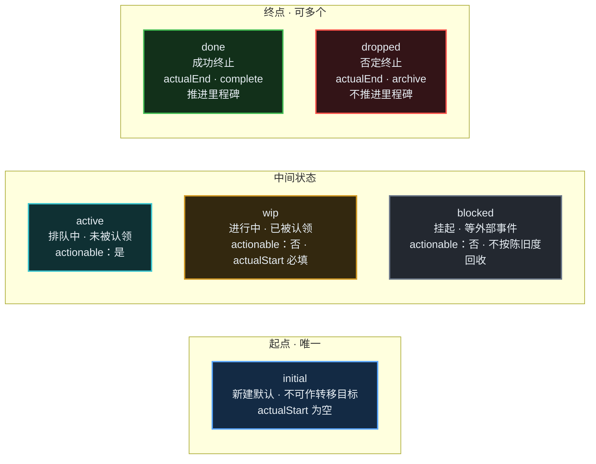
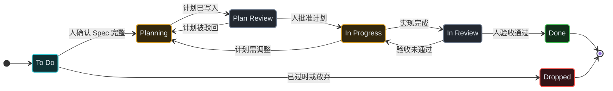
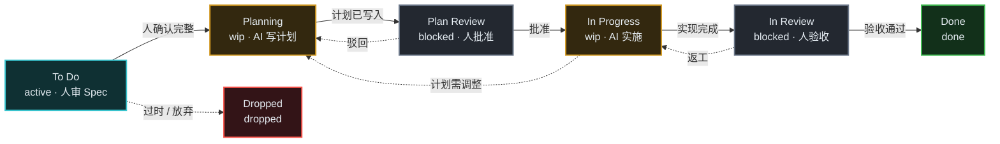

# PRD：默认状态机 —— 让 `To Do / In Progress / Done` 成为真正的状态机

| 项 | 内容 |
|---|---|
| **状态** | 草案（待评审）· 第 7 版 |
| **依据** | `doc-17` 第 9 章（方案 B）、第 6 章（三审查点）、第 12 章（落地路线）、第 13 章（引擎选型：自研，不引依赖） |
| **里程碑** | M1 —— doc-17 落地路线中「近期 / `category` 字段」这一格的第一步 |
| **范围一句话** | 把内建的三列默认值，细化成一个**能承载三审查点的七列状态机**；**代码只声明、只提示，不阻塞不判断**；用户随时能重置回它 |
| **M1 定位** | ① 状态机**能配置** ② 把状态机**讲给 AI 听** ③ 配坏了**能重置**。**不做任何转换拦截与判定** |
| **第 2 版变更** | 默认状态机由 3 列改为 **6 列**——原因见 §1.2 |
| **第 3 版变更** | 实施列由 `Implementing` 更名为 **`In Progress`**：与存量列名对齐，升级时老任务可直接命中同名列——见 §4.5 D6 与 §8 R6 |
| **第 4 版变更** | **撤回「ready 收紧」**：`ready` 只表「依赖已满足且非终态」，语义不动；另新增 `isActionable`（可开工 = ready 且未被认领）。**M1 由此实现零行为变更**——见 §5 FR-4 |
| **第 5 版变更** | ① **去掉 `To Do → Done`** 逃生边（琐碎任务不建记录即可，无需绕路）② **新增 `Dropped` 终态与 `To Do → Dropped`**（很久以前列的、已过时的任务走 archive 归档）→ 默认状态机 **6 列变 7 列** ③ **新增 FR-8：状态机指引注入**，M1 明确只提示不拦截 |
| **第 6 版变更** | **`Dropped` 不自动归档**（见 §4.5 D8）：archive 是**软删除**（`backlog.ts:1502`），归档后任务从所有常规视图消失且 ID 可被复用——这与"过时任务要留档可查"的目标冲突。`exit` 因此降级为「**显式归档时才生效的通道声明**」，不再是"进入即归档" |
| **第 7 版变更** | **补全 `ai` / `if` / `requires` / `evidence` 四个字段**（见 §4.5 D9）：这四个字段原本被整体归入 M2 非目标（NG1），理由是"M1 不校验所以不需要"——**该推理是错的**。`ai` 是**声明**，声明不需要拦截机制；而 M1 的交付物正是「给 AI 的指引」，指引最核心的一句话就是"这步你能不能自己走"。**修正：M1 解析并渲染全部字段，仍然一个都不校验** |
| **第 7 版补充** | 新增 **FR-9 设置页状态机编辑栏**：把对象形式的**可视化编辑**正式纳入 M1，解决 FR-7 的 R2（对象形式只能手改 config.yml）与 R4（Web UI 回写丢字段）。左状态设置 / 右树状 Mermaid / 改动后显「重置」；另设「默认」按钮回退约定七列（FR-5）。对应任务 **BACK-715** |

---

## 1. 背景与问题

### 1.1 现状（源码事实）

> **快照说明（2026-09-29 补）**：本节记录的是 **M1 改造前**的判定方式，用于交代本 PRD 的问题背景。其中「终态取 `statuses` 末位」「`BacklogConfig.statuses: string[]`」「内建默认只三列」等已被 M1 的实现推翻（现状见 §11，以及 FR-1 / FR-2 / FR-3 / FR-9）。

| 语义 | 现在的判定方式 | 位置 |
|---|---|---|
| 终态 | **取 `statuses` 数组最后一个元素** | `src/utils/terminal-status.ts::getTerminalStatus` |
| 进行中 | **硬编码**：归一化后等于 `"inprogress"` | `src/utils/status.ts:100::isInProgressStatus` |
| 新建默认 | `defaultStatus` ?? `FALLBACK_STATUS`（常量 `"To Do"`） | `src/constants/index.ts:51` |
| 配置类型 | `BacklogConfig.statuses: string[]` —— **只有名字，没有语义** | `src/types/index.ts:370` |
| 内建默认 | `DEFAULT_STATUSES = ["To Do","In Progress","Done"]` | `src/constants/index.ts:46` |
| ready 判定 | 非终态 + 依赖全部满足（**不区分是否已在做**） | `src/utils/readiness.ts:96` |
| 时间字段 | 进入 inprogress 填 `actualStart`；进入终态填 `actualEnd` | `src/core/backlog.ts:1724-1730` |
| 里程碑推进 | 进入终态即推进 `actualEnd` 与完成度 | `src/core/backlog.ts:1737-1750` |
| complete 门禁 | 非终态拒绝 `task_complete` | `src/mcp/tools/tasks/handlers.ts:485-492` |
| 指引注入 | `<!-- BACKLOG.MD GUIDELINES START -->` 幂等 marker，写 AGENTS.md / CLAUDE.md | `src/agent-instructions.ts`（`getMarkers()` 现有 `default` / `mcp` 两档） |

### 1.2 真正的病灶：三列压了六个语义位置，两个人类门禁没有落点

Backlog.md 的规范流程是**三审查点**（doc-17 §6）：审 Spec → 审 Plan → 审 Result。但把它摊到三列看板上，位置不够用：

| 真实位置 | 现在挤在哪列 | 谁在动 | 产物 / 门禁 |
|---|---|---|---|
| Spec 待审 | `To Do` | 人 | 描述 + 验收标准 |
| AI 撰写计划 | `In Progress` | AI | `implementationPlan` |
| **Plan 待批准** | `In Progress`（**无落点**） | 人 | 批准 / 驳回 |
| AI 实施 | `In Progress` | AI | 代码 + 测试 + 文档 |
| **Result 待验收** | `In Progress`（**无落点**） | 人 | diff + 测试 + 验收 |
| 完成 | `Done` | — | 走 `task_complete` |

由此产生三个必然结果：

1. **"审核通过后状态不变"是必然的**——没有列可去。Plan 批准这一事件在当前数据模型里**无处记录**，只能落在 comments 里。
2. **AI 只能猜自己在哪一步**：靠 `implementationPlan` 是否为空判断"该写计划还是该写代码"，这是约定不是机制。
3. **人类不知道该在哪点头**：看板上"待批准"和"实施中"长得一模一样。

这正是 doc-17 §6 对 Backlog.md 的核心批评——**三审查点只存在于 README 的图和 MCP 的静态文本里，没有任何工具强制 AI 停下来等人**。门禁是"建议"而非"机制"。

**M1 要做的**：让默认状态机**把六个位置都开出来**，使两个人类门禁各有独立落点；把这台机器**讲给 AI 听**；并保证用户配坏了能一键回到它。

> **M1 不做拦截，这是刻意的**
>
> 状态机在这里的角色是**说明书**，不是**闸门**。M1 交付后，AI 违规推进状态时工具**不报错、不拒绝**。
>
> 要明确区分两件事：**声明字段** vs **用字段去判定**（D9）。
> `ai` / `if` / `requires` / `evidence` 这四个字段 M1 **照常解析、照常渲染进指引**——
> AI 读到"这一步禁止自主推进"的那一刻，声明就已经生效了。
> M1 不做的是**拿这些字段去校验一次转换**（doc-17 §11 的四层校验 + 教学式报错），
> 那会改变既有行为，是一整套独立设计。M1 先把「语义」和「指引」做对，**判定**留给 M2。

---

## 2. 目标与非目标

### 目标

| # | 目标 | 验收口径 |
|---|---|---|
| G1 | `statuses` 支持**对象形式**（状态机定义），纯字符串数组行为**完全不变** | 存量项目零迁移、零报错 |
| G2 | 内建**七列默认状态机**，三个审查点（Spec / Plan / Result）各有状态承载，另有 `Dropped` 收留过时任务 | AC-2 / AC-11 |
| G3 | 终态 / 起点 / 进行中 / `actualStart` / `actualEnd` / 里程碑推进**改为按类别推导** | AC-3 |
| G4 | 新增**「可开工」信号 `isActionable`**（依赖已满足 **且** 尚未被认领），供 AI 取活；**`ready` 语义不动** | AC-4 / AC-14 |
| G5 | 用户可**重置**回默认状态机；配置损坏时**自动回退**而非崩溃 | AC-5 / AC-6 |
| G6 | **存量项目保持不动**：`backlog init` 的新项目拿 7 列，已有 `config.yml` 按旧规则编译 | AC-2b |
| G7 | **M1 零行为变更**：既有字符串数组项目的所有查询结果与今天完全一致 | AC-2b / AC-15 |
| **G8** | **把状态机讲给 AI 听**：自动生成状态机指引并注入 AGENTS.md / CLAUDE.md，**只提示不拦截** | AC-16 / AC-17 |

### 非目标（明确不做）

- **NG1**：**按 `ai` / `if` / `requires` / `evidence` 去校验或拦截转换** → M2（doc-17 §10 / §11）。
  ⚠ 注意边界：这**四个字段本身在 M1 就解析并渲染进指引**（D9），M2 只负责"用它们判定"
- **NG2**：`task_edit` 的转换拦截与教学式报错 → M2（doc-17 §11 C-2 / C-3）。**M1 明确不做任何转换判定**
- **NG3**：MCP 动态状态机资源（`backlog://workflow/state-machine`）→ 见 FR-8，**M1 可选，M2 必做**
- **NG4**：3 列 → 7 列的**存量迁移命令**（本版决定存量不动，见 §8 R6）
- **NG5**：工单类型系统（`type` 字段）→ 见 `doc-18` GAP 1，独立 PRD
- **NG6**：引入任何第三方流程引擎 → doc-17 §13 已结论：自研约 150 行，零依赖
- **NG7**：**改动 `--ready` / `isReady` 的既有语义** —— ready 只回答「前置依赖是否满足」，不兼表「是否已被认领」；后者由新增的 `isActionable` 承担（见 §5 FR-4）
- **NG8**：**任何形式的转换拦截** —— 包括"终态不可出站"也不拦（见 D5）

---

## 3. 术语：六个类别

沿用 doc-17 §9 的六类模型（完整论证见 doc-17）：

| category | 流程角色 | 语义 | 系统行为 |
|---|---|---|---|
| `initial` | 起点 | 新建即在此 | 新建默认；**不可作为任何 `next` 的目标** |
| `active` | 中间 | 可开工（排队中，未被认领） | **计入 actionable**；转入 `wip` 时填 `actualStart` |
| `wip` | 中间 | 进行中 | **不计入 actionable**（已被认领）；`actualStart` 必填 |
| `blocked` | 中间 | 挂起：等待外部事件 | 不计入 actionable；**不按陈旧度自动回收** |
| `done` | 终点 | 成功终止 | 填 `actualEnd`；走 `complete`；**推进**里程碑 |
| `dropped` | 终点 | 否定终止 | 填 `actualEnd`；走 `archive`；**不推进**里程碑 |

七列默认用到**五类**：`active` / `wip` / `blocked` / `done` / `dropped`（未用 `initial`，理由见 D1）。
**`blocked` 与 `dropped` 是这次的两个新增落点**——前者承载两个人类门禁，后者收留过时任务。

> **两个信号，不要混**（第 4 版修正，见 §5 FR-4）：
> **`ready` = 依赖可达性**（我的前置条件满足了没有），**`actionable` = 可开工**（依赖已满足 **且** 还没人在做）。
> 前者是既有的、语义稳定的信号，M1 **不动**；后者是本次新增。

### 3.1 六个类别与它们推导出的系统行为

节点之间**没有画箭头是故意的**：类别只决定"系统如何对待这个状态"，**不决定能走到哪**——
流向由每份配置自己的 `next` 决定（七列默认见 §4.4）。



七列默认的归类：`active`（`To Do`）、`wip`（`Planning` / `In Progress`）、`blocked`（`Plan Review` / `In Review`）、`done`（`Done`）、`dropped`（`Dropped`）。

> 与 §4.4 的分工：**这里是"类别视角"**（系统如何对待每一类），**§4.4 是"状态视角"**（具体列名、全部合法转换与回退边）。

---

## 4. 默认状态机：七列

### 4.1 定义

> **第 7 版修正**：本版补全 `ai` / `if` / `requires` / `evidence` 四个字段。
> 此前它们被整体归入 M2（NG1），理由是"M1 不校验所以不需要"——**这个推理是错的**：
> `ai` 是**声明**，声明不需要拦截机制。而 M1 的交付物是「给 AI 的指引」，
> 指引最核心的一句话正是"这步你能不能自己走"；没有 `ai` 字段，这句话只能硬编码进渲染逻辑，
> 用户改了配置指引不会变——状态机就白配了。
> **修正后 M1 解析并渲染全部字段，仍然一个都不校验**（D9）。

```yaml
statuses:
  - name: To Do
    category: active          # 可开工：actionable 队列入口
    next:
      - to: Planning
        when: "人类已确认描述与验收标准完整，可以开工"
        ai: allowed                        # 自主：AI 可自行开始写计划
      - to: Dropped
        when: "任务已过时或被放弃（如很久以前列的、现在不再需要做）"
        ai: propose                        # 提议：放弃与否由人决定

  - name: Planning
    category: wip             # AI 在写计划
    next:
      - to: Plan Review
        when: "实现计划已写入 implementationPlan"
        ai: allowed_if                     # 条件自主：写完了自己交审，没写完就交给人
        if: "implementationPlan 非空"
        requires: "implementationPlan 非空"

  - name: Plan Review
    category: blocked         # 等人类批准计划
    next:
      - to: In Progress
        when: "人类已批准实现计划"
        ai: forbidden                      # 禁止：批准是人类的决策
      - to: Planning
        when: "计划被驳回或需修改"
        ai: propose                        # 提议：驳回由人执行
        evidence: "comments（写明驳回理由）"

  - name: In Progress
    category: wip             # AI 在按计划实施
    next:
      - to: In Review
        when: "实现完成，diff / 测试 / 验收说明已就绪"
        ai: allowed_if                     # 条件自主：材料齐了自己交验
        if: "finalSummary 非空"
        requires: "finalSummary 非空"
      - to: Planning
        when: "实施中发现计划需要调整"
        ai: allowed                        # 自主：AI 可自行回退改计划

  - name: In Review
    category: blocked         # 等人类验收结果
    next:
      - to: Done
        when: "人类验收通过"
        ai: forbidden                      # 禁止：验收是人类的决策
      - to: In Progress
        when: "验收未通过，需返工"
        ai: propose                        # 提议：打回由人执行
        evidence: "comments（写明返工理由）"

  - name: Done
    category: done
    exit: complete            # 显式 task_complete → completed/，推进里程碑
    next: []

  - name: Dropped
    category: dropped
    # exit 声明的是「归档通道」，不是「进入即归档」。
    # 只有人显式执行 `backlog task archive <id>` 时才生效；M1 不会自动归档（见 D8）。
    exit: archive
    next: []
```

**`if` 与 `requires` 为何写两遍**：两者常指向同一条件，但语义不同（doc-17 §9 ②）——
`requires` 是「**走这条边的资格**」（缺了就走不了），`if` 是「**AI 自主的资格**」（缺了就回落提议）。
M1 都不校验，但会分别渲染进指引的不同位置。

> **`exit` 的精确语义（易被误读，务必按此实现）**
> `exit` **不是**"进入该状态就自动移文件"。它回答的是：当有人**显式执行归档命令**时，这个终态该走哪个通道。
> 是否归档永远由**人**（或 M2 的显式策略）决定，不由状态机自动触发。

### 4.2 状态表

| 状态 | category | 谁在动 | 产物 / 门禁 | 可开工（actionable） | 陈旧回收 |
|---|---|---|---|---|---|
| `To Do` | `active` | 人（审 Spec） | 描述 + 验收标准 | ✅ | 是 |
| `Planning` | `wip` | AI | `implementationPlan` | ❌ | 是 |
| `Plan Review` | `blocked` | 人（审 Plan） | 批准 / 驳回 | ❌ | **否** |
| `In Progress` | `wip` | AI | 代码 + 测试 + 文档 | ❌ | 是 |
| `In Review` | `blocked` | 人（审 Result） | 验收 / 返工 | ❌ | **否** |
| `Done` | `done` | — | 显式 `task_complete` → `completed/` | ❌ | — |
| `Dropped` | `dropped` | 人（决定放弃） | **留在看板**：可查可统计，不推进里程碑（= 留档，见 D8） | ❌ | — |
| （非状态）归档 | — | 人（要求清除） | 在 **`To Do`** 执行 `task_archive` → `archive/`，**任务消失** | — | — |

**两个终态的区别必须让 AI 分清**（指引文本里会显式写出，见 FR-8）：

| | `Done` | `Dropped` |
|---|---|---|
| 语义 | 做成了 | 没做成 / 不做了 |
| 默认归宿 | **留在看板**（两个终态都不自动归档） | 同左 |
| 归档 | 显式 `task_complete` → `completed/` | **不归档**——它就是留档本身（D8） |
| 里程碑 | **推进** | **不推进** |
| `task_complete` | 允许 | **拒绝**（`task_archive` 也拒绝，终态） |

> ⚠ **归档即软删除，且入口在 `To Do` 不在 `Dropped`**
> 想彻底清除一个过时任务：在 **`To Do`** 状态执行 `task archive`（`To Do` 非终态，门禁不拦）。
> 一旦改成 `Dropped`，就表示「留下这条记录」，此后归档不了——这是刻意的语义分工，见 D8。

### 4.3 三个审查点如何落位（与现状对照）

| 审查点 | 现在 | M1 之后 |
|---|---|---|
| **审 Spec**（描述 + 验收标准） | `To Do` 列，审完无事件记录 | 仍在 `To Do`；人类批准确认后 → 迁 `Planning` |
| **审 Plan**（实施计划） | 挤在 `In Progress`，**审完状态不变** | 独立列 `Plan Review`；**批准 = 迁到 `In Progress`**，驳回 = 退回 `Planning` |
| **审 Result**（diff + 测试 + 验收） | 挤在 `In Progress`，**审完状态不变** | 独立列 `In Review`；**验收通过 = 迁到 `Done`**，返工 = 退回 `In Progress` |

批准后"状态不变"这个问题由此消失：**批准本身就是一次状态迁移**。

### 4.4 图形视图



按「谁在动」切开看，AI 区与人类区一目了然（`blocked` 两列 = 人类区）：



### 4.5 七个设计决策

**D1 · `To Do` 标 `active`，不标 `initial`**

- 理由：七列板里 `To Do` 同时承担「新建默认」与「可退回队列」两个角色。`Plan Review → Planning` 乃至未来「打回重开」都要求它能作为转移目标；而 `initial` 的规则是**只能作转移源**。
- 起点语义由 `initialStatus() = initial ?? names()[0]` 承担，与现状 `FALLBACK_STATUS = "To Do"` 等价。
- 代价：默认机器没有「起点不可倒流」的硬约束。看板类流程本来就该允许回退，可接受。需要硬约束的项目自行加 `initial` 列。

**D2 · 两个人类门禁用 `blocked`，不用 `wip`**

- 这是本次修订的关键。`blocked` 的系统行为正好匹配门禁：不计入 actionable（已被人认领处理中）、**不按陈旧度自动回收**（区别于真正被废弃的任务）。
- 若标成 `wip`，则"卡在等人批准三周"的任务会被 `overview` 的 `staleTasks` 当成陈旧任务——语义错误。
- 附带收益：可以统计「有多少任务卡在 Plan Review / In Review」，这是流程瓶颈的第一手数据。

**D3 · `Planning` 与 `In Progress` 必须分开，不能靠 `implementationPlan` 是否为空来猜**

- 两者产出物不同（计划 vs 代码 + 测试），人类介入方式不同，失败后的回退目标也不同。
- 合并成一个 wip 列会让 AI 仍需读字段判断阶段——那就又回到"约定"而非"机制"，本 PRD 存在的意义就没了。

**D4 · 去掉 `To Do → Done` 直跳边**（第 5 版修正）

- 原方案保留这条"琐碎任务逃生边"，**现删除**。理由：琐碎的事（改个 typo、调个配置）**根本不需要建任务记录**——
  直接做完即可，不必为了关闭一条记录而在状态机里开一条绕过所有门禁的后门。
- 后门的代价大于收益：它让"没走完三审查点也能到 `Done`"成为合法路径，
  与 §1.2「让三审查点成为机制」的目标直接冲突，且污染完成度统计。
- 若某项目确实需要跳过计划 → 自行在 `config.yml` 里加回这条边（配置是开放的）。

**D5 · 两个终态的 `next: []`，但 M1 不拦截**

- 声明「终态不可出站」与 doc-17 的 Lint 规则一致；**M1 不启用拦截**，所以今天「把 Done 改回继续做」的用法不受影响。
- M2 上线拦截时再定重开方案（候选：`reopenTo` 字段或专门命令），本 PRD 不预先决定。

**D6 · 实施列沿用存量列名 `In Progress`，不新造 `Implementing`**

- 理由一：三列里的 `To Do` / `In Progress` / `Done` 与七列**同名**，存量项目升级时老任务**直接命中同名列**，无需迁移（§8 R6 由高风险降为低风险）。
- 理由二：与纯字符串数组的编译规则一致——归一化后等于 `inprogress` 即 `wip`（FR-7）。若默认机器另造名字，就会出现「默认配置」与「存量配置」两套词汇。
- 代价：单看列名无法区分「写计划」与「实施」。这正是 `Planning` 必须独立成列的原因（D3），而不是把两者合并的理由。
- 中文对照标注为「进行中（实施）」，以区别于 `Planning` 的「计划中」。

**D7 · 必须有 `Dropped` 终态，`To Do → Dropped` 是它的入口**（第 5 版新增）

- 场景：**很久以前列的任务，现在过时了、不做了**。这类任务没有"完成"，也不该留在看板上冒充积压。
- 为什么不能归到 `Done`：`Done` 会**推进里程碑完成度**，把从未做过的事算成已交付，污染统计。
- 为什么必须是独立列而不是直接删文件：删除丢失历史；`Dropped` 走 `archive` 通道（`backlog/archive/`），
  保留记录、填 `actualEnd`、**不推进**里程碑——这正是 `dropped` 这个类别存在的全部意义（doc-17 §9 ①）。
- 入口只开在 `To Do`：符合"还没开始就发现不用做"的场景。若某项目需要在中途放弃，自行加边（见 §12 待定 8）。

**D8 · 归档的入口是 `To Do`，不是 `Dropped`**（第 6 版修正）

这是第 6 版最重要的一条。**第 5 版把 `Dropped` 写成"走 archive 归档"，会让过时任务消失**，与 D7 的初衷自相矛盾。

源码事实（**这三条是既定的、M1 一律不改**）：

| # | 事实 | 位置 |
|---|---|---|
| 1 | archive = **软删除**：归档后 ID 可被复用 | `src/core/backlog.ts:1502-1503`（注释原话 "archived IDs can be reused. This makes archive act as a soft delete"） |
| 2 | `queryTasks()` **不含 archive**，即使 `includeCompleted: true` | `src/core/backlog.ts:783-793` |
| 3 | **只有终态被拒绝 `task archive`** | `src/cli.ts:3884-3890`（提示"终态应该 complete，不是 archive"）——**非终态不拦** |

第 3 条是破局点：门禁只拦**终态**，而 **`To Do` 是 `active`，不是终态** → `task archive` 正常放行。

于是归档有**两条路径，语义完全不同**，且都不需要改任何源码：

| 意图 | 路径 | 结果 |
|---|---|---|
| **留档**（过时了，但别抹掉历史） | `To Do` → **`Dropped`** | 留在 `backlog/tasks/` 与看板，**可查可统计**，不推进里程碑 |
| **清除**（确实不想要这条记录了） | 在 **`To Do`** 状态下执行 `task archive` | 进 `backlog/archive/`，**从所有常规视图消失**，ID 可复用 |

**关键结论**：想彻底删除一个过时任务，**不要先改成 `Dropped`**——直接从 `To Do` 归档即可。
改成 `Dropped` 表达的恰恰是「**我要留下这条记录**」，此后它就归档不了了（终态被拒）——
这不是缺陷，是**语义**：`Dropped` = 决定不做但保留历史；`archive` = 彻底清除。

由此确定四条：

1. **`exit: archive` 不接线**：M1 不解析它做任何动作，仅作为语义声明（"这是否定终止、不属于 completed 通道"）保留，供未来接线。
2. **不实现自动归档**：M1 与 M2 均不做"进入终态自动归档"（现状 `updateTask` 进入终态也只填 `actualEnd`，`backlog.ts:1727-1728`）。
3. **`Dropped` 列变长是特性不是 bug**：那是项目的放弃史，可查、可统计、不污染完成度。
4. **AI 不得自主归档**：归档会让任务从所有视图消失，属不可逆操作。只有人类**明确要求**时才执行，且执行前应提示后果（写入 FR-8 指引）。

**D9 · M1 解析并渲染全部字段，但一个都不校验**（第 7 版新增）

这是第 7 版的核心修正。字段要分两类看：

| 类别 | 字段 | M1 用法 |
|---|---|---|
| **语义字段** | `name` / `category` / `next[].to` / `exit` | **推导系统行为**（终态、wip、actualStart/End、里程碑、通道） |
| **声明字段** | `next[].when` / `ai` / `if` / `requires` / `evidence` | **只渲染进指引**，不参与任何判定 |

三条理由：

1. **声明不需要拦截机制也能生效**。`ai: forbidden` 的价值在于**被讲出来**——AI 读到"这一步禁止自主推进"就会停下来。
   把它推到 M2，等于说"没有闸门就没有交通标志"，这是错的：标志和闸门是两样东西。
2. **不解析 = 状态机白配**。M1 的交付物就是指引。若 `ai` 不被解析，指引里那句"这步你能不能自己走"
   只能硬编码进 `describe()`，用户改了配置指引不会变——配置就退化成了装饰品。
3. **`requires` 在 M2 的权限表里无处可挂**。§10 写满了 "`allowed_if`（`implementationPlan` 非空）"，
   这些条件在配置里必须有地方落笔；若 M1 不认识 `requires`/`if`，§10 整张表就是悬空的。

由此确定 M1 的处置：

- **解析**全部六个字段（含 `ai` / `if` / `requires` / `evidence`），未知字段仍按 FR-6 告警并忽略，不报错。
- **渲染**全部字段进 `describe()`（FR-8）：`when` 进"什么条件下走"、`ai`+`if` 进"AI 能不能自主"、`requires`+`evidence` 进"要带什么材料"。
- **校验零个字段**：不在运行时拒绝任何一次状态变更（NG8 / AC-18）。
- **唯一例外**：`validate()` 的 ⑨⑩ 会读 `ai` / `if` 判断"这份配置写得对不对"。
  这是**配置 Lint**，不是运行期校验——它不拒绝状态变更，与 NG8 不冲突。

> **缺省值**：转换未写 `ai` 时，指引按 **`propose`** 渲染（保守档：备好材料、等人决定），
> 不默认成 `allowed`。权限应当**显式声明**才生效（doc-17 §10）。

### 4.6 状态名语言

canonical 使用**英文**（兼容存量项目、MCP status enum 与既有文档）。
`category` 已不再依赖状态名（这正是本 PRD 的收益），中文命名可在任何项目里随时改：

| canonical | 中文对照 |
|---|---|
| To Do | 待办 |
| Planning | 计划中 |
| Plan Review | 待批准 |
| In Progress | 进行中（实施） |
| In Review | 待验收 |
| Done | 已完成 |
| Dropped | 已放弃 |

---

## 5. 功能需求

### FR-1 配置结构：`statuses` 支持对象形式（向后兼容）

见 §4.1 的完整定义。字段表：

| 字段 | 必填 | 取值 | M1 的行为（**解析·渲染·不校验**，D9） |
|---|---|---|---|
| `name` | ✅ | 字符串，全局唯一 | 看板列名、`--status` 取值 |
| `category` | ❌ | `initial/active/wip/blocked/done/dropped` | **语义字段**：驱动 §FR-3 全部语义推导；**缺省时按字符串数组规则推断**（见 FR-7） |
| `next[].to` | ❌ | 已存在的状态名 | **语义字段**：仅声明合法去向 + 渲染进指引，**不拦截**（M2 才判定） |
| `exit` | 终态必填 | `complete` / `archive` | **语义字段**：声明归档通道，仅在人显式执行归档命令时生效；**不触发任何自动归档**（D8） |
| `next[].when` | 出度 > 1 时必填 | 自然语言 | **声明字段** → 渲染进指引「什么条件下走这条边」；不校验 |
| `next[].ai` | ❌ | `allowed` / `allowed_if` / `propose` / `forbidden` | **声明字段** → 渲染进指引「AI 能不能自己走」；**缺省回落 `propose`**（保守档）；不校验 |
| `next[].if` | `ai: allowed_if` 时必填 | 条件描述 | **声明字段** → 渲染进指引「自主的条件是什么，不满足就交给人」；不校验 |
| `next[].requires` | ❌ | 机器可判定前置（声明式子集） | **声明字段** → 渲染进指引「走这条边要具备什么」；**M1 不求值**（求值属 M2） |
| `next[].evidence` | ❌ | 需附带的材料说明 | **声明字段** → 渲染进指引「要带什么材料」；不校验 |
| 其他未知字段 | — | — | 告警并忽略，不报错（FR-6 结构级之外） |

**编译器契约**：新增 `compileStateMachine(statuses)`，对外暴露（doc-17 §13.4 骨架的 M1 子集）：

```ts
class StateMachine {
  names(): string[]                       // 取代到处传的 string[]，供 CLI 校验 / MCP enum
  categoryOf(s: string): Category         // 未知状态回落 active
  terminalStatuses(): string[]            // done | dropped
  initialStatus(): string                 // initial ?? names()[0]
  isInProgress(s: string): boolean        // category === wip      → actualStart
  isTerminal(s: string): boolean          // done | dropped        → actualEnd / complete 门禁
  isActionableStatus(s: string): boolean  // active | initial      → 可开工（未被认领）
  isWaitingOnHuman(s: string): boolean    // blocked               → 不按陈旧度回收
  exitChannel(s: string): "complete" | "archive" | undefined

  // ↓ 以下两个是第 7 版为 FR-8 新增的「只读查询」——只取字段，不判定
  transitionsOf(s: string): Transition[]          // to/when/ai/if/requires/evidence 原样带出
  aiPolicyOf(from: string, to: string): AiPolicy  // allowed|allowed_if|propose|forbidden；缺省 propose

  validate(): LintIssue[]                 // FR-6：配置 Lint（不是运行期校验）
  describe(): string                      // FR-8：渲染成给 AI 看的指引文本（M1 渲染全部字段）
}
```

> **契约边界（务必按此实现）**：`transitionsOf()` / `aiPolicyOf()` 是**取数**，不是**判定**。
> 它们回答"配置里写了什么"，**绝不回答"这次转换能不能走"**——后者是 M2 的 `transition()`。
> M1 里不存在任何返回"允许 / 拒绝"的方法。

> **实现约束（doc-17 §13）**：放在 `src/core/state-machine.ts`，约 150 行，**零新增依赖**（Backlog.md 用 `bun build` 打单文件二进制，每引入一个依赖都带进一整套概念模型）。

### FR-2 内建默认状态机

`DEFAULT_STATUSES` 由 `["To Do","In Progress","Done"]` 改为**七列的对象形式**（§4.1）。
`FALLBACK_STATUS` 保持 `"To Do"` 语义不变（由 `initialStatus()` 推导得到）。

### FR-3 按类别推导取代位置约定与硬编码

| 语义 | 现在 | M1 之后 | 需改的源码位置 |
|---|---|---|---|
| 终态 | 数组末位 | `category ∈ {done, dropped}`；纯字符串数组**回退末位规则** | `src/utils/terminal-status.ts` |
| 进行中 | 归一化 `== "inprogress"` | `category === wip` | `src/utils/status.ts:100` |
| 新建默认 | `defaultStatus` ?? `"To Do"` 常量 | `defaultStatus` ?? `sm.initialStatus()` | 创建路径（`src/core/backlog.ts` 与向导） |
| `actualStart` | 进入 inprogress | 进入 `wip`（已有值则不覆盖，现状逻辑保持） | `src/core/backlog.ts:1724` |
| `actualEnd` | 进入终态（末位） | 进入 `done` / `dropped` | `src/core/backlog.ts:1727` |
| 里程碑推进 | 进入终态即推进 | **仅 `done` 推进**，`dropped` 不推进 | `src/core/backlog.ts:1737-1750` |
| complete 门禁 | 非末位拒绝 | 非 `done` 拒绝；`dropped` 走 `archive` | `src/mcp/tools/tasks/handlers.ts:485-492` |
| archive 门禁 | 终态一律拒绝 archive | **不变**（事实 3，M1 不改）——后果：`Dropped` 无法归档，永远留在看板（D8） | `src/cli.ts:3884-3890`（**不改**） |
| 自动归档 | 无 | **不变**：进入终态只填 `actualEnd`，不移动文件（D8） | `src/core/backlog.ts:1727-1728`（**不改**） |
| archive 可见性 | `queryTasks()` 不含 archive | **不变**（事实 2，M1 不改） | `src/core/backlog.ts:783-793`（**不改**） |
| `ready`（**语义不变**） | 非终态 + 依赖满足 | **同左**。只把「终态」判定从"数组末位"换成 `category ∈ {done, dropped}` | `src/utils/readiness.ts:96`（仅替换 `isTerminalStatus` 的实现依据） |
| `actionable`（**新增**） | 无 | `ready` **且** 状态类别 `∈ {active, initial}` | 状态级 `sm.isActionableStatus(status)`（`src/core/state-machine.ts`）+ 任务级 `isActionable(task)` |
| 陈旧回收 | 未区分 | `blocked` **不参与**陈旧回收 | `overview` / `projectHealth` 的 stale 统计 |
| CLI `--status` 校验 | 读 `config.statuses` | 读 `sm.names()` | `src/cli.ts:294`（`getValidStatuses`） |
| MCP status enum | 由 `statuses` 生成 | 由 `sm.names()` 生成 | `src/mcp/utils/schema-generators.ts` |

### FR-4 新增「可开工」信号 `isActionable`（`ready` 语义不变）

> **第 4 版修正**。第 2/3 版曾计划「收紧 ready：把 `wip`/`blocked` 排除出 ready」，**此方案已废弃**。
> 理由：`isReady` 的契约是「依赖已满足且非终态」（`src/utils/readiness.ts:8` 注释与 `:96` 实现），
> 回答的是**我的前置条件满足了没有**，与「这活有没有人在做」是两个正交维度。把认领状态塞进 ready
> 会让一个信号承担两个语义，且构成 M1 唯一的行为变更 —— 与「存量不动」原则冲突。

**结论：ready 不动，另开一个信号。**

| 信号 | 含义 | 判定 | 状态 |
|---|---|---|---|
| `isReady` | 依赖可达：前置依赖全部完成，且本任务未终止 | 非终态 **且** 依赖全满足 | **既有，M1 不改语义**（仅把终态判定换成 category 推导） |
| `isBlocked` | 有未完成或无法解析的依赖 | 既有 | **既有，不变** |
| `isActionable`（任务级） | 可开工：依赖已满足 **且** 尚未被认领 | `isReady && sm.isActionableStatus(task.status)` | **本次新增** |
| `isActionableStatus`（状态级） | 该状态是否属于"排队中、可认领" | `category ∈ {active, initial}` | **本次新增**（状态机方法） |

两个层级的命名必须分开，避免 `isActionable(s)` 到底是传状态还是传任务产生歧义。

**七列默认下的效果**（这正是 doc-17 §6 要的「AI 工作入口」）：

- `Planning` / `Plan Review` / `In Progress` / `In Review` / `Done` / `Dropped` 均非 actionable —— **AI 不会自己把等人的活、或自己已经在做的活再领一遍**。
- 只有 `To Do` 是 actionable。

**暴露方式（零行为变更）**

| 面 | 现状 | M1 之后 |
|---|---|---|
| CLI | `backlog task list --ready` | `--ready` **语义不变**；新增 `--actionable`（可选过滤，默认关闭） |
| MCP | `task_list --ready` | `--ready` **语义不变**；新增 `--actionable` |
| 七列项目的零新增替代 | — | `task_list --ready --status "To Do"` 已等价于可开工队列（因 `active` 列只有 `To Do`） |

- 对既有**字符串数组**项目：`isActionable` 的推导结果是「非终态 + 依赖满足 + 非 `wip`」，
  即会把 `In Progress` 排在外 —— 但**只有显式传 `--actionable` 才会生效**，默认路径完全不受影响。
- **不需要逃生舱**：没有任何既有行为被改变，也就没有需要逃的。
- `--actionable` 是否进 M1a 还是 M1b 见 §9；即使暂不上 CLI flag，`isActionable()` 也必须先落地（供 FR-8 的 `describe()` 使用）。

### FR-5 重置能力（用户配坏后可回到默认）

三种触发，缺一不可：

**① 显式命令**

```bash
backlog config reset statuses              # 写回默认七列，并打印前后值
backlog config reset statuses --dry-run    # 只打印将写入的内容，不落盘
```

- 写回内容为**对象形式的七列默认状态机**，并**同时刷新 AGENTS.md / CLAUDE.md 的状态机指引**（FR-8）——**注意：指引刷新依赖 FR-8，而 FR-8 尚未实现**；当前设置页的「默认」按钮只写回 `statuses`，不刷新 agent 指引。
- ⚠ 对原本是三列的存量项目，这是**升级而非还原**。命令必须显式提示退路：
  ```text
  已将 statuses 重置为默认状态机（7 列）：
    To Do → Planning → Plan Review → In Progress → In Review → Done
    To Do → Dropped
  若需保留原来的 3 列，执行：
    backlog config set statuses '["To Do","In Progress","Done"]'
  ```

**② 加载时兜底（配置损坏不许崩）**

`compileStateMachine()` 遇到**结构级错误**（见 FR-6）时：

1. 在内存中使用 `DEFAULT_STATE_MACHINE` 继续运行（命令不失败）；
2. 向 **stderr** 打印告警，并提示可执行 `backlog config reset statuses` 落盘；
3. **绝不静默改写**用户的 `config.yml`（只有显式 reset 才写）。

```text
⚠ backlog/config.yml 的 statuses 无法解析：状态 "Plan Review" 的 next 指向不存在的状态 "Plan Aproved"。
  本次运行已回退到默认状态机（7 列）。
  修复：编辑 backlog/config.yml，或执行 backlog config reset statuses 恢复默认。
```

**③ 校验命令**

```bash
backlog config validate          # 输出所有 Lint 问题（结构级 + 语义级），退出码 1 表示有问题
```

### FR-6 配置校验（Lint）

| 级别 | 规则 | 处置 |
|---|---|---|
| **结构级**（M1 实现） | ① `statuses` 非数组或空<br>② 元素既非字符串也非缺 `name` 的对象<br>③ `name` 重复<br>④ `category` 取值不在六类中<br>⑤ `next[].to` 指向不存在的状态<br>⑥ 终态（`done`/`dropped`）缺 `exit` | **回退默认 + stderr 告警** |
| **语义级**（M1 实现全部五条） | ⑦ 出度 > 1 但某条边缺 `when`<br>⑧ `initial` 出现在任何 `to` 中<br>⑨ 指向终态的边 `ai: allowed`<br>⑩ `allowed_if` 缺 `if`<br>⑪ `ai` 取值不在四档内 | **仅告警**，不回退 |

- **⑨⑩⑪ 在第 7 版进入 M1**：既然 M1 已解析 `ai` / `if`（D9），这三条就是顺手可得的配置自检，成本极低。
  注意它们是**配置 Lint**——只回答"这份配置写对了没有"，**不会在运行时拒绝任何状态变更**（NG8）。
  默认七列机器**自洽**：两条终态入边分别是 `propose` 与 `forbidden`，两条 `allowed_if` 都写了 `if`，故 ⑨⑩ 均不触发。
- 未知字段（配置里出现了本表之外的键）→ **告警并忽略，不报错**；`ai` 取值非法 → 告警并按 `propose` 渲染（保守档，D9）。
- 额外教学式告警（M1 实现，价值很高）：
  当 `statuses` 是**纯字符串数组且非默认三列**时提示——
  `statuses 未声明 category，终态按"数组最后一个"推断为「未通过」。若存在多个语义相反的终态，请改用对象形式显式声明 category。`

> **注意：Lint 是对「配置」的校验，不是对「转换」的校验。**
> M1 的 Lint 只回答"这份配置写对了没有"，**永远不会在运行时拒绝一次状态变更**（NG8）。

### FR-7 存量不动：迁移与兼容

- **纯字符串数组**编译规则（M1 明写进代码，即现状两条约定，只是搬进编译器）：
  - 末位 → `done`（`exit: complete`）
  - 归一化后等于 `inprogress` → `wip`
  - 其余 → `active`
  - `next`：**不限制**（任意非终态之间互转、非终态 → 终态），终态不可出
- 由此 **`["To Do","In Progress","Done"]` 编译结果与今天完全一致**，存量项目**零行为变化**（第 4 版起不再有任何例外项）。
- `backlog init` 生成的 `config.yml` 写入**七列对象形式**（新项目直接拿到语义）。
- CLI `backlog config set statuses` **只接受字符串数组**（shell 传对象形式不现实）；对象形式可在**设置页编辑栏**维护（FR-9 / BACK-715，走 `PUT /api/config/statuses`），或手工编辑 `config.yml` —— FR-5 的「CLI 重置」仍待做。
- Web UI / 浏览器向导的状态编辑路径需同步改为写 `name` 集合，避免把对象形式降级成字符串时丢字段（核对 `src/web/components/Board.tsx` 与向导写入处；具体编辑栏设计见 **FR-9**）。

### FR-8 给 AI 的状态机指引（M1 的核心交付物）

> **这是第 5 版新增的需求，也是 M1 的立身之本。**
> 状态机配好了、语义推导对了，但**如果 AI 看不到这台机器，一切等于零**。
> M1 交付的是「说明书」：让 AI 在开始干活前就知道——有哪些状态、从当前状态能去哪、哪两步必须停下来等人。

#### 原则：只提示，不判定

| | M1 做法 |
|---|---|
| 转换合法性（`next[].to` / `when`） | **只写进指引文本，不校验**。AI 越界推进时工具**不报错、不拒绝**（AC-18） |
| 人类门禁（`ai: forbidden`） | **渲染成「禁止自主，停下来等人」**，不做任何强制 |
| AI 自主边界（`ai` / `if`） | **渲染四档权限表 + 每条边的档位**；`allowed_if` 的条件成立与否**不判定** |
| 前置条件（`requires`） | **渲染成「走这条边要具备什么」**，**不求值** |
| 证据要求（`evidence`） | **渲染成「要带什么材料」**，**不检查** |
| 配置错误 | 告警并回退默认，**不崩**（FR-6） |

一句话概括：**配置里写了什么，指引里就写什么；写了不等于查**。

#### 生成内容：`StateMachine.describe()`

由配置**自动渲染**，不手写（改了配置就变）。渲染**全部字段**——`name` / `category` / `next[].to` / `when` / `ai` / `if` / `requires` / `evidence` / `exit`（D9），
但**一个都不校验**。

> **纯字符串数组项目的渲染例外**（FR-7 编译结果，无 `next` 信息）：
> 不渲染 `ai` 档位表（配置里没有），改渲染一句
> 「本项目未声明转换规则，状态可在任意非终态之间流转」——否则会把存量三列项目里
> 每一条正常流转都渲染成"只能提议"，反而误导 AI。

```markdown
<!-- BACKLOG.MD STATE MACHINE START -->

## 项目状态机（自动生成，请勿手改）

> **本段是说明，不是强制**：工具**不会阻止**任何越界的状态变更。
> 下面的权限档位靠 AI 自觉遵守，M2 起将转为真正的校验。

本项目共 7 个状态：

| 状态 | 类别 | 含义 |
|---|---|---|
| To Do | active | 可开工，尚未被认领 |
| Planning | wip | 进行中：正在写实现计划 |
| Plan Review | blocked | 挂起：等待人类批准计划 |
| In Progress | wip | 进行中：正在实施 |
| In Review | blocked | 挂起：等待人类验收结果 |
| Done | done | 成功终止：已完成 |
| Dropped | dropped | 否定终止：已放弃或过时 |

### AI 权限档位（由配置的 `ai` 字段生成）

| 档位 | 含义 | AI 该怎么做 |
|---|---|---|
| `allowed` | 可自主执行 | 直接推进，无需请示 |
| `allowed_if` | 满足条件才自主 | 条件成立 → 自主推进；**不成立 → 备好材料交给人类**（不是禁止） |
| `propose` | 只能提议 | 备好材料，等人类决定，**不要自己推进** |
| `forbidden` | 禁止自主 | **停下来等人**，任何情况下不得自行推进 |

### 下一步可以走哪条（按当前状态查表）

**当前在 To Do**
- → `Planning`：当 人类已确认描述与验收标准完整，可以开工　·　`allowed`：**可自主执行**
- → `Dropped`：当 任务已过时或被放弃（如很久以前列的、现在不再需要做）　·　`propose`：**只能提议，等人类决定**

**当前在 Planning**
- → `Plan Review`：当 实现计划已写入 implementationPlan　·　`allowed_if`：**满足「implementationPlan 非空」可自主，否则交给人类**　·　需具备：implementationPlan 非空

**当前在 Plan Review**
- → `In Progress`：当 人类已批准实现计划　·　`forbidden`：**禁止自主，必须等人类批准**
- → `Planning`：当 计划被驳回或需修改　·　`propose`：**只能提议，等人类决定**　·　需带：comments（写明驳回理由）

**当前在 In Progress**
- → `In Review`：当 实现完成，diff / 测试 / 验收说明已就绪　·　`allowed_if`：**满足「finalSummary 非空」可自主，否则交给人类**　·　需具备：finalSummary 非空
- → `Planning`：当 实施中发现计划需要调整　·　`allowed`：**可自主执行**

**当前在 In Review**
- → `Done`：当 人类验收通过　·　`forbidden`：**禁止自主，必须等人类验收**
- → `In Progress`：当 验收未通过，需返工　·　`propose`：**只能提议，等人类决定**　·　需带：comments（写明返工理由）

**当前在 Done / Dropped**：终态，无出边。

### 两个终态的区别（不要选错）

| | Done | Dropped |
|---|---|---|
| 语义 | 做成了 | 没做成 / 不做了 |
| 归档 | 显式 task_complete → completed/ | **不归档**——它就是留档本身 |
| 里程碑 | 推进 | 不推进 |
| 可用工具 | task_complete | 无——留在 `Dropped` 列即可，它不影响任何统计 |

### 关于归档（不可逆，谨慎）

归档 = **软删除**：任务移入 `backlog/archive/`，从此**不在 task list / 看板 / overview 中出现**，
且**任务 ID 可被后续新建任务复用**。

**归档的入口是 To Do，不是 Dropped**：
- 想**彻底清除**一条任务 → 在 `To Do` 状态执行 `task archive`（`To Do` 非终态，允许归档）
- 想**保留记录**但标记"不做了" → 迁到 `Dropped`（此后归档不了，因为终态被拒）

**AI 规则**：**不得自主归档任何任务**。归档会让任务消失，属不可逆操作。
只有在人类**明确要求**时才执行，执行前须说明「该任务将从所有视图消失，ID 可被复用」。

### 需要停下来等人的地方

本表由 `ai ∈ {forbidden, propose}` 的边**自动生成**（不是手写）：

- **`Plan Review → In Progress`**（`forbidden`）：等人类批准实现计划
- **`In Review → Done`**（`forbidden`）：等人类验收实现结果
- **`To Do → Dropped`**（`propose`）：是否放弃由人类决定
- **`Plan Review → Planning`**（`propose`）：驳回由人类执行
- **`In Review → In Progress`**（`propose`）：返工由人类决定
- **归档**（非状态转换）：等人类明确要求，AI 不得自主执行

<!-- BACKLOG.MD STATE MACHINE END -->
```

#### 注入点

| 优先级 | 注入到哪 | 机制 | 现状 |
|---|---|---|---|
| **P0（M1 必做）** | `AGENTS.md` / `CLAUDE.md` / `GEMINI.md` / Copilot 指令文件 | `src/agent-instructions.ts` 的幂等 marker 块。**新增第三种 marker kind `state-machine`**（现有 `default` / `mcp` 两档，见 `getMarkers()`） | 机制已存在，只需加一档 kind + 渲染函数 |
| P1（M1 可选） | MCP resource `backlog://workflow/state-machine` | `src/mcp/workflow-guides.ts` 的 `WORKFLOW_GUIDES` 目前是**编译期静态常量**，动态内容需新增生成函数 | M1 可做可不做，M2 必做 |

- **刷新时机**：`backlog init`、`backlog config reset statuses`、`backlog config set statuses` 时重写；
  每次 `addAgentInstructions` 调用时也按当前 `config.yml` 重渲染（推荐，保证与实际配置永远同步）。
- **幂等性**：与现有 marker 块一致——先 `stripGuidelineSection` 移除旧块，再追加新块，绝不重复插入。

#### 为什么这样就够了

M1 不拦，靠什么保证 AI 不越界？靠的是**AI 在动手前就查得到表**：

1. 指引里按「当前状态」分节，AI 只需定位自己所在状态，就能读出全部合法去向 —— 不需要猜。
2. **每条边都写明 `ai` 档位**：AI 读到 `forbidden` 就知道该停、读到 `allowed` 就知道可以直接走、
   读到 `allowed_if` 就知道要自己先判断条件。这不是靠"理解文案"，是靠查表。
3. 两个终态的区别用一张表讲清，避免把 `Dropped` 当成 `Done` 污染完成度。
4. 越界了也不拦 —— 因为**拦不住的强制只会催生绕过**，而 M1 的目标是先让语义和指引正确。

**第 7 版的关键变化**：第 2 条在修正之前是做不到的。那时 `ai` 字段不存在，
"能不能自己走"只能由 `describe()` 硬编码——于是**用户改配置，指引不变**，状态机沦为装饰品。
现在 `ai` 进了配置，`describe()` 只是把它读出来：**配置变了，指引就变**。

> 真正的闸门在 M2：届时**同一份文本**既是说明书，也是 `task_edit` 四层校验（doc-17 §11 C-2）的输入——
> `aiPolicyOf()`（**尚未实现**，随 FR-8 交付）从"渲染用"升级为"判定用"，`requires` / `evidence` 从"提示"升级为"检查项"。
> 这正是 D9「只解析不校验」为 M2 留下的接缝：**字段现在就有，判定以后再接**。

---

### FR-9 设置页：状态机编辑栏（可视化维护对象形式）

> **第 7 版补充**。FR-7 的 R2 / R4 指出两个缺口：① 对象形式**只能手改 `config.yml`**（FR-5 的由来）② **Web UI / 向导回写配置时可能丢字段**。
> FR-9 把"在设置页**可视化**维护对象形式 `statuses`"正式纳入 M1——让非命令行用户也能安全编辑状态机，且**写回时不丢任何字段**。对应 backlog 任务 **BACK-715**。

#### 布局：左状态设置 / 右树状 Mermaid

- **左栏 · 状态设置**：状态卡片列表，每张卡片可编辑 `name` / `category` / `exit`；每个状态节点下可增删改转换 `next`（字段见 FR-1：`to` / `when` / `ai` / `if` / `requires` / `evidence`）。
- **右栏 · 树状 Mermaid**：以 `initialStatus()` 为根、按 `next` 递归展开为有向树：
  - **回退边 / 环边不导致无限展开**——已展开的节点再次作为目标时渲染为「回指」连线（虚线），而非新建子树（如 `Plan Review → Planning`、`In Review → In Progress`、`Dropped` 不入树）。
  - 随左栏改动**实时刷新**：编辑器内复用 FR-1 的 `transitionsOf()` 取边；树布局在前端完成，**不依赖** M2 的 `StateMachine.toMermaid()`。
  - 纯字符串数组存量项目无 `next` 信息，右栏显示「本项目未声明转换规则」占位，不渲染树。

> 与 §4.4 的区别：§4.4 是**全图**（含双向边/回退边同权），供人审结构；FR-9 右栏是**树**（以 `initialStatus` 为根、回退边降级为回指），更贴合"从起点怎么走"的编辑心智模型。两者数据源同为 FR-1 编译器。

#### 脏状态与两个恢复按钮（语义严格区分）

- **重置（Reload from config）**：左栏发生任意改动（增删状态、改名、改 `category`、改转换）后，编辑栏出现「重置」按钮。点击 = **放弃全部未保存改动，从 `config.yml` 重新加载当前已保存内容**，**不做任何覆盖**（纯前端撤销，不触达磁盘）。
- **默认（Set to agreed default）**：将状态机**整体替换为 doc-19 约定的内置七列默认状态机**（调用 FR-5 的 `backlog config reset statuses` 写回对象形式七列），**覆盖**当前 config。即「恢复约定出厂值」。
- 二者必须**在 UI 上区分清楚**：重置 = 撤销本次编辑（回到上次保存点）；默认 = 回到约定七列（**可能丢弃用户此前的自定义配置**）。故「默认」按钮应有**二次确认**，确认文案复用 FR-5 的退路提示（3 列还原命令）。

> 与 FR-5 的关系：「默认」底层就是 FR-5；「重置」是纯内存撤销。两个动作都**不解析 `ai` 等字段做判定**（D9），只是读取与写回。

#### 约束

- **保存写回对象形式，不得丢字段**（FR-7 R4）：保存时把编辑器内存模型序列化为与 §4.1 完全一致的对象结构，确保 `ai` / `if` / `requires` / `evidence` / `exit` **全保留**；**绝不允许**把对象形式降级成字符串数组。
- **存量兼容**：纯字符串数组项目打开编辑栏时，提供「转换为对象形式」提示（转换后按 FR-7 编译规则回填 `category` 与终态 `exit`）；不强制、不报错；允许只读查看。
- **不拦截**（与 AC-18 一致）：编辑器**不实现任何转换合法性判定**。可**展示** FR-6 的 Lint 告警（出度 > 1 缺 `when`、指向不存在状态、终态缺 `exit` 等），但**不阻断保存**——保存永远成功，校验交给 `config validate` 与加载兜底（FR-5 ②）。
- **复用而非重写**：左栏编辑模型与右栏树渲染都建立在 FR-1 的 `StateMachine`（`names()` / `transitionsOf()` / `categoryOf()`）之上，**不另立一套解析**。

#### 与 M2 的边界

- 树状图布局、字段表单、Lint 提示属 M1；M2 的 `StateMachine.toMermaid()` 若存在可替代前端自绘，但 M1 **不依赖**它。
- 字段级校验提示（如 `allowed_if` 缺 `if`）的"阻断式"交互属 M2；M1 仅**展示**不阻断。

---

## 6. 非功能需求

| 项 | 要求 |
|---|---|
| 依赖 | **零新增**（doc-17 §13：自研约 150 行） |
| 分发 | 不能破坏 `bun build` 单文件二进制产物 |
| 性能 | `compileStateMachine()` 每次配置加载调用一次；`isReady` / `isActionable` / `isTerminal` 等查询为 O(1) 查表 |
| 兼容 | 既有任意字符串数组项目：**行为零变化，无例外项**（G7） |
| 看板宽度 | 7 列会显著变宽；依赖 `hideEmptyColumns`（默认 true）与 `maxColumnWidth` 缓解 |
| 指引体积 | `describe()` 输出控制在 **~70 行**内（含 `ai` 四档权限表），避免挤占 AGENTS.md 上下文；状态数 > 12 时只渲染当前状态周围一跳 |
| 测试 | 见 AC 清单；每个类别语义至少 1 个单测；存量兼容测试为回归闸门 |

---

## 7. 验收标准（AC）

- **AC-1（结构）** `statuses` 写成对象形式时可被正确解析；字段非法时按 FR-6 分级处置。
- **AC-2a（默认自洽）** `DEFAULT_STATE_MACHINE` 编译后：`names()` 七列且顺序正确；`categoryOf` 逐一等于 §4.2；`terminalStatuses() == ["Done","Dropped"]`；`initialStatus() == "To Do"`；`exitChannel("Dropped") == "archive"`。
- **AC-2b（存量不变）** `compileStateMachine(["To Do","In Progress","Done"])` 的结果在**所有**查询上与当前实现一致（`Done` 终态、`In Progress` 进行中、`To Do` 可开工、转换不受限）。
- **AC-3（语义替换）** 以下位置不再出现位置约定或硬编码 `"inprogress"`：`terminal-status.ts`、`status.ts:100`、`backlog.ts:1724-1750`、`readiness.ts:96`。
- **AC-4（ready 不变）** `--ready` / `isReady` 在七列与三列下的判定都与今天一致：非终态 + 依赖全满足。**回归闸门**：任何既有 `--ready` 用例不得因本次改动而变更预期值。
- **AC-14（新增 actionable）** 七列默认下：仅 `To Do` 且依赖已满足 → actionable；其余六列均非 actionable。把某列改成 `active` 后重新变 actionable。显式 `--actionable` 之外的所有路径不受影响。
- **AC-15（零行为变更）** 既有字符串数组项目在默认路径下，所有 CLI / MCP 输出与改动前逐字一致（`--ready` 尤其如此）。
- **AC-5（重置）** 把 `statuses` 改成任意非法值后，`backlog config reset statuses` 能恢复默认七列并提示 3 列退路；`--dry-run` 不写盘。
- **AC-6（兜底）** 配置损坏时：命令不崩溃、stderr 有告警、使用默认状态机、且**不修改** `config.yml`。
- **AC-7（时间字段）** 进入 `wip` 填 `actualStart`（已有值不覆盖）、进入 `done` / `dropped` 填 `actualEnd`；判定依据是 `category` 而非列名，中文项目不再需要把某列强行改名为 `In Progress`。
- **AC-8（里程碑）** 进入 `Dropped` **不推进**里程碑且不走 `task_complete`；进入 `Done` 推进。
- **AC-19（不自动归档）** 把任务状态改为 `Dropped`（或 `Done`）后，文件**仍在 `backlog/tasks/`**，仍出现在 `task list` 与看板中；只有显式执行 `task archive` / `task complete` 才移动文件。
- **AC-20（归档行为零变化）** 以下现状**逐字不变**：① `queryTasks()` 仍不含 archive ② 终态任务执行 `task archive` 仍被拒绝并提示改用 complete ③ 进入终态仍只填 `actualEnd` 不移动文件 ④ **`To Do`（非终态）执行 `task archive` 仍然成功** —— 这是"彻底清除"路径可用的前提，不得被本次改动破坏。
- **AC-21（指引含归档规则）** `describe()` 输出中必须包含「关于归档」一节：讲清归档 = 软删除（消失 + ID 可复用）、入口在 `To Do` 而非 `Dropped`、AI 不得自主归档。
- **AC-9（CLI/MCP/UI）** `--status` 校验与 MCP status enum 均取自 `sm.names()`；Web UI 看板列顺序与配置一致。
- **AC-10（既有测试）** 现有 `src/test/terminal-status.test.ts` 与 readiness 相关用例全绿，**且不修改任何既有 `--ready` 断言**。
- **AC-11（门禁落位）** `blocked` 列不出现在 `--actionable` 结果中，且**不进入** `overview` 的 `staleTasks`（另可考虑单列 "waiting on human" 计数）。
- **AC-12（init）** `backlog init` 新项目的 `config.yml` 直接包含七列状态机定义。
- **AC-13（列名对齐）** 七列默认中必须包含 `To Do` / `In Progress` / `Done` 三个存量同名列（D6），且 `In Progress` 的 `category` 为 `wip`——保证存量项目手工升级时老任务的状态值不会失配。
- **AC-16（指引生成）** `describe()` 输出的 Markdown 包含：全部 7 个状态及其类别、按「当前状态」分节的合法去向（含 `when` 原文 **与 `ai` 档位**）、`ai` 四档权限表、两个终态的区别表、**「需停下来等人」清单**（由 `forbidden` / `propose` 边自动生成）、归档规则一节。
- **AC-17（指引注入与幂等）** 执行一次注入后 `AGENTS.md` 中出现且**仅出现一次** `<!-- BACKLOG.MD STATE MACHINE START -->` 块；重复执行不产生第二个块；修改 `config.yml` 后重新注入会**替换**旧内容而非追加。
- **AC-22（档位来自配置，不硬编码）** 把 `config.yml` 中 `Plan Review → In Progress` 的 `ai` 由 `forbidden` 改为 `allowed` 并重新注入：指引中该边的档位标注随之变为"可自主执行"，且「需停下来等人的地方」一节中该行**消失**。改回 `forbidden` 后指引恢复原样。这是 D9「解析并渲染」的核心回归闸门。
- **AC-23（存量项目不渲染档位）** `compileStateMachine(["To Do","In Progress","Done"])` 的 `describe()` **不含 `ai` 档位表**，改渲染「本项目未声明转换规则，状态可在任意非终态之间流转」——不得把存量项目的正常流转渲染成 `propose` 或 `forbidden`（见 FR-8 渲染例外）。
- **AC-18（不拦截）** 七列默认下，把任务从 `To Do` 直接改到 `Done`（**配置里没有这条边**）时，工具**不报错、不拒绝、正常写入**。这是 M1「只提示不判定」的回归闸门。
- **AC-24（设置页编辑栏 / FR-9）** 设置页出现状态机编辑栏：左右布局（左状态设置、右**树状** Mermaid 随左栏实时刷新、**回退/环边不无限展开**）；左栏任意改动后显示「重置」按钮（reload from config，放弃未保存改动）；另设「默认」按钮（调用 FR-5 写回约定七列）且与「重置」语义清晰区分；保存写回**对象形式**、**不丢任何字段**（含 `ai`/`if`/`requires`/`evidence`/`exit`）；纯字符串数组存量项目可正常打开（只读或提示转换）；编辑器**不实现任何转换拦截**（与 AC-18 一致）。

---

## 8. 风险与对策

| 风险 | 影响 | 对策 |
|---|---|---|
| ~~R1 · ready 收紧影响既有脚本~~ | — | **已消除**（第 4 版）：ready 语义不动，M1 零行为变更。原「逃生舱」设计随之作废 |
| **R1' · 两个信号容易被误用**（`--ready` 与 `--actionable` 混淆） | 中 | 帮助文本与 MCP tool description 必须各写一句判定式定义；`--actionable` 描述里显式写「= ready 且未认领」 |
| **R2 · 对象形式只能手改 config.yml** | 中高 | 这正是 FR-5 存在的原因；FR-6 加教学式告警引导 |
| **R3 · 配置损坏后回退，用户没看见告警** | 高 | 告警走 stderr 且**每条命令都提示修复命令**，不能只写日志 |
| **R4 · Web UI / 向导写回配置时丢字段** | 中 | **FR-9 直接化解**：规定保存写回**对象形式**、绝不降级为字符串数组，且校验 `ai`/`if`/`requires`/`evidence`/`exit` 全字段落盘；纳入 AC-9 与 AC-24 |
| **R5 · 看板变宽**（7 列 × maxColumnWidth） | 中高 | 依赖 `hideEmptyColumns`；`Dropped` 通常为空会被自动隐藏；可在 `overview` 中按 category 折叠展示（M2 考虑） |
| **R6 · 存量项目手工升级到 7 列时的状态失配** | 低（**因 D6 定名 `In Progress` 而大幅降低**） | 三列里的 `To Do` / `In Progress` / `Done` 与七列**同名**，老任务可直接命中。仅「正在写计划」这一小部分任务会被归入 `In Progress`（实际在实施阶段）——语义偏差可接受，且比映射到 `Planning` 更贴切。本版仍**不做迁移命令**；若未来提供 `migrate`，只需补一条可选规则：`In Progress` 且 `implementationPlan` 为空 → `Planning`。 |
| **R7 · 指引只是文本，AI 可能不遵守** | 中 | **已知且接受**：M1 定位就是"说明书不是闸门"（§1 末尾）。M2 用 `ai` 档位 + `task_edit` 四层校验升级为强制 |
| **R8 · 指引挤占 AGENTS.md 上下文** | 中 | NFR 已定上限 ~70 行（第 7 版新增 `ai` 档位表后上调）；状态数 > 12 时只渲染当前状态一跳范围。见 §12 待定 9 |
| **R10 · 指引写了档位但工具不拦，用户误以为已生效**（第 7 版新增） | 中 | 指引顶部固定加一句"本段是说明，不是强制：工具不会阻止越界的状态变更"（已写入 FR-8 样例）。`config validate` 与 M2 规划里同步说明当前阶段。反面教训：若不加这句，用户看到 `forbidden` 会以为 AI 被拦住了，实际没有 |
| **R9 · `Dropped` 被自动归档导致任务消失** | **高**（第 6 版识别，已化解） | archive 是**软删除**：归档后不在 `queryTasks()`、不看板、不 overview，且 **ID 可被复用**（`backlog.ts:1502-1503`）。对策：D8——**不实现自动归档**，并把归档入口定位在 **`To Do`**（非终态，本来就能归档）。于是「留档走 `Dropped`、清除走 `To Do` 归档」两条路径各自成立，**三条源码事实一条都不用改**。AC-19 / AC-20 为回归闸门 |

---

## 9. 拆分建议

- **M1a（配置与语义）**：FR-1（编译器 + 对象形式解析）+ FR-2（七列默认状态机）+ FR-3（语义推导替换，**含 ready 终态判定换实现**）+ AC-1/2a/2b/3/4/7/8/9/10/12/13/15/18
- **M1b（指引与可恢复性）**：**FR-8（状态机指引生成 + AGENTS.md 注入）** + FR-4 的 `--actionable` 开关 + FR-5（重置三种触发）+ FR-6（Lint，含教学式告警）+ **FR-9（设置页编辑栏）** + AC-5/6/11/14/16/17/24

**FR-5 的加载兜底必须与 FR-1 同期**：否则对象形式一旦配错就没有退路。
**FR-8 的 `describe()` 建议与 FR-1 同期**：它是编译器最直接的自测——渲染对了说明语义推导对了；且能立刻让 M1a 产出可见价值。

> `isActionable()` 是**新增查询**，不碰 `getTaskReadiness` 的既有返回值，因此可以与 M1a 同期交付而不产生行为变更；
> CLI/MCP 的 `--actionable` flag 是**新增可选参数**，默认关闭，进 M1b 即可。

---

## 10. M2 权限预留（本 PRD 不实现，仅确认有地方可挂）

按"谁在动"推导出的权限分配，供 M2 评审时参考：

| 转换 | 谁执行 | M2 建议 `ai` |
|---|---|---|
| `To Do → Planning` | 人派活后 AI 自主开始 | `allowed` |
| `To Do → Dropped` | 人决定放弃（**留档**） | `propose` |
| `To Do` → 归档（非状态转换） | **人明确要求**才做；AI 不得自主 | **`forbidden`**（不可逆，见 D8） |
| `Planning → Plan Review` | AI 写完即交审 | `allowed_if`（`implementationPlan` 非空） |
| `Plan Review → In Progress` | **人批准** | **`forbidden`** |
| `Plan Review → Planning` | 人驳回 | `propose` |
| `In Progress → In Review` | AI 完成即交验 | `allowed_if`（验收说明已写） |
| `In Progress → Planning` | AI 发现计划要改 | `allowed` |
| `In Review → Done` | **人验收** | **`forbidden`** |
| `In Review → In Progress` | 人打回返工 | `propose` |

两个 `forbidden` 正是 doc-17 §10「决策点留给人」的落点——**人类的注意力被精确地安排在两处**，其余由 AI 自主跑完。

---

## 11. 与 M2 的边界（本 PRD 不覆盖）

| M2 内容 | 挂在 M1 的哪里 | M1 已做了哪一步（第 7 版） |
|---|---|---|
| `ai` 四档权限 + `allowed_if` 回落 | 转换对象上的 `ai` / `if` | ✅ **已解析**（`normalizeTransition` 读入 `ai` / `if`）；❌ **未渲染进指引**（`describe()` 未实现）、❌ 未判定 |
| `evidence` 入场券 | 转换对象上的 `evidence` | ✅ **已解析**；❌ **未渲染**（`describe()` 未实现）、❌ 未检查 |
| `requires` 机器可判定前置（声明式子集） | 转换对象上的 `requires` | ✅ **已解析**；❌ **未渲染**（`describe()` 未实现）、❌ 未求值 |
| `task_edit` 四层校验 + 教学式报错 | `StateMachine.transition()` / `unmet()` / `resolvePolicy()` / `missingEvidence()` | ❌ 全部未实现（M1 无"允许 / 拒绝"返回） |
| `describe()` 完整版 | `StateMachine.describe()` | ❌ **未实现**（FR-8 待做；M1 目前只落了 FR-9 设置页编辑栏）。M2 增加校验项说明 |
| MCP `backlog://workflow/state-machine` 下发 | M1 可选（FR-8 P1），**M2 必做** | P1 可选 |
| `toMermaid()` 图形视图 | `StateMachine.toMermaid()` | ❌ 未实现 |
| 配置 Lint ⑨⑩⑪ | `StateMachine.validate()` | ✅ **已实现**（第 7 版，仅告警不回退） |

**接缝的设计意图**：M1 把字段全部读进来、讲出去，M2 只需要把"渲染用"的 `aiPolicyOf()`（**尚未实现**）改造成"判定用"，
把"提示"的 `requires` / `evidence` 改造成"检查项"。**配置格式在 M1 与 M2 之间不需要再变一次**——这是 D9 最大的收益。

---

## 12. 待定问题（评审时拍板）

1. `backlog config reset statuses` 是否直接覆盖？（当前方案：直接覆盖 + 打印前后值 + 提示 3 列退路 + `--dry-run` 可选）
2. **`--actionable` 的命名与暴露范围**：CLI flag 名用 `--actionable` 还是 `--ready --unstarted`？是否需要在 `overview --plain` 里直接输出可开工清单？（当前方案：两者都加 `--actionable`，overview 清单列为 M2）
3. **AI 的默认取活入口是否要换成 actionable**：MCP `task_list` 的 tool description 是否应当显式引导 AI 用 `--actionable` 而非 `--ready` 取活？（当前方案：描述里写明两者差别，不改变默认值）
4. `overview --plain` 是否需要新增「waiting on human」计数（即 `blocked` 类任务数）？——这是流程瓶颈最直接的指标，建议列入 M1b。
5. `In Review → In Progress`（返工）与 `Plan Review → Planning`（驳回）是否需要 `evidence`（写明驳回理由）？属 M2 的 `evidence` 设计。
6. 是否需要为 `Planning` 增设 WIP 限制（同时只能写 N 个计划）？看板层能力，本 PRD 不涉及。
7. **未知字段的处置**：`ai` / `if` / `requires` / `evidence` 在第 7 版已升为**已知字段**（解析 + 渲染），
   只剩"本表之外的键"沿用告警忽略。是否要改为结构级报错？（当前方案：告警忽略，为 M2 留平滑升级路径）
8. **`Dropped` 是否只从 `To Do` 进入？** 当前方案只开 `To Do → Dropped`。若任务做到 `Plan Review` / `In Review` 才发现不该做，需要能直接到 `Dropped`——是否补这两条边？（当前方案：不补，由项目自行加；反正 M1 不拦截）
9. **指引体积上限**：`describe()` 输出超过多少行就改为"只渲染当前状态一跳"？（当前方案：~60 行 / 状态数 > 12）
10. **指引是否也要写进 `CLAUDE.md` 以外的新文件**（如 `backlog/state-machine.md`）？（当前方案：复用现有 AGENTS.md marker 机制，不新增文件）
11. **是否要接线 `exit: archive`**（让 `Dropped` 也能归档）？需要改动事实 3（终态 archive 门禁），
    本版**明确不做**。当前设计下"清除"走 `To Do` 归档、"留档"走 `Dropped`，两条路径已够用。
