# Mermaid Diagram Gallery

本文件收录 Mermaid 各类图表的详尽示例，每个示例都可直接作为模板使用，刻意写得足够复杂，覆盖常用语法（子图、判断、样式类、泳道、alt/loop 等）。

示例来源两类：
- **项目内流程**：以 Backlog.md（地质随身行 SuiShenXing）的任务、里程碑、CLI、图数据库底座为例。
- **通用程序**：以微信、支付宝等日常 App 的支付、转账、扫码流程为例。

> 本项目通过 `ChartBlock` + 引擎注册表渲染图表（`src/web/charts/`）。在 Markdown 中用 ` ```mermaid ` 围栏即可渲染，且随主题（亮/暗）自动适配配色。标 **(Beta)** 的图表类型属于 Mermaid 实验特性，需较新版本（本仓库 mermaid 11.16.1 已支持）。

---

## 1. 流程图 Flowchart

语法关键字：`graph` 或 `flowchart`，方向后缀 `TD`/`LR`/`TB`。节点形状：`[]` 矩形、`()` 圆角、`{}` 菱形判断、`([ ])` 体育场形、`[( )]` 圆柱形。

### 1.1 Backlog 任务生命周期

覆盖 Draft → To Do → In Progress → Blocked → In Review → Done → Archived，含依赖阻塞、验收回退、放弃等分支，并用 `classDef` 上色。

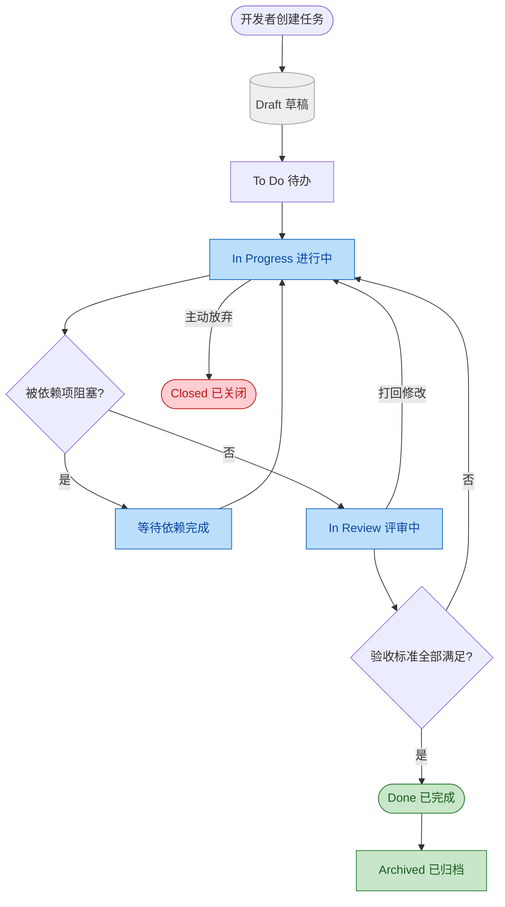
```mermaid
flowchart TD
    Start([开发者创建任务]) --> Draft[(Draft 草稿)]
    Draft --> Todo[To Do 待办]
    Todo --> Active[In Progress 进行中]
    Active --> Blocked{被依赖项阻塞?}
    Blocked -->|是| Wait[等待依赖完成]
    Wait --> Active
    Blocked -->|否| Review[In Review 评审中]
    Review --> AC{验收标准全部满足?}
    AC -->|否| Active
    AC -->|是| Done([Done 已完成])
    Done --> Archive[Archived 已归档]
    Active -->|主动放弃| Closed([Closed 已关闭])
    Review -->|打回修改| Active
    classDef done fill:#c8e6c9,stroke:#2e7d32,color:#1b5e20;
    classDef active fill:#bbdefb,stroke:#1565c0,color:#0d47a1;
    classDef draft fill:#eeeeee,stroke:#9e9e9e,color:#424242;
    classDef dead fill:#ffcdd2,stroke:#c62828,color:#b71c1c;
    class Done,Archive done;
    class Active,Review,Wait active;
    class Draft draft;
    class Closed dead;
```

要点：`{...}` 为判断节点，`|标签|` 为边上的条件文字；`classDef`/`class` 用于条件着色。

### 1.2 微信支付流程图

覆盖登录校验、商户下单、统一下单 API、收银台、扣款结果与失败分支。

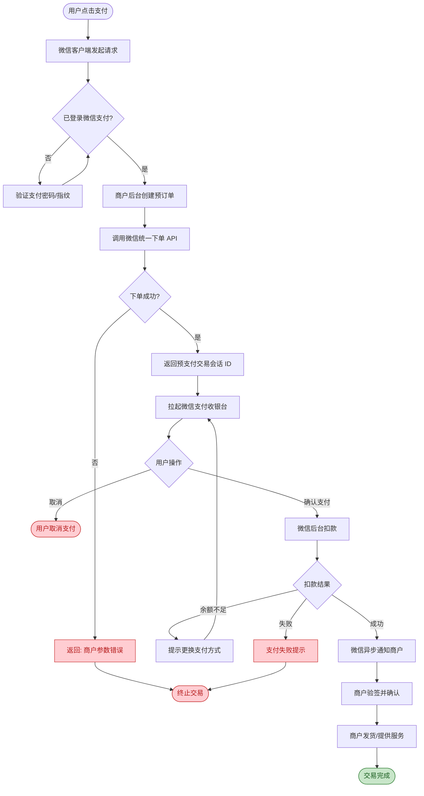
```mermaid
flowchart TD
    A([用户点击支付]) --> B[微信客户端发起请求]
    B --> C{已登录微信支付?}
    C -->|否| C1[验证支付密码/指纹]
    C1 --> C
    C -->|是| D[商户后台创建预订单]
    D --> E[调用微信统一下单 API]
    E --> F{下单成功?}
    F -->|否| F1[返回: 商户参数错误]
    F1 --> Z([终止交易])
    F -->|是| G[返回预支付交易会话 ID]
    G --> H[拉起微信支付收银台]
    H --> I{用户操作}
    I -->|取消| Z2([用户取消支付])
    I -->|确认支付| J[微信后台扣款]
    J --> K{扣款结果}
    K -->|余额不足| K1[提示更换支付方式]
    K1 --> H
    K -->|成功| L[微信异步通知商户]
    L --> M[商户验签并确认]
    M --> N[商户发货/提供服务]
    N --> O([交易完成])
    K -->|失败| K2[支付失败提示]
    K2 --> Z
    classDef success fill:#c8e6c9,stroke:#2e7d32,color:#1b5e20;
    classDef fail fill:#ffcdd2,stroke:#c62828,color:#b71c1c;
    class O success;
    class Z,Z2,K2,F1 fail;
```

---

## 2. 时序图 Sequence Diagram

语法关键字：`sequenceDiagram`。参与者 `participant`/`actor`，消息 `-->` 虚线、`->>` 实线箭头，`Note` 标注，`alt`/`opt`/`loop` 分组。

### 2.1 Backlog CLI 执行一条命令

展示 CLI → Core → 文件系统 → Git → Kuzu 图数据库的完整链路。

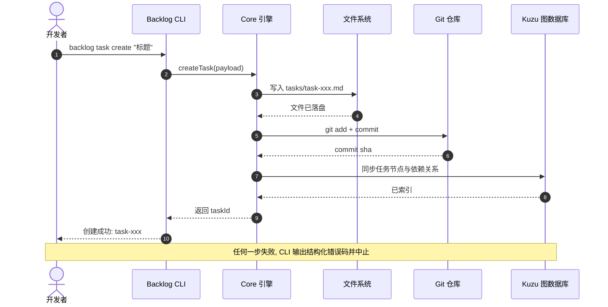
```mermaid
sequenceDiagram
    autonumber
    actor User as 开发者
    participant CLI as Backlog CLI
    participant Core as Core 引擎
    participant FS as 文件系统
    participant Git as Git 仓库
    participant DB as Kuzu 图数据库

    User->>CLI: backlog task create "标题"
    CLI->>Core: createTask(payload)
    Core->>FS: 写入 tasks/task-xxx.md
    FS-->>Core: 文件已落盘
    Core->>Git: git add + commit
    Git-->>Core: commit sha
    Core->>DB: 同步任务节点与依赖关系
    DB-->>Core: 已索引
    Core-->>CLI: 返回 taskId
    CLI-->>User: 创建成功: task-xxx
    Note over User,DB: 任何一步失败, CLI 输出结构化错误码并中止
```

要点：`autonumber` 自动编号；`actor` 用于区分人类角色；`Note over A,B` 跨角色标注。

### 2.2 支付宝转账时序

使用 `alt` 展示余额充足与不足的两条路径。

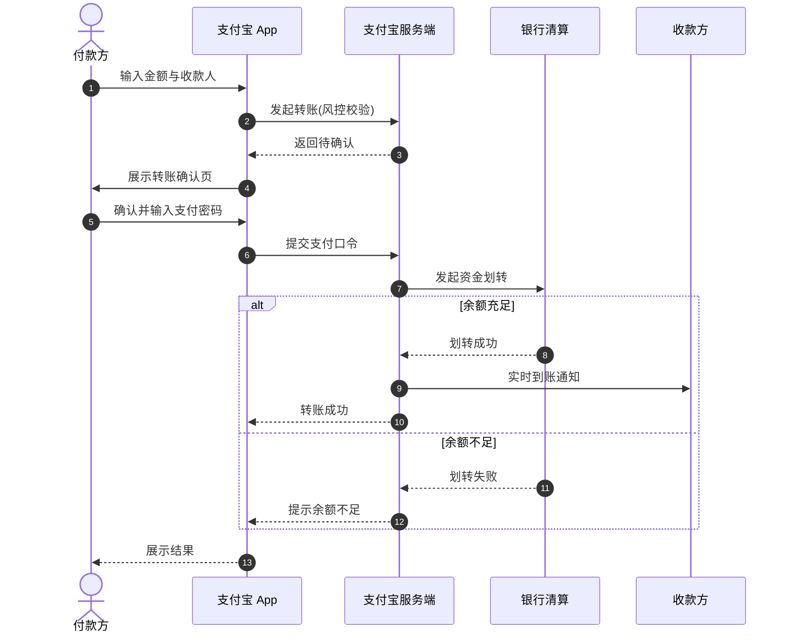
```mermaid
sequenceDiagram
    autonumber
    actor Sender as 付款方
    participant App as 支付宝 App
    participant AS as 支付宝服务端
    participant Bank as 银行清算
    participant R as 收款方

    Sender->>App: 输入金额与收款人
    App->>AS: 发起转账(风控校验)
    AS-->>App: 返回待确认
    App->>Sender: 展示转账确认页
    Sender->>App: 确认并输入支付密码
    App->>AS: 提交支付口令
    AS->>Bank: 发起资金划转
    alt 余额充足
        Bank-->>AS: 划转成功
        AS->>R: 实时到账通知
        AS-->>App: 转账成功
    else 余额不足
        Bank-->>AS: 划转失败
        AS-->>App: 提示余额不足
    end
    App-->>Sender: 展示结果
```

---

## 3. 类图 Class Diagram

语法关键字：`classDiagram`。`+` 公有、`-` 私有、`#` 保护；关系：`-->` 关联、`*--` 组合、`o--` 聚合、`<|--` 继承、`..>` 依赖。

### 3.1 Backlog 核心领域模型

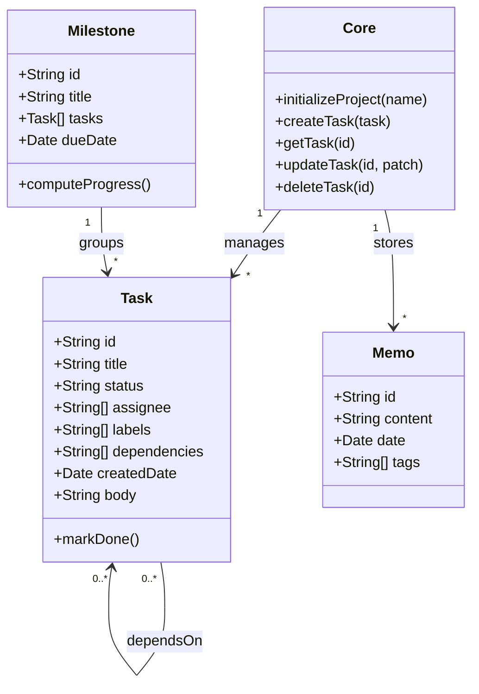
```mermaid
classDiagram
    class Core {
        +initializeProject(name)
        +createTask(task)
        +getTask(id)
        +updateTask(id, patch)
        +deleteTask(id)
    }
    class Task {
        +String id
        +String title
        +String status
        +String[] assignee
        +String[] labels
        +String[] dependencies
        +Date createdDate
        +String body
        +markDone()
    }
    class Milestone {
        +String id
        +String title
        +Task[] tasks
        +Date dueDate
        +computeProgress()
    }
    class Memo {
        +String id
        +String content
        +Date date
        +String[] tags
    }
    Core "1" --> "*" Task : manages
    Milestone "1" --> "*" Task : groups
    Task "0..*" --> "0..*" Task : dependsOn
    Core "1" --> "*" Memo : stores
```

### 3.2 电商订单领域模型（通用）

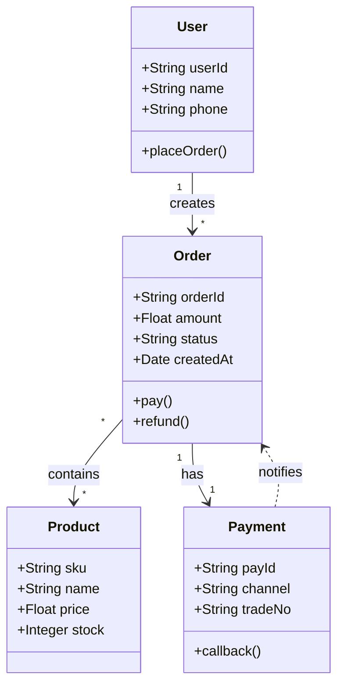
```mermaid
classDiagram
    class User {
        +String userId
        +String name
        +String phone
        +placeOrder()
    }
    class Order {
        +String orderId
        +Float amount
        +String status
        +Date createdAt
        +pay()
        +refund()
    }
    class Product {
        +String sku
        +String name
        +Float price
        +Integer stock
    }
    class Payment {
        +String payId
        +String channel
        +String tradeNo
        +callback()
    }
    User "1" --> "*" Order : creates
    Order "*" --> "*" Product : contains
    Order "1" --> "1" Payment : has
    Payment ..> Order : notifies
```

---

## 4. 状态图 State Diagram

语法关键字：`stateDiagram-v2`。`[*]` 起止态，`-->` 转移，`:` 触发事件，`note` 注释。

### 4.1 订单状态机（微信 / 支付宝支付场景）

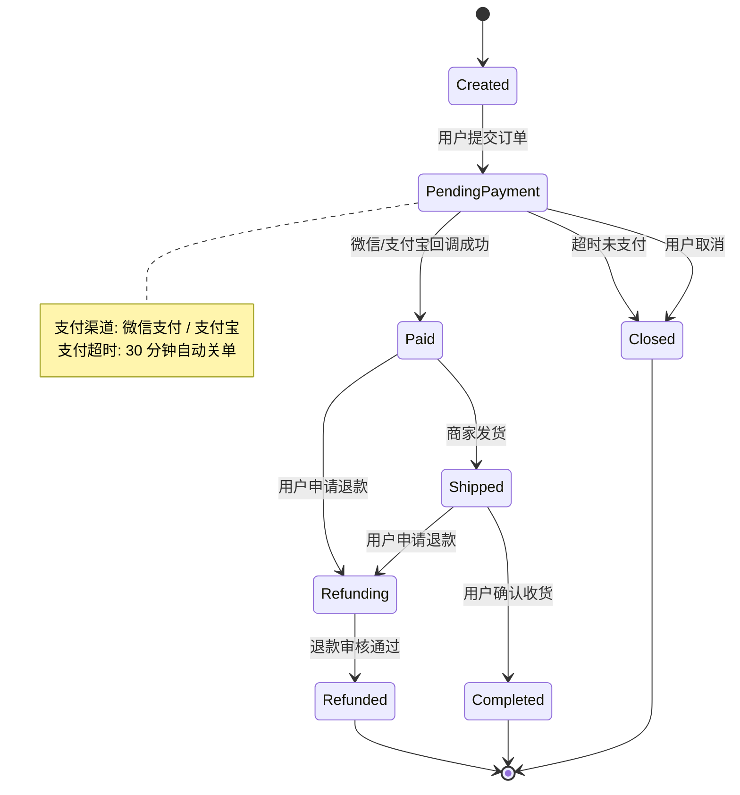
```mermaid
stateDiagram-v2
    [*] --> Created
    Created --> PendingPayment : 用户提交订单
    PendingPayment --> Paid : 微信/支付宝回调成功
    PendingPayment --> Closed : 超时未支付
    PendingPayment --> Closed : 用户取消
    Paid --> Shipped : 商家发货
    Shipped --> Completed : 用户确认收货
    Paid --> Refunding : 用户申请退款
    Shipped --> Refunding : 用户申请退款
    Refunding --> Refunded : 退款审核通过
    Refunded --> [*]
    Completed --> [*]
    Closed --> [*]
    note right of PendingPayment
        支付渠道: 微信支付 / 支付宝
        支付超时: 30 分钟自动关单
    end note
```

---

## 5. 实体关系图 ER Diagram

语法关键字：`erDiagram`。关系基数：`||--o{`（一對零或多）、`}|o--o|`（多對多）、`||--||` 等；实体块内列出字段，`PK` 主键、`FK` 外键。

### 5.1 Backlog 数据模型

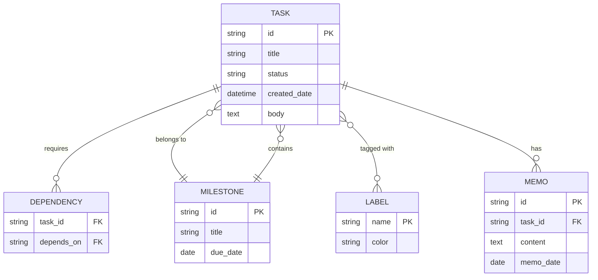
```mermaid
erDiagram
    TASK ||--o{ DEPENDENCY : "requires"
    TASK }o--|| MILESTONE : "belongs to"
    TASK }o--o{ LABEL : "tagged with"
    TASK ||--o{ MEMO : "has"
    MILESTONE ||--o{ TASK : "contains"

    TASK {
        string id PK
        string title
        string status
        datetime created_date
        text body
    }
    MILESTONE {
        string id PK
        string title
        date due_date
    }
    LABEL {
        string name PK
        string color
    }
    DEPENDENCY {
        string task_id FK
        string depends_on FK
    }
    MEMO {
        string id PK
        string task_id FK
        text content
        date memo_date
    }
```

### 5.2 电商用户-订单-商品模型（通用）

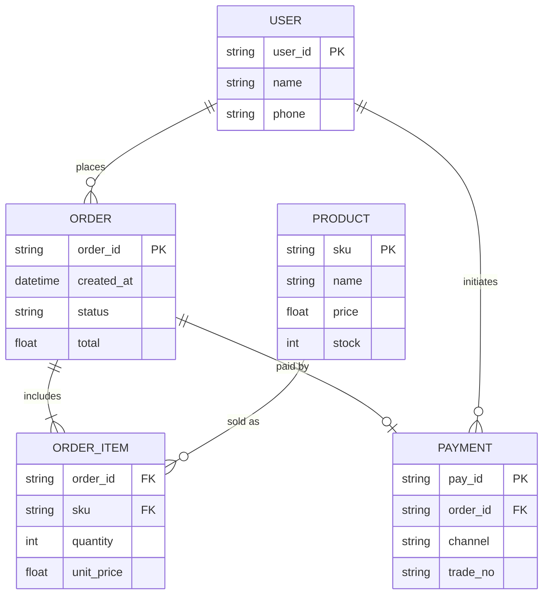
```mermaid
erDiagram
    USER ||--o{ ORDER : places
    ORDER ||--|{ ORDER_ITEM : includes
    PRODUCT ||--o{ ORDER_ITEM : "sold as"
    ORDER ||--o| PAYMENT : "paid by"
    USER ||--o{ PAYMENT : initiates

    USER {
        string user_id PK
        string name
        string phone
    }
    ORDER {
        string order_id PK
        datetime created_at
        string status
        float total
    }
    PRODUCT {
        string sku PK
        string name
        float price
        int stock
    }
    ORDER_ITEM {
        string order_id FK
        string sku FK
        int quantity
        float unit_price
    }
    PAYMENT {
        string pay_id PK
        string order_id FK
        string channel
        string trade_no
    }
```

---

## 6. 用户旅程图 User Journey

语法关键字：`journey`。`title` 标题，`section` 分节，每行 `任务: 评分: 角色`（评分 1–5）。

### 6.1 新用户上手 Backlog.md

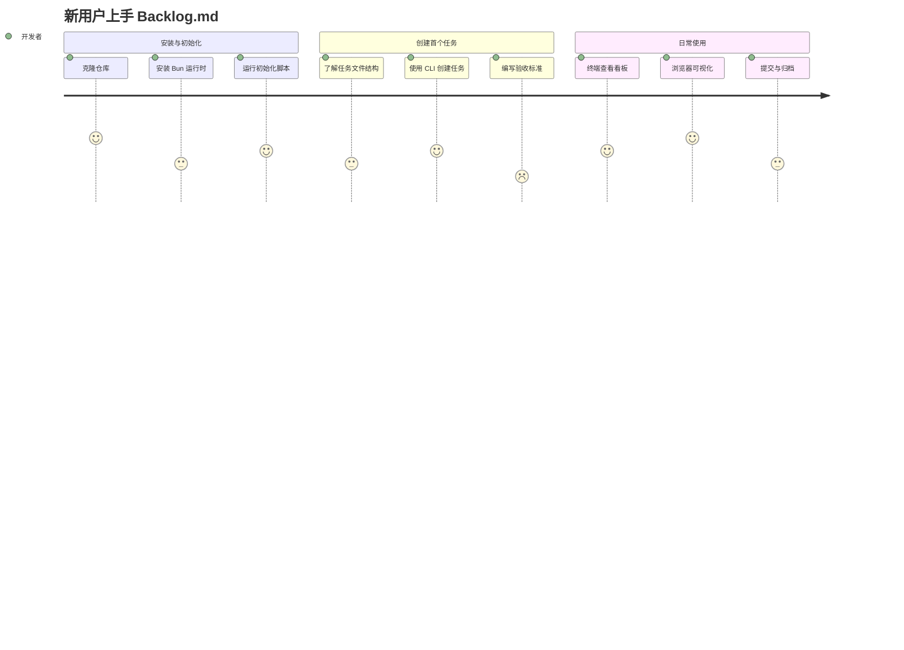
```mermaid
journey
    title 新用户上手 Backlog.md
    section 安装与初始化
        克隆仓库: 5: 开发者
        安装 Bun 运行时: 3: 开发者
        运行初始化脚本: 4: 开发者
    section 创建首个任务
        了解任务文件结构: 3: 开发者
        使用 CLI 创建任务: 4: 开发者
        编写验收标准: 2: 开发者
    section 日常使用
        终端查看看板: 4: 开发者
        浏览器可视化: 5: 开发者
        提交与归档: 3: 开发者
```

### 6.2 支付宝扫码付款旅程

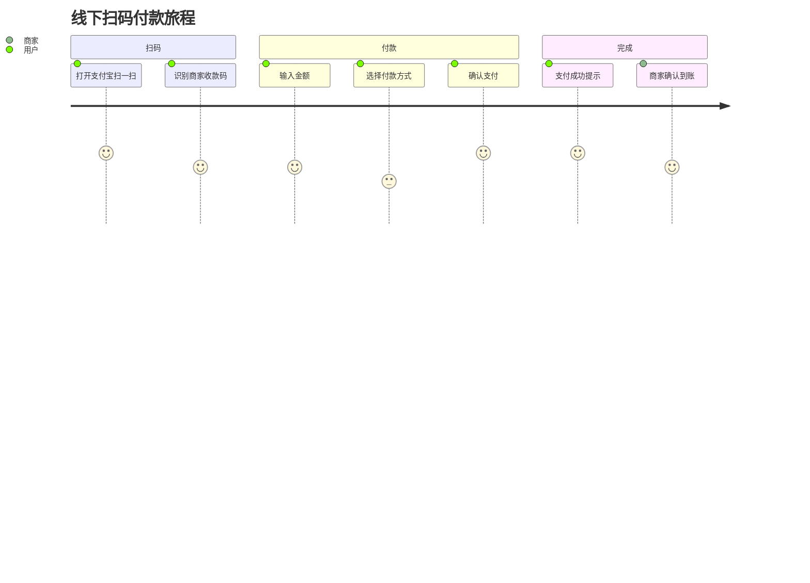
```mermaid
journey
    title 线下扫码付款旅程
    section 扫码
        打开支付宝扫一扫: 5: 用户
        识别商家收款码: 4: 用户
    section 付款
        输入金额: 4: 用户
        选择付款方式: 3: 用户
        确认支付: 5: 用户
    section 完成
        支付成功提示: 5: 用户
        商家确认到账: 4: 商家
```

---

## 7. 甘特图 Gantt

语法关键字：`gantt`。`dateFormat` 日期格式，`section` 分组，任务后可跟 `done`/`active`/`crit` 状态与 `after` 依赖。

### 7.1 图表扩展里程碑 m-14 计划

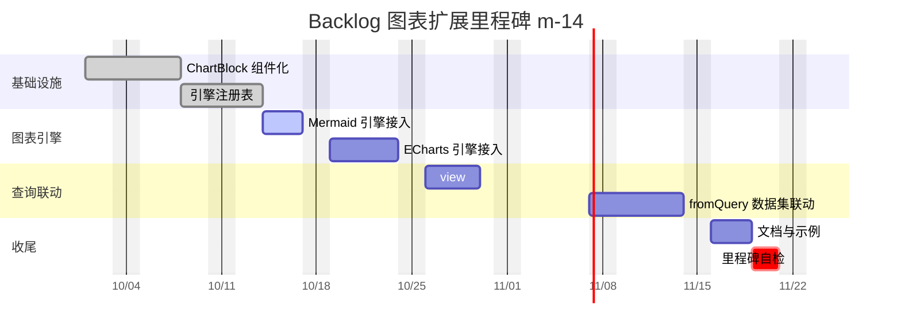
```mermaid
gantt
    title Backlog 图表扩展里程碑 m-14
    dateFormat YYYY-MM-DD
    axisFormat %m/%d
    excludes weekends
    section 基础设施
        ChartBlock 组件化: done, m1, 2026-10-01, 5d
        引擎注册表: done, m2, after m1, 4d
    section 图表引擎
        Mermaid 引擎接入: active, m3, after m2, 3d
        ECharts 引擎接入: m4, after m3, 5d
    section 查询联动
        view:echarts 简单映射: m5, after m4, 4d
        fromQuery 数据集联动: m6, after m5, 6d
    section 收尾
        文档与示例: m7, after m6, 3d
        里程碑自检: crit, m8, after m7, 2d
```

---

## 8. 饼图 Pie Chart

语法关键字：`pie`。`title` 后逐行 `标签: 数值`。

### 8.1 任务状态分布

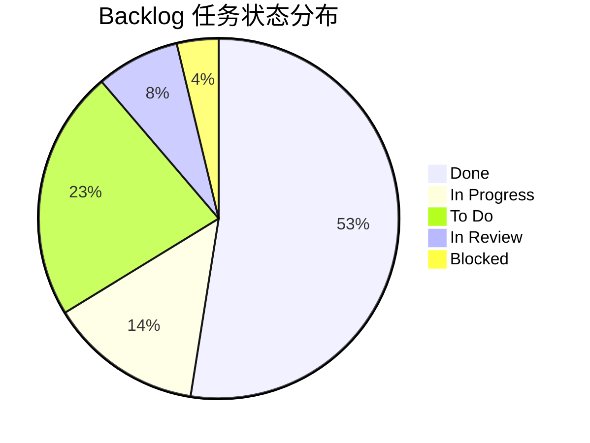
```mermaid
pie title Backlog 任务状态分布
    "Done" : 42
    "In Progress" : 11
    "To Do" : 18
    "In Review" : 6
    "Blocked" : 3
```

---

## 9. 象限图 Quadrant Chart

语法关键字：`quadrantChart`。`x-axis`/`y-axis` 定义轴方向与高低端，`quadrant-N` 命名四个象限，数据点为 `"名称": [x, y]`（0–1）。

### 9.1 微信功能需求优先级矩阵

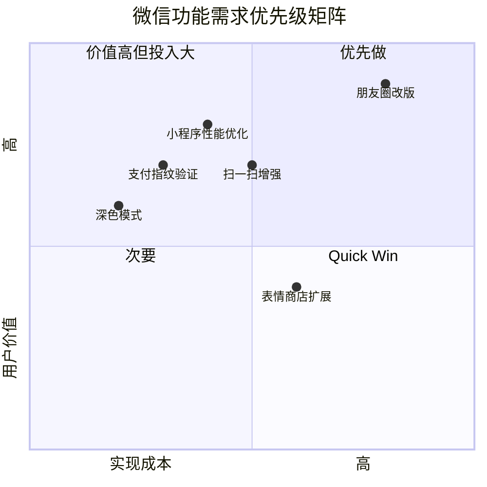
```mermaid
quadrantChart
    title 微信功能需求优先级矩阵
    x-axis 实现成本 --> 高
    y-axis 用户价值 --> 高
    quadrant-1 优先做
    quadrant-2 价值高但投入大
    quadrant-3 次要
    quadrant-4 Quick Win
    "朋友圈改版": [0.8, 0.9]
    "支付指纹验证": [0.3, 0.7]
    "小程序性能优化": [0.4, 0.8]
    "表情商店扩展": [0.6, 0.4]
    "深色模式": [0.2, 0.6]
    "扫一扫增强": [0.5, 0.7]
```

---

## 10. 需求图 Requirement Diagram

语法关键字：`requirementDiagram`。`requirement` 定义需求（`id`/`text`/`risk`/`verifymethod`），`element` 定义系统元素，`- satisfies ->` 建立满足关系。

### 10.1 支付系统需求分解

注意：需求图的元素名与 `id` 须为 ASCII（id 不能含连字符），中文描述放在 `text:` 内并加引号；`risk` 取 `high`/`medium`/`low`，`verifymethod` 取英文枚举（如 `inspection`/`test`/`analysis`），均不加引号。

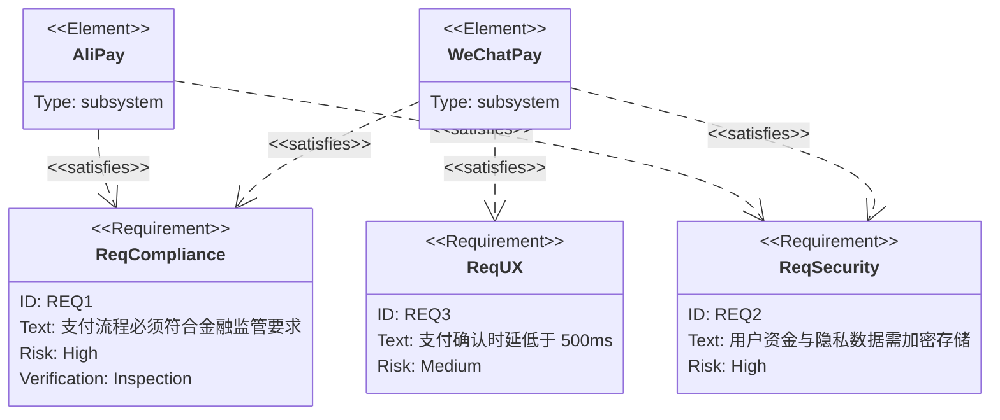
```mermaid
requirementDiagram
    requirement ReqCompliance {
        id: REQ1
        text: "支付流程必须符合金融监管要求"
        risk: high
        verifymethod: inspection
    }
    requirement ReqSecurity {
        id: REQ2
        text: "用户资金与隐私数据需加密存储"
        risk: high
    }
    requirement ReqUX {
        id: REQ3
        text: "支付确认时延低于 500ms"
        risk: medium
    }
    element WeChatPay {
        type: subsystem
    }
    element AliPay {
        type: subsystem
    }
    WeChatPay - satisfies -> ReqCompliance
    AliPay - satisfies -> ReqCompliance
    WeChatPay - satisfies -> ReqSecurity
    AliPay - satisfies -> ReqSecurity
    WeChatPay - satisfies -> ReqUX
```

---

## 11. Git 图 Gitgraph

语法关键字：`gitGraph`。`branch`/`checkout`/`commit`/`merge`，`commit id:` 自定义提交标签，`tag` 打标签。

### 11.1 Backlog 分支工作流

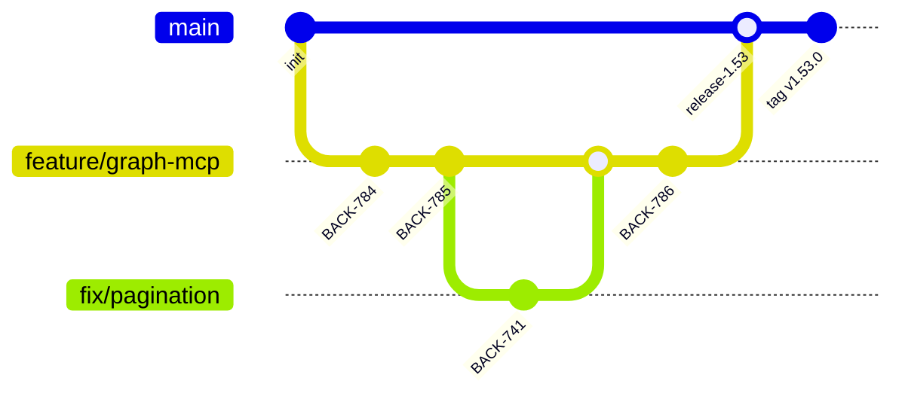
```mermaid
gitGraph
    commit id: "init"
    branch feature/graph-mcp
    checkout feature/graph-mcp
    commit id: "BACK-784"
    commit id: "BACK-785"
    branch fix/pagination
    checkout fix/pagination
    commit id: "BACK-741"
    checkout feature/graph-mcp
    merge fix/pagination
    commit id: "BACK-786"
    checkout main
    merge feature/graph-mcp id: "release-1.53"
    commit id: "tag v1.53.0"
```

---

## 12. 思维导图 Mindmap

语法关键字：`mindmap`。父子关系用缩进表达，`((根))` 为根节点，`((文本))` 圆形叶节点，普通文本为方框节点。

### 12.1 Backlog 功能全景

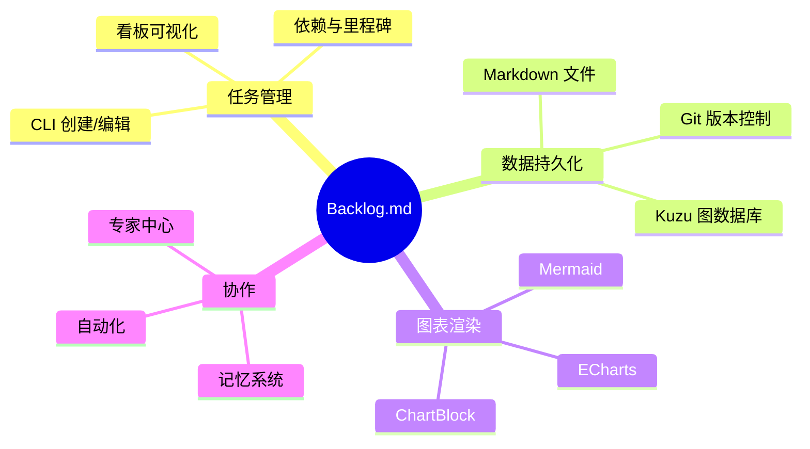
```mermaid
mindmap
    root((Backlog.md))
        任务管理
            CLI 创建/编辑
            依赖与里程碑
            看板可视化
        数据持久化
            Markdown 文件
            Git 版本控制
            Kuzu 图数据库
        图表渲染
            Mermaid
            ECharts
            ChartBlock
        协作
            记忆系统
            专家中心
            自动化
```

### 12.2 微信生态功能地图

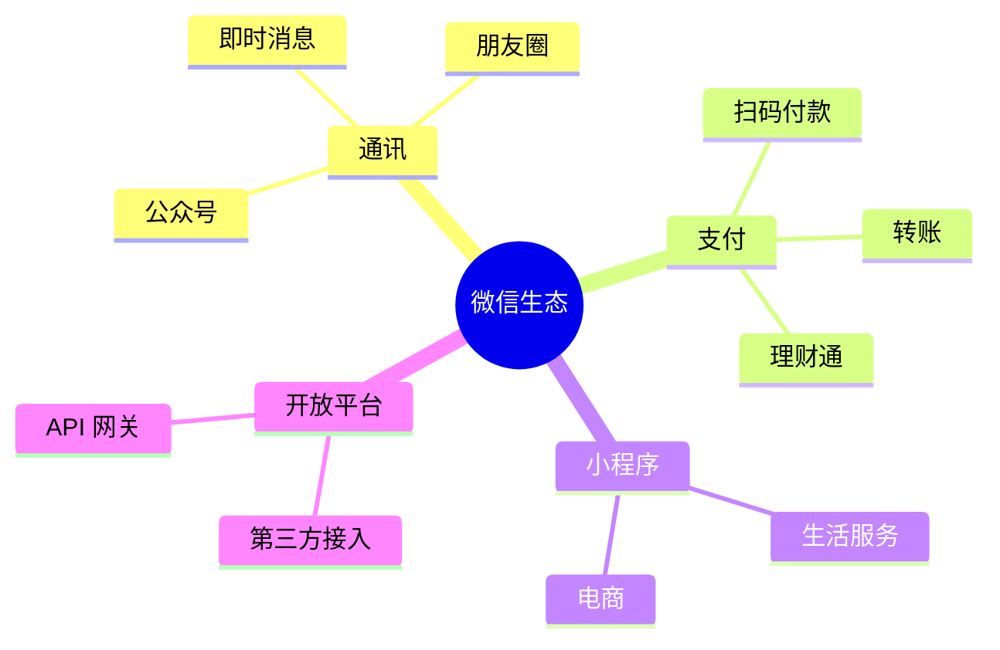
```mermaid
mindmap
    root((微信生态))
        通讯
            即时消息
            朋友圈
            公众号
        支付
            扫码付款
            转账
            理财通
        小程序
            生活服务
            电商
        开放平台
            第三方接入
            API 网关
```

---

## 13. 时间线图 Timeline

语法关键字：`timeline`。`title` 后每行 `时间点 : 事件`，可用 `:` 分隔多个事件。

### 13.1 版本发布时间线

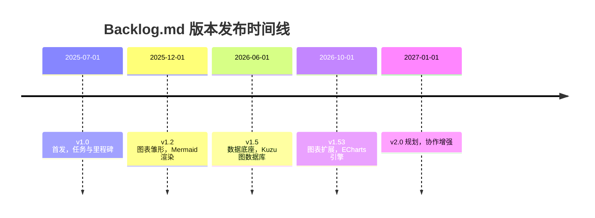
```mermaid
timeline
    title Backlog.md 版本发布时间线
    2025-07-01 : v1.0 首发，任务与里程碑
    2025-12-01 : v1.2 图表雏形，Mermaid 渲染
    2026-06-01 : v1.5 数据底座，Kuzu 图数据库
    2026-10-01 : v1.53 图表扩展，ECharts 引擎
    2027-01-01 : v2.0 规划，协作增强
```

---

## 14. 桑基图 Sankey（Beta）

语法关键字：`sankey-beta`。本质是 CSV：`源,目标,值` 三列；节点名仅支持 ASCII，不能用中文。

### 14.1 支付渠道转化漏斗

语法为 CSV：`source,target,value` 三列；节点名在 source/target 间必须完全一致。注意：桑基图的解析器为 ASCII 限定，节点名请用英文（本例 Visitors=访问用户、WeChatPay=微信支付、AliPay=支付宝 等）。

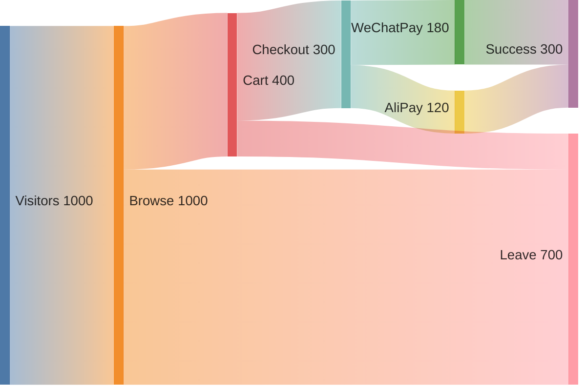
```mermaid
sankey-beta

Visitors,Browse,1000
Browse,Cart,400
Cart,Checkout,300
Checkout,WeChatPay,180
Checkout,AliPay,120
WeChatPay,Success,180
AliPay,Success,120
Browse,Leave,600
Cart,Leave,100
```

---

## 15. XY 图 XYChart（Beta）

语法关键字：`xychart-beta`。`x-axis`/`y-axis` 定义轴与取值范围，`bar`/`line` 定义数据系列。注意：`x-axis` 的类别项必须用双引号包裹（如 `"W1"`），否则解析报错；标题与 `y-axis` 文案可正常用中文。

### 15.1 每周完成任务数

```mermaid
xychart-beta
    title "Backlog 每周完成任务数"
    x-axis ["第1周", "第2周", "第3周", "第4周", "第5周", "第6周"]
    y-axis "完成任务数" 0 --> 20
    bar [5, 8, 12, 9, 15, 18]
    line [5, 8, 12, 9, 15, 18]
```

---

## 16. 架构图 Architecture Diagram（Beta）

语法关键字：`architecture-beta`。`group` 分组，`service` 定义服务（图标括号：`server`/`database`/`disk`/`cloud` 等），连接用 `A:边 --> 边:B`。边方向：`T`(上)`B`(下)`L`(左)`R`(右)。注意：该类型词法器仅支持 ASCII，**组名与服务标签必须全英文**（中文会触发 Lexer error），本处以英文标签呈现，结构含义与中文一致。

### 16.1 Backlog 系统架构

```mermaid
architecture-beta
    group core(cloud)[Backlog System]
    service cli(server)[CLI] in core
    service engine(server)[Core Engine] in core
    service store(disk)[Markdown Git] in core
    service graph(database)[Kuzu Graph] in core
    cli:B --> T:engine
    engine:B --> T:store
    engine:L --> R:graph
```

### 16.2 微信小程序架构

```mermaid
architecture-beta
    group wechat(cloud)[WeChat Mini Program]
    service view(server)[View WXML] in wechat
    service logic(server)[Logic JS] in wechat
    service api(server)[WeChat API] in wechat
    service backend(database)[Merchant Backend] in wechat
    view:B --> T:logic
    logic:B --> T:api
    api:L --> R:backend
```

---

## 17. 块图 Block Diagram（Beta）

语法关键字：`block-beta`。`columns N` 设定列数，`block:名称 ... end` 定义子块，块间用 `-->` 连接。

### 17.1 分层架构

```mermaid
block-beta
    columns 3
    block:Presentation
        CLI
        WebUI
    end
    block:Application
        Core
        MCP
    end
    block:Persistence
        Markdown
        Git
        Kuzu
    end
    Presentation --> Application
    Application --> Persistence
```

---

## 18. 树图 Treemap（Beta）

语法关键字：`treemap`。`根 --> 节点[标签, 数值]` 表达层级与权重。

### 18.1 任务按标签分布

语法为缩进层级：顶层用 `"分类"`，子项用 `"名称": 数值`，父节点数值由子项累加。

```mermaid
treemap-beta
"缺陷"
    "前端缺陷": 18
    "后端缺陷": 12
"需求"
    "CLI 需求": 40
    "Web 需求": 30
"杂务"
    "文档": 12
    "流水线": 8
```

---

## 速查表

| 类型 | 围栏关键字 | 方向/坐标要点 | 本项目示例 |
|------|-----------|--------------|-----------|
| 流程图 | `flowchart`/`graph` | `TD`/`LR`；`{}` 判断、`classDef` 上色 | 任务生命周期、微信支付 |
| 时序图 | `sequenceDiagram` | `actor`/`participant`；`alt`/`loop` | CLI 执行、支付宝转账 |
| 类图 | `classDiagram` | `<|--` 继承、`*--` 组合 | Backlog 领域模型 |
| 状态图 | `stateDiagram-v2` | `[*]` 起止、`note` | 订单状态机 |
| 实体关系图 | `erDiagram` | `\|\|--o{` 基数、`PK`/`FK` | 数据模型 |
| 用户旅程 | `journey` | `section` + `任务:评分:角色` | 上手、扫码付款 |
| 甘特图 | `gantt` | `after` 依赖、`done`/`crit` | 里程碑 m-14 |
| 饼图 | `pie` | `标签: 数值` | 状态分布 |
| 象限图 | `quadrantChart` | `[x, y]` 0–1 | 需求优先级 |
| 需求图 | `requirementDiagram` | `- satisfies ->`；名称/id 须 ASCII，中文放引号 `text:` | 支付需求 |
| Git 图 | `gitGraph` | `branch`/`merge`/`tag` | 分支工作流 |
| 思维导图 | `mindmap` | 缩进表达层级 | 功能全景 |
| 时间线 | `timeline` | `时间点 : 事件` | 版本发布 |
| 桑基图 | `sankey-beta` | CSV 三列 `源,目标,值`（节点名仅 ASCII） | 转化漏斗 |
| XY 图 | `xychart-beta` | `bar`/`line` 系列；`x-axis` 类别须加引号 | 吞吐趋势 |
| 架构图 | `architecture-beta` | `service`/边方向 `TBLR`；标签须 ASCII | 系统架构 |
| 块图 | `block-beta` | `columns N` + 子块 | 分层架构 |
| 树图 | `treemap-beta` | 缩进 `"分类"` / `"叶子": 值` | 标签分布 |

> 所有 Beta 类型需 Mermaid 10+；本仓库 11.16.1 均已支持。围栏统一用 ` ```mermaid `，渲染由 `src/web/charts/mermaid-engine.ts` 处理，并随主题切换配色。
